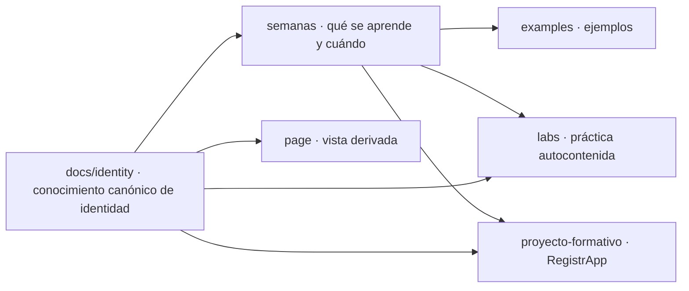
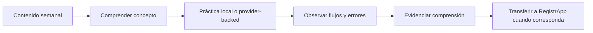
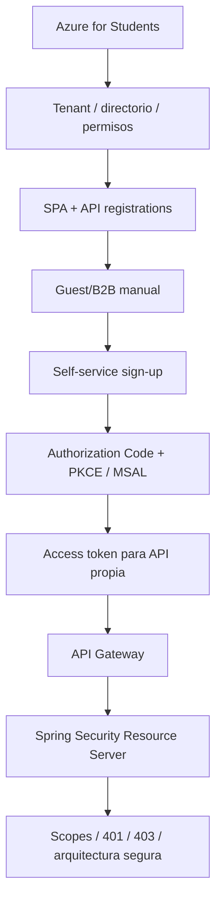

# DSY1107 · Desarrollo Cloud Native I · 2026-2

Repositorio de apoyo para la asignatura **DSY1107 Desarrollo Cloud Native I**.

Este repositorio reúne contenido de clases, ejemplos, laboratorios, guías y recursos complementarios utilizados durante el semestre 2026-2 para las secciones **DSY1107-002D** y **DSY1107-003D**.

## Acceso rápido

- [`semanas/`](semanas/) — índice y contenido curricular consolidado de cada semana.
- [`examples/`](examples/) — ejemplos demostrativos independientes del proyecto transversal.
- [`labs/`](labs/) — laboratorios locales, autocontenidos e independientes del proyecto formativo.
- [`proyecto-formativo/`](proyecto-formativo/) — **RegistrApp**, vertical transversal independiente que evoluciona clase a clase.
- [`docs/identity/`](docs/identity/) — dominio canónico de identidad y acceso: Azure for Students, Entra ID, Guest/B2B, self-service, MSAL, tokens y API Gateway.
- [`page/`](page/) — portal web del curso, superficie derivada y navegable.
- [**Guía completa de Microsoft Entra ID**](docs/identity/entra-guia-completa/README.md) — ruta por etapas desde la cuenta hasta la API protegida.
- [**Versión web · Identidad y acceso**](page/identidad.html) — read model para estudiantes con navegación progresiva y diagramas Mermaid.
- [**Estrategia de laboratorios y relación con AVA**](docs/ESTRATEGIA-LABORATORIOS-CONCEPTO-A-CLOUD.md) — labs locales en el repo; ejercicios/labs cloud institucionales en AVA.
- [**Estándar de repositorio del estudiante**](docs/ESTANDAR-REPOSITORIO-ESTUDIANTE.md) — nombre, estructura, packages, Markdown, labs Cloud Native y entregas colaborativas.
- [**Material público del curso**](https://drive.google.com/drive/folders/1UOZMZcEbtfKFq4ygWKj3Yi8VEHkW7hx1?usp=sharing) — biblioteca pública organizada semana a semana.

## Regla pedagógica canónica

DSY1107 mantiene **dos verticales distintas, con raíces distintas**.

### Vertical de contenido · `semanas/`, `examples/`, `labs/`

```text
concepto
→ explicación
→ ejemplo pequeño y autocontenido
→ mini ejercicio/laboratorio local e independiente
→ evidencia de comprensión
```

El contenido no depende de RegistrApp. Los ejemplos pueden cambiar de dominio si eso permite explicar mejor una competencia.

### Vertical transversal · `proyecto-formativo/`

```text
contenido comprendido
→ transferencia a RegistrApp
→ incremento
→ evidencia
→ checkpoint
```

> **Primero se aprende fuera de RegistrApp. Después se transfiere a RegistrApp.**

RegistrApp es el desafío transversal del semestre; **no es el ejemplo conductor ni forma parte física de una carpeta `semana-XX`**.

## Cómo se organiza el material

La semana curricular dice **qué corresponde aprender ahora**. Las raíces transversales dicen **dónde vive cada artefacto**, mientras `docs/` conserva conocimiento transversal organizado por dominio.



Una semana puede enlazar al checkpoint vigente de RegistrApp y a documentación transversal, pero no mantiene copias paralelas del mismo conocimiento.

## Material original

Los archivos originales de la asignatura utilizados durante cada semana se mantienen en la [biblioteca pública de Google Drive](https://drive.google.com/drive/folders/1UOZMZcEbtfKFq4ygWKj3Yi8VEHkW7hx1?usp=sharing), organizados en carpetas semanales de solo lectura.

## Filosofía de laboratorios

Los laboratorios de este repositorio deben poder ejecutarse **sin infraestructura cloud real** cuando el objetivo sea aislar un concepto. Cuando el proveedor administrado forma parte esencial de la competencia, el material puede ser provider-backed y debe separar claramente configuración, código, evidencia y troubleshooting.



El laboratorio de contenido debe ser entendible por sí mismo. Si después la misma competencia se aplica a RegistrApp, esa aplicación pertenece al proyecto formativo y se documenta por separado.

→ [Ver estrategia completa](docs/ESTRATEGIA-LABORATORIOS-CONCEPTO-A-CLOUD.md)

## Repositorio personal del estudiante

La estructura usada por el docente para publicar material no se copia en el repositorio del alumno.

Cada estudiante mantiene un único repo personal:

```text
DSY1107-002D-nombre-apellido
```

o

```text
DSY1107-003D-nombre-apellido
```

según su sección.

Para código Java/Kotlin se usa `cl.duoc.<usuario-duoc-sin-puntos>` como raíz de package. Las entregas se documentan con Markdown y cada lab/proyecto debe poder reproducirse desde otra máquina sin depender del IDE del autor.

→ [Ver estándar completo](docs/ESTANDAR-REPOSITORIO-ESTUDIANTE.md)  
→ [Versión web](page/repositorio-estudiante.html)

## Cómo obtener el repositorio

```bash
git clone https://github.com/cmartinezs/DSY1107-DESARROLLO-CLOUD-NATIVE-I-2026-2.git
cd DSY1107-DESARROLLO-CLOUD-NATIVE-I-2026-2
```

Para actualizar una copia existente:

```bash
git pull
```

## Organización del semestre

Ambas secciones utilizan el mismo repositorio y persiguen los mismos resultados de aprendizaje, aunque el avance real de cada sesión puede variar.

No se sincronizan artificialmente: cada sección registra su último checkpoint demostrable y continúa desde ahí.

## Semana actual

**Semana 4 · 31 de agosto al 5 de septiembre de 2026**

**Cierre de Identity as a Service + integración Full Stack segura.**

Esta semana debe:

- cerrar **1.2.5–1.2.8**: usuarios externos, seguridad en API Manager, JWT/Claims y decodificación de tokens;
- trabajar la ruta operativa **Azure for Students → tenant/permisos → SPA/API registrations → Guest/B2B → self-service sign-up**;
- continuar con **1.3.1–1.3.4**: MSAL, MSAL en frontend, Spring Security en backend y arquitecturas seguras en la nube;
- comparar Microsoft Entra ID con Firebase Authentication como implementaciones de la capacidad IDaaS;
- revisar con los estudiantes la **Evaluación Parcial 1**, su rúbrica, condiciones de entrega y la ventana planificada de semanas 6–7;
- aclarar que **Pedidos360** es el nombre de referencia usado en el documento institucional, mientras que cada grupo aplica los requisitos a su proyecto real.

Ruta técnica:



Consulta [`docs/identity/`](docs/identity/) para la fuente canónica del dominio, [`page/identidad.html`](page/identidad.html) para la vista web derivada, [`semanas/semana-04/`](semanas/semana-04/) para el contexto curricular, [`labs/`](labs/) para práctica y [`proyecto-formativo/`](proyecto-formativo/) para RegistrApp.

## Documentación y publicación

Este repositorio consume el estándar transversal de documentación/publicación y el estándar de diagramación de ADÜMÜN. En particular:

- la documentación se descompone por fronteras semánticas y dominios, no por tamaño arbitrario;
- `docs/identity/` es la fuente mantenida del dominio de identidad;
- `page/identidad.html` es una vista derivada, no una fuente normativa paralela;
- los cambios materiales de conocimiento público deben mantener documentación y web en paridad semántica;
- los diagramas técnicos nuevos o modificados usan Mermaid cuando es viable;
- nunca se publican secretos, passwords, access/refresh tokens reutilizables, client secrets, claves privadas ni credenciales cloud.

---

> AVA continúa siendo la plataforma oficial para comunicaciones, actividades, ejercicios/labs cloud y recursos institucionales que deban gestionarse desde el entorno académico.
