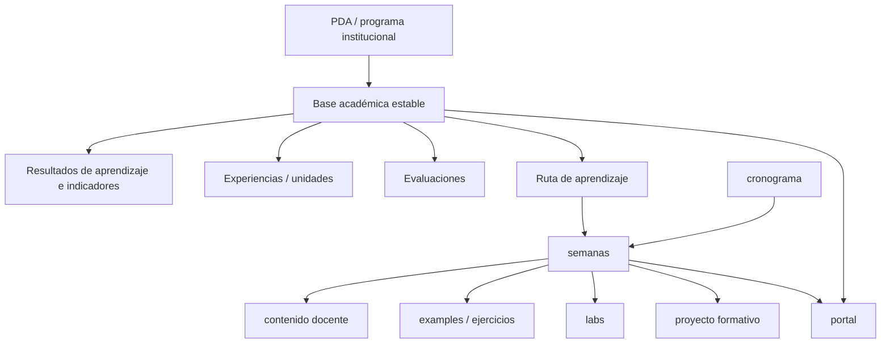

# Canon transversal de repositorios docentes · 2026-2

Este documento define la estructura, responsabilidades y reglas comunes de los repositorios docentes activos del semestre 2026-2.

Aplica a:

- DSY1102 · Desarrollo Orientado a Objetos;
- DSY1105 · Desarrollo de Aplicaciones Móviles;
- DSY1107 · Desarrollo Cloud Native I;
- BDY1101 · Base de Datos Aplicada I.

La organización específica de cada asignatura puede extender este canon, pero no debe contradecirlo sin una razón pedagógica explícita y documentada.

> Este archivo es una copia homologada del canon transversal. Mientras no exista un repositorio neutral dedicado exclusivamente a estándares docentes, las cuatro copias deben mantener paridad semántica y no pueden redefinir localmente las reglas comunes.

## 1. Principio rector: separar capas

Todo repositorio docente debe distinguir cuatro capas:

1. **Base académica estable**: qué es la asignatura institucionalmente.
2. **Planificación temporal**: cuándo se enseña cada parte.
3. **Ejecución docente**: cómo se enseña efectivamente durante el semestre.
4. **Práctica e integración**: ejemplos, ejercicios, labs y proyecto formativo.



Regla: **el PDA define qué; el cronograma define cuándo; las semanas registran la ejecución; los recursos prácticos materializan cómo se aprende.**

## 2. Principios transversales

1. Una fuente canónica por artefacto; no mantener copias activas divergentes.
2. La semana organiza el momento curricular; las raíces transversales organizan el tipo de recurso.
3. La base académica estable no debe mezclarse con el estado de la semana actual.
4. El repositorio docente y el repositorio del estudiante son arquitecturas distintas.
5. GitHub contiene conocimiento consolidado, material reproducible y documentación docente derivada.
6. Drive conserva material institucional/original y bibliotecas públicas de archivos; AVA mantiene su rol oficial.
7. La web es una superficie de navegación y lectura derivada, no una segunda fuente normativa.
8. Todo recurso evolutivo debe tener un README o punto de entrada equivalente.
9. La estructura debe seguir siendo comprensible al final del semestre sin depender de memoria tácita del docente.
10. Plan y avance real deben mantenerse separados.
11. Diagramas técnicos usan Mermaid cuando es viable y consumen el estándar transversal vigente de diagramación.
12. Los cronogramas, fechas y ponderaciones no se infieren cuando falta fuente institucional: se registran como pendientes hasta disponer de evidencia.

## 3. Estructura base

```text
/
├── README.md
├── docs/
│   ├── README.md
│   ├── PDA-RESUMEN.md
│   ├── RESULTADOS-DE-APRENDIZAJE.md
│   ├── RUTA-DE-APRENDIZAJE.md
│   ├── CRONOGRAMA.md                 # cuando exista fuente oficial
│   └── ... documentación transversal
├── data/
│   └── weekly/
│       ├── README.md
│       └── semana-XX.yml
├── semanas/
│   ├── README.md
│   └── semana-XX/
├── examples/ | ejemplos/
│   └── README.md
├── ejercicios/                       # cuando la asignatura lo requiera
│   └── README.md
├── labs/
│   └── README.md
├── evaluaciones/
│   └── README.md
├── proyecto-formativo/               # cuando aplique
│   └── README.md
└── page/ | site/
```

`examples/` y `ejemplos/`, así como `page/` y `site/`, son alias estructurales permitidos por legado. Cada repositorio elige uno y no mantiene ambos con contenido duplicado.

## 4. Base académica estable

La capa estable debe existir independientemente de cuánto contenido semanal se haya publicado.

### `docs/PDA-RESUMEN.md`

Debe registrar, desde fuente institucional:

- sigla y nombre;
- formato;
- créditos/horas cuando estén disponibles;
- línea formativa;
- prerrequisitos;
- descripción de la asignatura;
- experiencias/unidades;
- sistema general de evaluación;
- fuente institucional utilizada;
- información pendiente o no conciliada.

### `docs/RESULTADOS-DE-APRENDIZAJE.md`

Debe registrar todos los RA e indicadores de logro, preservando su trazabilidad institucional.

### `docs/RUTA-DE-APRENDIZAJE.md`

Debe mapear:

```text
RA / IL
→ experiencia de aprendizaje
→ actividad institucional
→ horas
→ evaluación asociada
```

Cuando exista cronograma oficial, se extiende con:

```text
→ semana / fecha
```

### `evaluaciones/README.md`

Debe consolidar:

- evaluaciones formativas;
- evaluaciones parciales;
- evaluación final/transversal;
- ponderaciones;
- modalidad;
- semanas o fechas solo cuando estén respaldadas por fuente institucional.

## 5. `README.md` raíz

El README raíz debe permitir entender la asignatura antes de explicar la arquitectura del repo.

Debe incluir como mínimo:

- sigla y nombre;
- sección o secciones;
- período;
- sede;
- docente;
- descripción breve institucional;
- resultados de aprendizaje resumidos;
- experiencias/unidades resumidas;
- esquema de evaluación;
- horario cuando corresponda;
- enlaces al PDA resumido, RA, ruta, evaluaciones y cronograma;
- enlaces a semanas, labs, ejemplos, proyecto formativo y portal;
- enlace al Drive institucional/material público;
- estado de información pendiente de conciliación.

La sección “semana actual” puede existir, pero nunca sustituye la ficha académica base.

## 6. `semanas/`

Es el mapa temporal y curricular.

Cada `semana-XX/` debe indicar:

- qué corresponde aprender;
- qué RA/IL y actividad institucional se están trabajando;
- qué material docente se utiliza;
- qué ejemplos, ejercicios o labs corresponden;
- qué incremento del proyecto formativo aplica, si existe;
- evidencias o checkpoints esperados;
- diferencias de avance por sección cuando correspondan.

La semana enlaza recursos canónicos; no duplica labs, ejemplos ni proyecto formativo.

## 7. `examples/` / `ejemplos/`

Contiene ejemplos demostrativos, breves e independientes.

Reglas:

- un objetivo principal por ejemplo;
- reproducibles;
- independientes del proyecto formativo salvo que se declare lo contrario;
- organizables por semana o materia;
- README general como índice.

## 8. `ejercicios/`

Se usa cuando la asignatura necesita práctica no guiada o desafíos que no califican como laboratorio.

Puede contener:

- mini ejercicios;
- bancos de práctica;
- desafíos;
- ejercicios de refuerzo;
- material de preparación no sumativo.

No debe convertirse en depósito de evaluaciones oficiales.

## 9. `labs/`

Contiene laboratorios guiados con identidad propia.

Cada lab debe declarar al menos:

- objetivo;
- RA/IL o contenido asociado;
- prerrequisitos;
- instrucciones paso a paso sin omitir pasos relevantes;
- artefactos/scripts necesarios;
- checkpoints verificables;
- resultado esperado;
- troubleshooting cuando corresponda.

La semana correspondiente enlaza al lab; no mantiene otra copia.

## 10. `proyecto-formativo/`

Es longitudinal e incremental cuando la asignatura lo requiera.

Debe distinguir:

```text
proyecto-formativo/
├── README.md
├── REQUERIMIENTOS.md          # cuando aplique
├── ROADMAP-SEMANAL.md         # cuando aplique
├── <proyecto-vivo>/           # una única base de código viva
├── guias/ o semana-XX/        # instrucciones incrementales
└── historicos/                # referencias a tags/commits/checkpoints
```

Reglas:

- reutilizar lo ya construido;
- evitar reinicios artificiales cada semana;
- separar proyecto vivo, guía incremental e histórico;
- usar Git para reconstruir estados previos cuando sea suficiente;
- mantenerse separado de soluciones de evaluaciones sumativas.

## 11. `data/weekly/`

Contiene estado agregado y procesable de cada semana.

Reglas:

- un `semana-XX.yml` por semana curricular;
- plan y avance real separados;
- múltiples secciones dentro del mismo archivo cuando corresponda;
- desconocidos como `null`;
- sin nombres, notas individuales ni datos personales;
- particularidades en `course_specific`.

Sirve para estadísticas, dashboards, tendencias y reconciliación; no reemplaza la interpretación docente.

## 12. Web del curso

La fuente editable vive en `page/` o `site/` según el repositorio.

La publicación estática estándar para estos repositorios es:

```text
fuente editable en master
→ artefacto estático en gh-pages
→ GitHub Pages · Deploy from a branch
→ gh-pages / (root)
```

No se requiere GitHub Actions para publicar el sitio.

La portada debe tener dos niveles visibles:

1. **Identidad académica estable**: qué es la asignatura, RA, experiencias, evaluaciones y fuentes.
2. **Acción inmediata**: qué corresponde esta semana y dónde estudiar/practicar.

La web puede resumir o presentar mejor la información, pero debe enlazar a la fuente mantenida y no divergir semánticamente de ella.

## 13. Drive y AVA

### Drive

Se usa para:

- PDA, PA, PIA, EFT y otros archivos institucionales originales;
- PPTX, DOCX, PDF y recursos binarios oficiales;
- biblioteca pública de material cuando corresponda;
- cronogramas y documentos de coordinación recibidos.

El repo no copia indiscriminadamente esos archivos. Extrae y documenta conocimiento estable, trazable y útil para la operación docente.

### AVA

Sigue siendo la plataforma institucional para comunicaciones, evaluaciones, actividades o recursos que deban gestionarse oficialmente allí.

## 14. No duplicación y autoridad documental

Antes de crear un archivo nuevo:

> ¿Es una nueva fuente canónica o solo otra forma de acceder/presentar una fuente existente?

Si es acceso o presentación, enlazar o derivar. Si es nueva fuente, definir explícitamente su hogar y autoridad.

## 15. Reconciliación inicial de una asignatura

Para llevar un repo al canon:

1. inventariar estructura y documentación actual;
2. localizar PDA/programa, cronograma, evaluaciones y material de coordinación;
3. crear la capa académica estable sin inventar datos faltantes;
4. mapear RA → IL → experiencias → actividades → evaluaciones;
5. conciliar cronograma → semanas cuando exista fuente;
6. conservar material docente existente en su hogar correcto;
7. separar ejemplos, ejercicios, labs y proyecto formativo;
8. actualizar README raíz y portal;
9. validar enlaces, no duplicación y paridad semántica;
10. registrar pendientes explícitos.

## 16. DoR / DoD de conformidad

### Definition of Ready

Una conciliación puede comenzar cuando existen al menos:

- repo accesible;
- una fuente institucional base (PDA/programa o equivalente);
- inventario de la estructura actual.

Cronograma y coordinación pueden faltar, pero deben quedar como pendientes explícitos.

### Definition of Done

Una asignatura se considera conciliada cuando:

- [ ] README raíz contiene ficha académica estable;
- [ ] `docs/PDA-RESUMEN.md` existe;
- [ ] `docs/RESULTADOS-DE-APRENDIZAJE.md` existe;
- [ ] `docs/RUTA-DE-APRENDIZAJE.md` existe;
- [ ] `evaluaciones/README.md` refleja la fuente institucional disponible;
- [ ] cronograma está integrado o marcado como pendiente;
- [ ] `semanas/` enlaza correctamente la ruta temporal;
- [ ] examples/ejemplos, ejercicios, labs y proyecto formativo tienen fronteras claras;
- [ ] Drive/AVA/repositorio tienen roles explícitos;
- [ ] portal web refleja base académica y semana actual;
- [ ] publicación `gh-pages` funciona cuando existe portal;
- [ ] no existen copias activas divergentes del mismo artefacto;
- [ ] pendientes de conciliación están documentados.

## 17. Extensiones por asignatura

Este canon admite especializaciones sin cambiar las reglas comunes.

- **DSY1102**: POO, ejemplos Java, labs, PetCare, ejercicios/desafíos progresivos.
- **DSY1105**: Kotlin/Android, PocketLog, evolución consola → Android → persistencia/REST.
- **DSY1107**: concepto → ejemplo/lab → transferencia a RegistrApp; labs cloud institucionales pueden permanecer en AVA cuando corresponda.
- **BDY1101**: modelamiento conceptual → normalización/modelo relacional → SQL/APEX; fuerte trazabilidad entre EA, actividades, RA/IL y evaluaciones.

Las particularidades complementan el canon; no redefinen la base académica, la autoridad documental ni las reglas de no duplicación.
