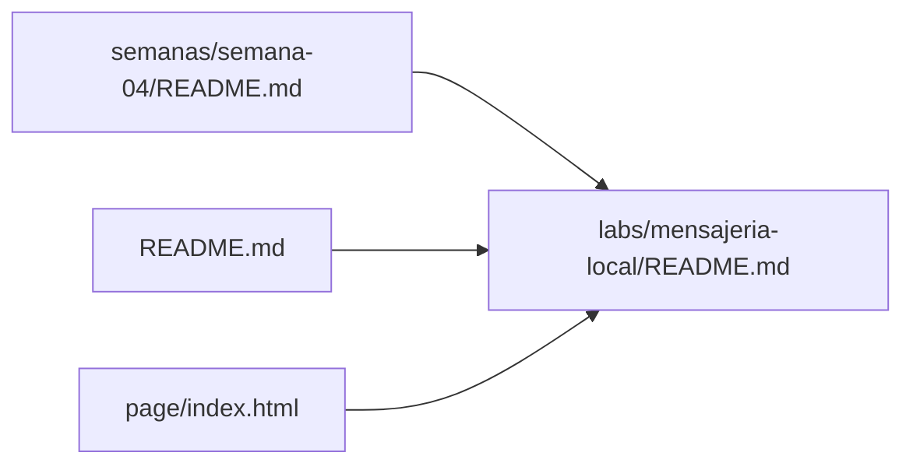
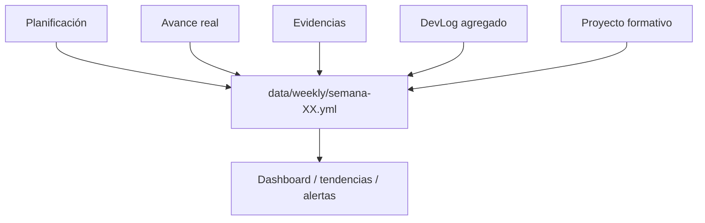

# Canon transversal de repositorios docentes · 2026-2

Este documento define la **estructura y reglas comunes** de los repositorios docentes activos del semestre. La organización específica de cada asignatura puede extender este canon, pero no debe contradecirlo sin una razón pedagógica explícita.

> Este archivo debe mantenerse homologado entre DSY1102, DSY1105 y DSY1107. El contenido específico de cada asignatura vive en sus propios README, guías y documentos de dominio.

## 1. Principios

1. **Una fuente canónica por artefacto.** Evitar dos copias activas del mismo contenido.
2. **La semana organiza la experiencia curricular; las carpetas transversales organizan el tipo de recurso.**
3. **El repositorio docente y el repositorio del estudiante son arquitecturas distintas.**
4. **GitHub contiene material consolidado y reproducible; Drive conserva material público/original y referencias; AVA mantiene su rol institucional.**
5. **La web prioriza navegación y experiencia del estudiante, no duplica innecesariamente el contenido.**
6. **Todo recurso que evoluciona durante el semestre debe tener un punto de entrada README o página equivalente.**
7. **La estructura debe seguir siendo comprensible en Semana 18.** Si una decisión funciona solo porque el docente recuerda dónde dejó algo, debe corregirse.
8. **El estado semanal debe ser medible con un contrato común.** Los agregados operacionales viven en `data/weekly/` y separan siempre plan de avance real.
9. **Los diagramas técnicos consumen el estándar corporativo vigente.** Este repositorio aplica `STD-ENG-DIAG-001 — Diagramming & Visual Representation Standard` de ADÜMÜN; no redefine localmente su orden de herramientas ni sus reglas de visualización.

## 2. Estructura base

```text
/
├── README.md
├── .github/
│   └── workflows/
├── docs/
│   └── README.md
├── data/
│   └── weekly/
│       ├── README.md
│       └── semana-XX.yml
├── semanas/
│   ├── README.md
│   ├── semana-01/
│   ├── semana-02/
│   └── ...
├── examples/
│   └── README.md
├── labs/
│   └── README.md
├── proyecto-formativo/
│   └── README.md
└── page/
```

Carpetas como `practica/`, `desafios/`, `assets/`, `scripts/` u otras se agregan **cuando la naturaleza de la asignatura las necesita**.

## 3. Responsabilidad de cada carpeta

### `semanas/`

Es el **mapa curricular**. Cada `semana-XX/` indica qué corresponde estudiar/hacer esa semana y enlaza los recursos canónicos.

Una semana puede contener:

- guías propias de esa semana;
- resúmenes por sección;
- enlaces a ejemplos;
- enlaces a práctica;
- enlaces a labs;
- checkpoint del proyecto formativo;
- material complementario estrictamente semanal.

**No debe convertirse en el único lugar físico de recursos que después necesitan consultarse transversalmente.**

### `examples/`

Contiene o indexa **ejemplos demostrativos reutilizables**. Si el código es un ejemplo y no una entrega/laboratorio, su hogar canónico es `examples/`.

Puede organizarse por semana cuando ayude a localizar el momento curricular:

```text
examples/
├── README.md
├── semana-01/
├── semana-02/
└── ...
```

### `labs/`

Contiene **laboratorios integradores** con identidad propia. Cada lab debe tener su `README.md` y todos los archivos necesarios para reproducirlo.

```text
labs/
├── README.md
├── nombre-lab-1/
└── nombre-lab-2/
```

La semana correspondiente **enlaza** al lab; no se mantiene una segunda copia del mismo laboratorio dentro de `semanas/`.

### `proyecto-formativo/`

Contiene el software o dominio longitudinal de la asignatura.

Regla general:

```text
proyecto-formativo/
├── README.md
├── ROADMAP-SEMANAL.md        # cuando corresponda
├── <proyecto-vivo>/          # estado actual reutilizable
├── checkpoints/              # snapshots/hitos cuando aporten valor
└── guias/                    # instrucciones históricas por semana, si son necesarias
```

No usar simultáneamente nombres ambiguos como `semana-02/` y `checkpoint-semana-02/` para representar cosas distintas sin explicitar su función. Las rutas históricas pueden mantenerse solo como **compatibilidad de navegación**, nunca con una segunda copia activa del código o guía canónica.

### `docs/`

Documentación transversal: decisiones pedagógicas/técnicas, estrategias, glosarios, referencias a estándares externos aplicados y conocimiento que no pertenece a una única semana.

Los estándares corporativos consumidos por el curso deben **referenciarse**, no copiarse ni redefinirse como fuente normativa local.

### `data/weekly/`

Contiene el **estado agregado y procesable de cada semana**, bajo el contrato definido en `docs/ESTANDAR-ESTADISTICAS-SEMANALES.md`.

Reglas:

- mismo esquema en DSY1102, DSY1105 y DSY1107;
- un `semana-XX.yml` por semana curricular;
- múltiples secciones se registran dentro del mismo archivo;
- plan y avance real se mantienen separados;
- valores desconocidos se registran como `null`;
- no se guardan nombres, notas individuales ni datos personales;
- las particularidades viven en `course_specific`.

Esta carpeta es la fuente para estadísticas, dashboards y análisis longitudinales. No reemplaza la bitácora docente ni los DevLogs individuales.

### `page/`

Portal web para estudiantes. Debe responder primero:

1. ¿Qué corresponde esta semana?
2. ¿Dónde estudio?
3. ¿Dónde practico?
4. ¿Qué lab/proyecto corresponde?
5. ¿Qué es opcional o de profundización?

La web puede presentar enunciados canónicos cuando esa experiencia sea superior a Markdown, pero entonces los Markdown deben actuar como índice/enlace, no como una segunda copia divergente.

## 4. Liberación curricular

El material se libera por **semana curricular**, no por el minuto exacto alcanzado en una sesión.

Si la semana actual es `N`, debe existir acceso coherente al material correspondiente hasta `N`, aunque una sección vaya algunas horas detrás.

Las diferencias reales entre secciones se registran en resúmenes/planificación específicos, sin fragmentar el material común.

## 5. Separación entre fuente y navegación

Un mismo recurso puede aparecer en varias rutas de navegación, pero debe tener **un único hogar canónico**.

Ejemplo:



Tres accesos; un solo laboratorio.

## 6. Proyecto formativo

Cada asignatura puede tener un proyecto o dominio longitudinal. Debe:

- reutilizar lo construido previamente;
- evolucionar cuando aparece una nueva necesidad curricular;
- evitar reinicios artificiales semana a semana;
- diferenciar el **proyecto vivo**, las **guías de trabajo** y los **checkpoints históricos**;
- mantenerse separado de las soluciones de evaluaciones sumativas.

## 7. Web y experiencia del estudiante

La portada debe privilegiar **“Esta semana”** sobre el catálogo completo.

Patrón recomendado:

```text
Esta semana
1. Aprende
2. Observa ejemplos
3. Practica
4. Realiza el lab / checkpoint
5. Profundiza (opcional)
```

El roadmap completo puede existir, pero no debe competir visualmente con lo que el alumno necesita hacer hoy.

## 8. Reconciliación semanal

Antes de abrir una nueva semana se revisa, como mínimo:

- [ ] `README.md` raíz y semana actual correctos;
- [ ] `semanas/semana-XX/` creado y enlazado;
- [ ] `examples/` reconciliado si hubo ejemplos nuevos;
- [ ] `labs/` reconciliado si hubo laboratorio nuevo;
- [ ] `proyecto-formativo/` actualizado si hubo checkpoint/incremento;
- [ ] `practica/` o desafíos actualizados cuando la asignatura los use;
- [ ] portal web actualizado;
- [ ] Material Público/Drive actualizado cuando corresponda;
- [ ] enlaces internos sin apuntar a ubicaciones obsoletas;
- [ ] material liberado hasta la semana curricular vigente;
- [ ] `data/weekly/semana-XX.yml` reconciliado con planificación, avance real, evidencias, DevLog agregado, proyecto formativo y deuda siguiente.

## 9. Regla de no duplicación

Antes de crear un archivo nuevo, responder:

> ¿Esto es una nueva fuente o solamente otra forma de acceder a una fuente existente?

Si es acceso, se crea un enlace/índice. Si es fuente, se define explícitamente su hogar canónico.

## 10. Estadísticas y trazabilidad

El contrato estadístico común permite comparar cursos sin borrar sus diferencias pedagógicas.



Las estadísticas nunca sustituyen la interpretación docente: sirven para detectar diferencias de avance, deuda acumulada, participación y bloqueos que merecen revisión.

## 11. Extensiones por asignatura

Este canon admite especializaciones:

- **DSY1102:** práctica de clase, laboratorios, PetCare y grandes desafíos progresivos.
- **DSY1105:** Kotlin/Android, PocketLog y evolución de consola → app móvil → persistencia/REST.
- **DSY1107:** labs del repositorio locales, autocontenidos e independientes; los ejercicios/labs cloud oficiales permanecen en AVA; RegistrApp recibe por separado la transferencia al proyecto formativo.

Estas especializaciones complementan el canon; las reglas generales anteriores se mantienen.

## 12. Conformidad con estándares externos

Este canon puede declarar qué estándares externos aplica, pero no se convierte por ello en su fuente normativa.

Para diagramas y representación visual, este repositorio consume:

- `STD-ENG-DIAG-001@0.1.0-draft — Diagramming & Visual Representation Standard`
- fuente normativa: `adumun/platform-standards/engineering/STD-ENG-DIAG-001-DIAGRAMMING-AND-VISUAL-REPRESENTATION-STANDARD.md`

Los artefactos del curso deben aplicar el estándar vigente o documentar una desviación concreta cuando exista una razón pedagógica/técnica para ello.
