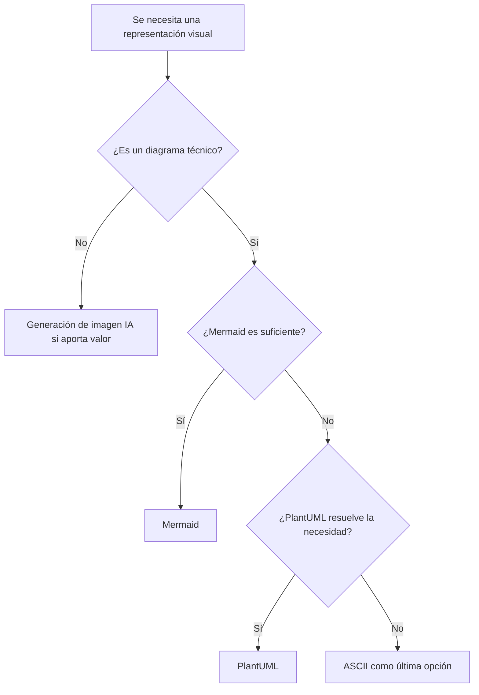

# Estándar transversal de diagramas y visualización

Este estándar aplica a documentación docente, técnica, de evaluaciones, labs, examples, proyecto formativo y material de apoyo versionado en los repositorios del semestre.

## Orden de preferencia

1. **Mermaid** como formato canónico por defecto.
2. **PlantUML** cuando Mermaid no pueda expresar adecuadamente el diagrama o el entorno de destino no soporte Mermaid.
3. **ASCII** únicamente como última opción cuando no sea viable utilizar Mermaid ni PlantUML.
4. **Generación de imagen por IA** cuando el objetivo sea principalmente visual, ilustrativo, conceptual o comunicacional y no un diagrama técnico que deba evolucionar junto al código/documentación.

## Regla canónica

Los diagramas técnicos deben ser textuales y versionables siempre que sea razonablemente posible.

Esto permite revisión en Git, trazabilidad, mantenimiento junto al código y reutilización en Markdown/GitHub.

## Mermaid

Usar Mermaid de forma preferente para:

- arquitectura;
- flujos;
- secuencias;
- estados;
- relaciones entre entidades;
- timelines;
- journeys;
- Git graphs;
- representaciones C4 cuando Mermaid sea suficiente.

## PlantUML

Usar como fallback justificado cuando:

- se necesite mayor expresividad UML;
- Mermaid no cubra la necesidad;
- la plataforma objetivo no soporte Mermaid y sí PlantUML.

## ASCII

ASCII no es el formato documental canónico salvo imposibilidad técnica. Puede utilizarse en consola, explicaciones efímeras o entornos donde no exista capacidad de renderizar Mermaid/PlantUML.

Cuando se modifique un documento existente con un diagrama ASCII que Mermaid pueda representar razonablemente, se debe migrar progresivamente a Mermaid.

## Generación de imagen por IA

Usar cuando el valor principal esté en la comunicación visual y no en una fuente técnica exacta, por ejemplo:

- infografías;
- láminas pedagógicas;
- representaciones conceptuales;
- ilustraciones de escenarios;
- visualizaciones para presentación.

Una imagen generada por IA no reemplaza la fuente técnica Mermaid/PlantUML cuando se requiere precisión arquitectónica.

## Anti-patrones

Evitar:

- arquitectura importante solo en PNG/JPG;
- diagramas manuales duplicados que puedan divergir de la fuente textual;
- ASCII por conveniencia cuando Mermaid está disponible;
- imágenes generadas por IA como única fuente para topologías o flujos que requieren exactitud técnica.
