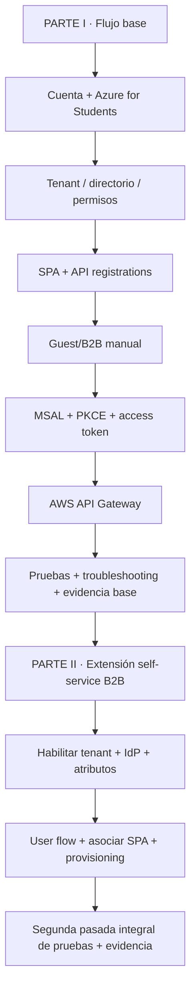
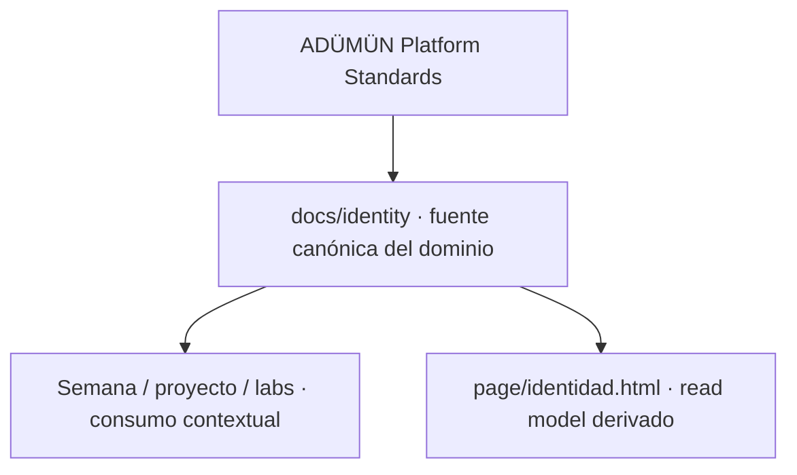

# Identidad y acceso · DSY1107

Este dominio concentra la documentación canónica relacionada con **Identity as a Service**, Microsoft Entra ID, usuarios internos/externos, OAuth2/OIDC, MSAL, emisión de tokens, protección de APIs y extensiones de lifecycle como self-service B2B.

> La documentación de este dominio es canónica para el detalle técnico. La web del curso es una vista derivada y navegable; si difiere de estos documentos, debe considerarse desactualizada y corregirse.

## Comienza aquí

### Microsoft Entra ID · ruta completa

→ [Guía completa por etapas](./entra-guia-completa/README.md)

La guía se divide en dos partes.

La extensión self-service **no se intercala antes de MSAL**. Se trabaja después de cerrar el flujo base para que el alumno pueda aislar provisioning de autenticación/token/API.

### Caso específico · usuarios externos + SPA + API Gateway

→ [Referencia extendida](./entra-usuarios-externos-spa-api-gateway.md)

Úsala cuando el síntoma sea, por ejemplo, **“al dueño del tenant le funciona pero a un compañero no”** o cuando sea necesario diagnosticar issuer, audience, scopes y JWT Authorizer.

## Navegación por contexto

- [Semana 4 · guía operativa](../../semanas/semana-04/00a-guia-operativa-autenticacion-entra.md)
- [RegistrApp · transferencia del patrón](../../proyecto-formativo/semana-04/guia-operativa-identidad-entra.md)
- [Firebase Auth · comparación IDaaS](../../labs/firebase-auth-miniapp/README.md)
- [Portal web · Identidad y acceso](../../page/identidad.html)

## Autoridad y publicación

Este repositorio consume `STD-ENG-DOC-001` para documentación/publicación y `STD-ENG-DIAG-001` para diagramación. No redefine esos estándares localmente.

## Regla de actualización

Cuando cambie materialmente una etapa, flujo, prerequisito, permiso o frontera de seguridad de este dominio:

1. actualizar primero el documento canónico correspondiente;
2. actualizar enlaces/contextos que consumen esa información;
3. actualizar la superficie web derivada en el mismo cambio cuando el conocimiento sea relevante para estudiantes;
4. mantener diagramas técnicos en Mermaid cuando sea viable;
5. nunca publicar secretos, tokens reutilizables, passwords, client secrets ni credenciales cloud.
