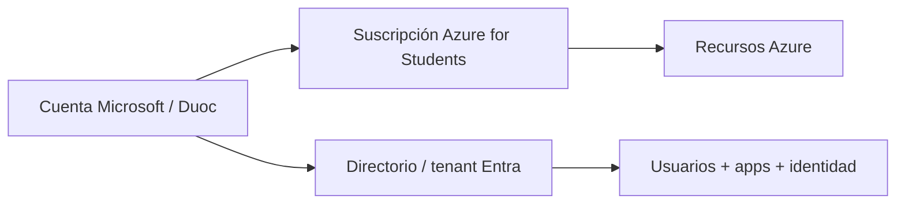

# Etapa 0 · Cuenta Duoc y Azure for Students

## Objetivo

Confirmar que el estudiante está usando la cuenta correcta y que Azure for Students está realmente habilitado antes de tocar Microsoft Entra ID.

## Contexto de DSY1107

Los estudiantes usan su **cuenta institucional Duoc** para activar **Azure for Students ofrecido directamente por Microsoft**. No se debe asumir que existe un tenant especial administrado por Duoc para este laboratorio ni permisos administrativos sobre el tenant institucional.

## Paso 1 · Iniciar sesión con la cuenta correcta

1. Abrir una ventana privada/incógnito para evitar mezclar cuentas Microsoft personales e institucionales.
2. Ingresar a Azure Portal.
3. Autenticarse con la cuenta institucional Duoc que el estudiante utilizó para activar Azure for Students.
4. Confirmar en el selector de cuenta que no quedó activa una cuenta Outlook/Hotmail personal.

## Paso 2 · Confirmar Azure for Students

En Azure Portal:

1. buscar **Subscriptions**;
2. abrir la lista de suscripciones;
3. comprobar que exista una suscripción activa asociada al beneficio de estudiante;
4. revisar que su estado sea `Enabled` o equivalente activo.

### Si no aparece ninguna suscripción

No continuar con Entra todavía. Revisar:

- que se inició sesión con la misma cuenta usada al activar Azure for Students;
- que la activación finalizó correctamente;
- que el portal no está mostrando otro directorio;
- que no se agotó o suspendió el beneficio.

## Concepto clave

**Suscripción Azure ≠ tenant Entra.**

La suscripción habilita consumo de recursos Azure. El tenant/directorio administra identidades y aplicaciones. Que el alumno tenga una suscripción no implica automáticamente que sea administrador de cualquier tenant donde aparezca su cuenta.

## Paso 3 · Registrar datos básicos para diagnóstico

Sin publicar secretos, anotar en el DevLog:

- cuenta utilizada;
- nombre de la suscripción visible;
- Subscription ID parcialmente oculto si se necesita evidencia;
- nombre del directorio actual;
- Tenant ID parcialmente oculto si se necesita evidencia.

Nunca publicar tokens, credenciales ni datos reutilizables.

## Checkpoint E0

No avanzar hasta poder afirmar:

- [ ] estoy con la cuenta Duoc correcta;
- [ ] Azure for Students aparece activo;
- [ ] sé distinguir mi suscripción de mi tenant/directorio;
- [ ] sé qué directorio está seleccionado actualmente.

→ Continúa con [Etapa 1 · Directorio, tenant y permisos](./01-tenant-directorio-permisos.md).
