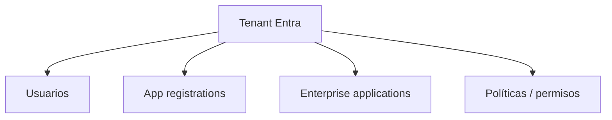
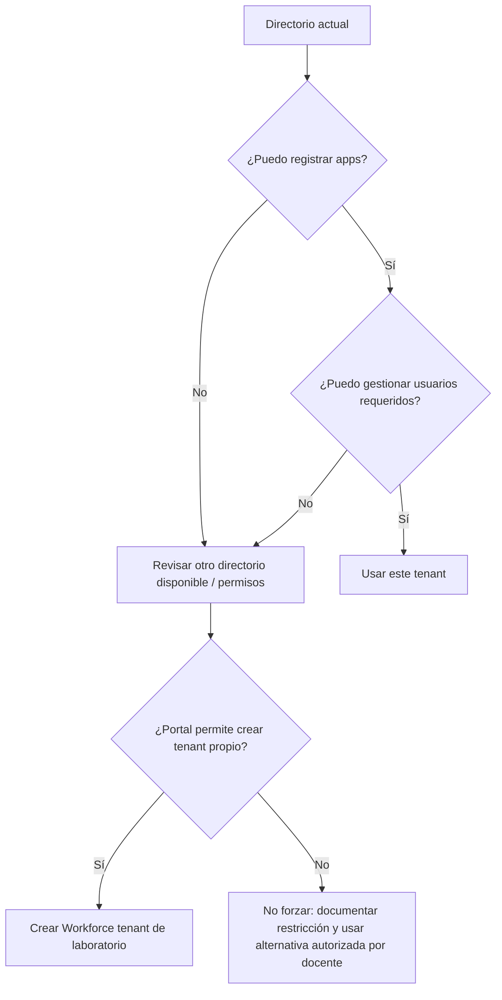

# Etapa 1 · Directorio, tenant y permisos

## Objetivo

Asegurar que el estudiante está trabajando en un tenant donde realmente puede registrar aplicaciones y administrar los usuarios necesarios para el laboratorio.

## Antes de empezar: qué es un tenant

Un tenant de Microsoft Entra ID es un directorio aislado de identidades, aplicaciones y configuración de acceso.

Cambiar de directorio cambia el contexto administrativo.

## Paso 1 · Identificar el directorio actual

1. Entrar a Azure Portal o Microsoft Entra admin center.
2. Abrir el selector de **Directories + subscriptions** / directorio actual.
3. Anotar el nombre del directorio y Tenant ID.
4. Verificar si aparecen varios directorios.

### Señal de error frecuente

El estudiante tiene Azure for Students activo, pero está mirando un directorio donde su cuenta es solo un usuario normal y por eso:

- no puede crear App Registrations;
- no puede invitar usuarios;
- no ve opciones administrativas;
- recibe `Insufficient privileges` o equivalente.

No intentar resolver eso creando secretos, cambiando código o tocando AWS. El problema todavía está en identidad/administración.

## Paso 2 · Verificar si puede registrar aplicaciones

Ir a:

`Microsoft Entra ID → App registrations`

Comprobar si aparece **New registration** y si puede iniciar una creación sin error de permisos.

Microsoft requiere permisos suficientes para registrar aplicaciones. En muchos tenants los usuarios miembros pueden registrar apps por defecto, pero una organización puede deshabilitar esa capacidad.

### Si `New registration` no aparece o falla

Posibles causas:

1. directorio incorrecto;
2. política del tenant que impide a usuarios normales registrar aplicaciones;
3. la cuenta es Guest en ese tenant;
4. falta un rol como Application Developer/Application Administrator o equivalente;
5. el tenant es institucional y administrado por terceros.

Para DSY1107, **no asumir que Duoc otorgará roles administrativos** en su tenant institucional.

## Paso 3 · Verificar capacidad para invitar usuarios externos

Ir a:

`Microsoft Entra ID → Users → New user`

Comprobar si existe **Invite external user**.

Si la opción está ausente o devuelve error, el usuario actual no posee la capacidad requerida en ese directorio o la política de colaboración externa la restringe.

## Paso 4 · ¿Debo crear otro tenant?

Primero: **no asumir que sí**.

Microsoft ha restringido la creación de nuevos Workforce tenants en determinados escenarios gratuitos/trial. Azure for Students tampoco debe interpretarse como permiso automático para crear tenants adicionales.

### Decisión

### Si el portal permite crear un tenant propio

Solo entonces:

1. `Microsoft Entra ID → Overview → Manage tenants`;
2. **Create**;
3. seleccionar **Microsoft Entra ID / Workforce**;
4. definir un nombre de organización identificable para el laboratorio;
5. definir dominio inicial `*.onmicrosoft.com`;
6. usar Chile como región cuando corresponda;
7. crear;
8. cambiar explícitamente al nuevo directorio;
9. volver a verificar App registrations y Users.

### Si no permite crear tenant

No es necesariamente un error del alumno. Puede ser una restricción vigente del producto/licenciamiento o del tenant desde el que opera. Registrar el error exacto y trabajar con el directorio que permita completar el laboratorio según la indicación docente.

## Paso 5 · Confirmar propiedad/control de la App Registration

Una vez creada una aplicación, revisar `Owners` y comprobar que el alumno creador aparezca como owner. Esto permite administrar esa aplicación aunque no sea administrador global del directorio, dentro de los límites de las políticas del tenant.

## Checkpoint E1

No avanzar hasta comprobar:

- [ ] conozco el Tenant ID que usaré;
- [ ] estoy en el directorio correcto;
- [ ] puedo abrir App registrations;
- [ ] puedo crear una App Registration o tengo explícitamente resuelta esa restricción;
- [ ] puedo gestionar/invitar los usuarios que exige el ejercicio;
- [ ] entiendo que Azure for Students no equivale a permisos administrativos del tenant institucional.

→ Continúa con [Etapa 2 · App Registration de la SPA](./02-app-registration-spa.md).
