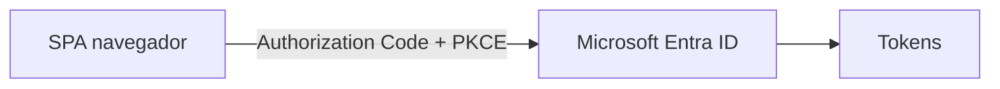

# Etapa 2 · App Registration de la SPA

## Objetivo

Registrar correctamente el frontend SPA como **public client** single-tenant y dejar preparado el flujo Authorization Code + PKCE.

## Paso 1 · Crear App Registration

En Microsoft Entra admin center:

1. `Entra ID → App registrations`;
2. seleccionar **New registration**;
3. nombre sugerido: `DSY1107-<grupo>-SPA`;
4. en **Supported account types**, seleccionar:

`Accounts in this organizational directory only (Single tenant)`

5. registrar la aplicación.

## Paso 2 · Guardar identificadores

Desde `Overview`, registrar en configuración local:

- **Application (client) ID**;
- **Directory (tenant) ID**.

No confundir ambos valores.

```text
clientId = identifica la aplicación SPA
tenantId = identifica el directorio Entra
```

## Paso 3 · Configurar plataforma SPA

Ir a:

`Authentication → Add a platform → Single-page application`

Agregar el redirect URI real del frontend.

Ejemplos:

```text
http://localhost:5173
http://localhost:3000
```

Debe coincidir exactamente con la URL usada por la aplicación, incluyendo protocolo, host, puerto y path.

## Paso 4 · No crear client secret

Una SPA corre en el navegador. Cualquier secreto embebido en JavaScript deja de ser secreto.

Por tanto:

- no crear client secret para autenticar la SPA;
- no versionar secretos;
- usar Authorization Code + PKCE mediante MSAL.



## Paso 5 · Configurar authority single-tenant

La configuración base debe apuntar al tenant concreto:

```text
https://login.microsoftonline.com/<TENANT_ID>
```

Durante esta etapa evitar `common` y `organizations`, porque el objetivo es comprender explícitamente el directorio donde viven Member y Guest.

## Paso 6 · Revisar Enterprise Application

Registrar una App Registration genera también una representación de servicio en el tenant.

Ir a:

`Entra ID → Enterprise applications`

Buscar la aplicación y verificar que existe.

Si posteriormente los usuarios invitados pueden autenticarse en el tenant pero no acceder a la aplicación, revisar especialmente:

`Properties → Assignment required?`

Si está habilitado, será necesario asignar usuarios o grupos explícitamente.

## Checkpoint E2

- [ ] App Registration creada;
- [ ] single-tenant;
- [ ] client ID identificado;
- [ ] tenant ID identificado;
- [ ] plataforma SPA configurada;
- [ ] redirect URI exacto;
- [ ] sin client secret en frontend;
- [ ] authority apuntando al tenant correcto.

→ Continúa con [Etapa 3 · API propia, scopes y permisos](./03-api-scopes.md).
