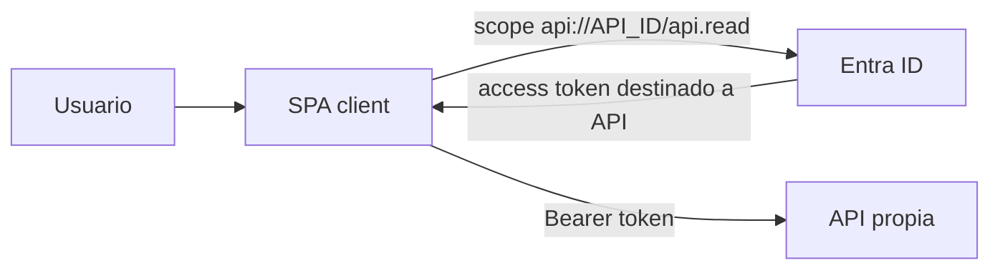

# Etapa 3 · Registrar la API propia y exponer scopes

## Objetivo

Hacer que la SPA solicite un **access token para la API del proyecto**, no un token destinado a Microsoft Graph u otro recurso.

## Paso 1 · Crear App Registration para la API

1. `Entra ID → App registrations → New registration`;
2. nombre sugerido: `DSY1107-<grupo>-API`;
3. seleccionar **Single tenant**;
4. crear.

Registrar su **Application (client) ID**. Este identificador corresponde al recurso API y es distinto al client ID de la SPA.

## Paso 2 · Exponer la API

En la App Registration de la API:

1. ir a **Expose an API**;
2. configurar **Application ID URI**;
3. usar inicialmente:

```text
api://<API_CLIENT_ID>
```

## Paso 3 · Crear scope delegado

Crear un scope, por ejemplo:

```text
api.read
```

Ejemplo de scope completo:

```text
api://<API_CLIENT_ID>/api.read
```

Para una segunda capacidad se podría agregar posteriormente `api.write`, pero no agregar permisos que todavía no se necesiten.

## Paso 4 · Dar a la SPA permiso sobre la API propia

En la App Registration de la SPA:

1. `API permissions`;
2. `Add a permission`;
3. `My APIs`;
4. seleccionar la API del grupo;
5. seleccionar **Delegated permissions**;
6. marcar `api.read`;
7. agregar el permiso.

## Paso 5 · Entender qué recurso debe aparecer en el token



Un access token es emitido **para un recurso/audience**. Que un token sea válido criptográficamente no significa que sirva para cualquier API.

## Paso 6 · No usar Microsoft Graph como atajo

`User.Read` y tokens destinados a Graph sirven para Microsoft Graph. No constituyen autorización para el backend del proyecto.

## Checkpoint E3

- [ ] existe App Registration separada para la API;
- [ ] la API tiene Application ID URI;
- [ ] existe al menos el scope `api.read`;
- [ ] la SPA tiene delegated permission sobre ese scope;
- [ ] el grupo puede explicar la diferencia SPA client vs API resource;
- [ ] el grupo sabe por qué un token de Graph no debe enviarse a su API.

→ Continúa con [Etapa 4 · Usuarios externos](./04-usuarios-externos.md).
