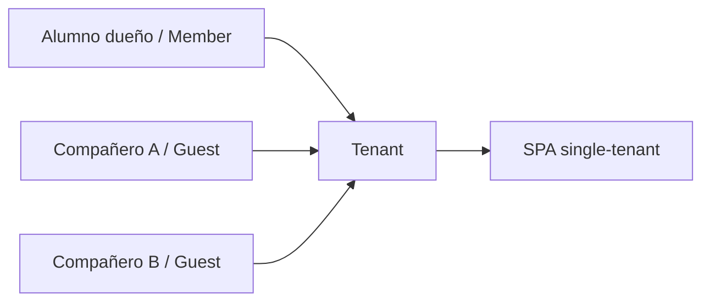
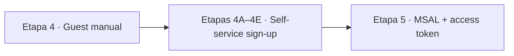

# Etapa 4 · Habilitar usuarios externos Guest/B2B

## Objetivo

Permitir que los compañeros del grupo puedan autenticarse contra la SPA single-tenant sin convertir la aplicación en multitenant.

> Esta es la **primera forma** de incorporar usuarios externos. Debe completarse antes de estudiar auto-registro. La secuencia pedagógica es: `Guest manual → self-service Guest → MSAL/token/API`.

## Paso 1 · Invitar al compañero

En Microsoft Entra admin center:

1. `Entra ID → Users`;
2. `New user`;
3. `Invite external user`;
4. ingresar correo del compañero;
5. definir nombre visible;
6. enviar invitación.

El usuario debe aparecer como **Guest**.

## Paso 2 · Aceptar invitación

El compañero debe:

1. abrir el correo de invitación;
2. seleccionar el enlace de aceptación;
3. completar el flujo de autenticación con su identidad de origen;
4. aceptar las condiciones/consentimiento cuando corresponda.

## Paso 3 · Verificar estado

En el usuario invitado revisar:

- `User type = Guest`;
- estado de invitación;
- que no permanezca en `PendingAcceptance`;
- que el usuario no esté bloqueado.

Si está pendiente, reenviar la invitación.

## Paso 4 · Repetir por cada integrante que no sea Member

No basta con invitar a un integrante y asumir que los demás funcionarán. Cada identidad externa debe existir en el tenant si la aplicación sigue siendo single-tenant.

## Paso 5 · Revisar asignación a Enterprise Application si aplica

Si la Enterprise Application tiene `Assignment required? = Yes`, asignar explícitamente a los usuarios o grupos requeridos.

Ruta:

`Enterprise applications → <app> → Users and groups`

## Modelo mental

## Lo que NO hacemos en esta etapa

No cambiar Supported account types a multitenant solo para evitar invitaciones.

Single-tenant + Guests permite enseñar de forma controlada:

- pertenencia al directorio;
- identidad externa;
- lifecycle de invitación;
- frontera entre tenant y aplicación.

## Checkpoint E4

- [ ] dueño del tenant entra como Member;
- [ ] al menos un compañero aparece como Guest;
- [ ] invitación aceptada;
- [ ] compañero puede iniciar el flujo de login;
- [ ] si existe `Assignment required`, el usuario está asignado;
- [ ] nadie cambió la app a multitenant para resolver un problema de invitación.

## Siguiente aprendizaje: eliminar la invitación manual

Una vez que este checkpoint está verde, **no saltar todavía a MSAL**. Primero estudiar cómo Entra External ID puede aprovisionar al Guest mediante un flujo de auto-registro asociado a la aplicación.

→ Continúa con [Etapa 4A · Evolución: auto-registro de usuarios externos](./04a-self-service-introduccion.md).
