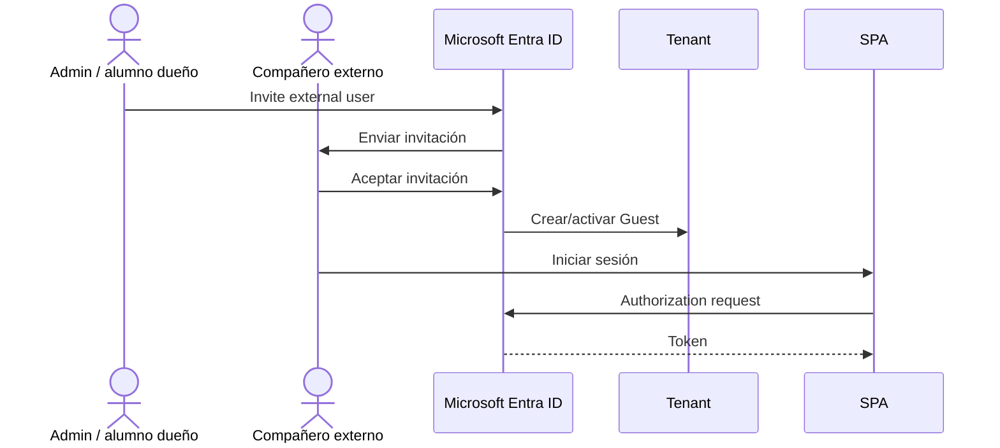
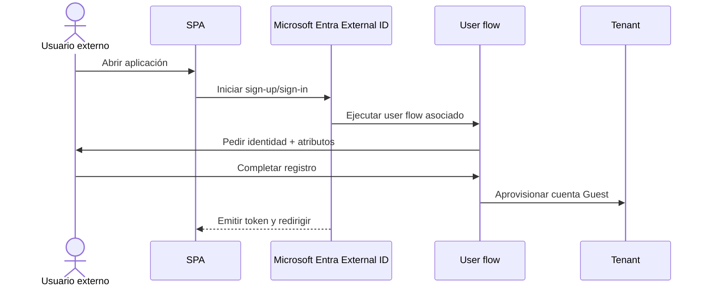

# Etapa 4A · Evolución: auto-registro de usuarios externos

## Objetivo

Comprender la diferencia entre **invitar manualmente** a un usuario Guest/B2B y permitir que una persona externa se **auto-registre** en una aplicación mediante un user flow de Microsoft Entra External ID.

> Esta etapa se trabaja **después** de completar la Etapa 4 manual. Primero hay que entender qué es un Guest, cómo entra al tenant y qué controla el directorio. Luego se automatiza ese alta.

## Qué cambia respecto de la invitación manual

### Invitación manual



### Self-service sign-up



## Idea clave

En ambos casos el resultado termina siendo una identidad externa gestionada por Entra, pero cambia **quién inicia el alta**:

```text
Invitación manual
admin conoce al usuario primero
→ lo invita
→ usuario acepta

Self-service
usuario llega a la aplicación
→ inicia registro
→ Entra crea la cuenta Guest al completar el flujo
```

## Qué NO significa self-service

No significa:

- que el tenant quede abierto a cualquier recurso;
- que el usuario obtenga permisos administrativos;
- que desaparezcan issuer, audience, scopes o autorización;
- que la aplicación tenga que ser multitenant;
- que la SPA cree usuarios por código propio.

El user flow controla **la experiencia de alta** asociada a aplicaciones concretas.

## Cuándo usar cada modelo en DSY1107

| Modelo | Qué enseña | Uso recomendado |
|---|---|---|
| Guest manual | tenant, Member/Guest, invitación, aceptación | obligatorio primero |
| Self-service Guest | lifecycle automatizado, user flow, atributos, IdP | segunda etapa |
| External tenant / CIAM | identidad orientada a clientes | comparación/avance posterior |

## Gate E4A

Antes de continuar:

- [ ] Etapa 4 manual completada;
- [ ] al menos un Guest manual funciona;
- [ ] se comprende Member vs Guest;
- [ ] se comprende que self-service no equivale a multitenant;
- [ ] se puede explicar quién crea/provisiona la identidad en cada flujo.

→ Continúa con [Etapa 4B · Habilitar self-service sign-up en el tenant](./04b-self-service-habilitar-tenant.md).
