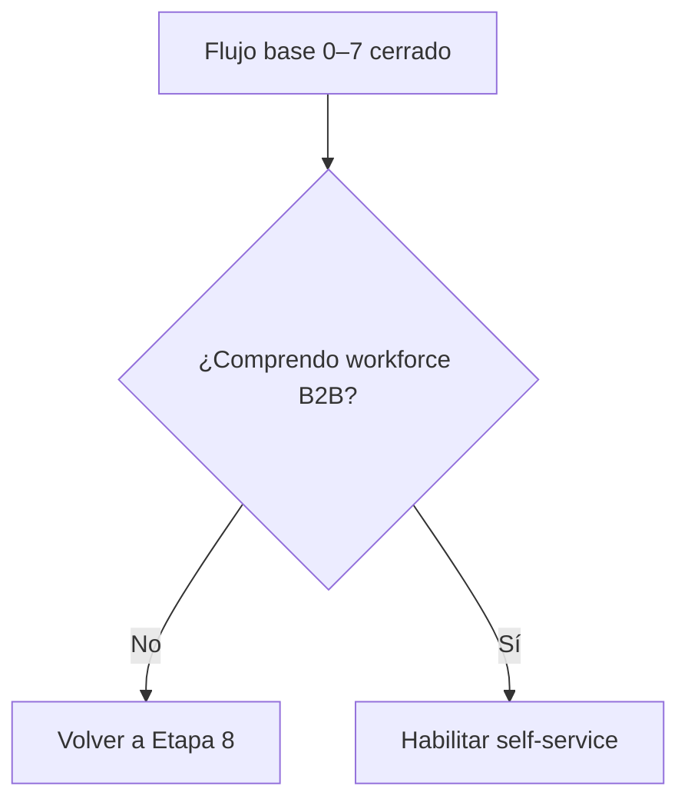
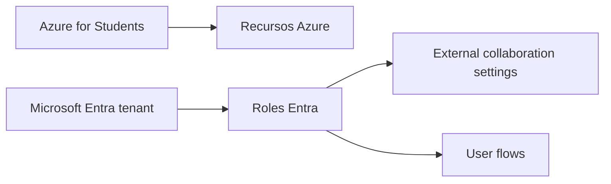
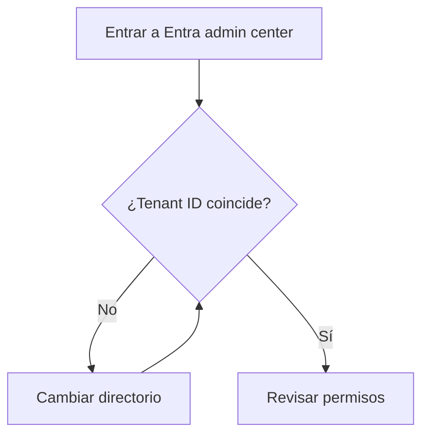
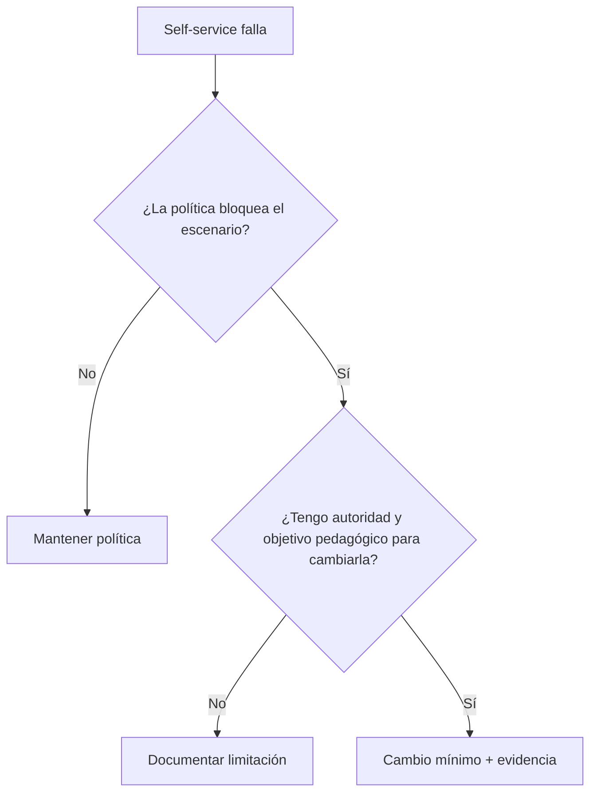
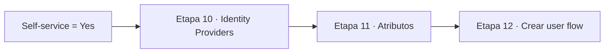

# Etapa 9 · Habilitar self-service sign-up en el workforce tenant

## Objetivo

Habilitar en el tenant de Microsoft Entra ID la capacidad de crear **user flows de auto-registro B2B para usuarios externos**.

> Esta guía usa un **workforce tenant**. El resultado del auto-registro será un usuario externo/Guest dentro del mismo directorio. No estamos creando un `external tenant` de CIAM.

---

## 0 · Antes de tocar la configuración

Debes haber completado:

- Etapas 0–7 del flujo base;
- Etapa 8: comprensión de manual vs self-service.



---

## 1 · Roles y permisos: no confundir dos operaciones

Microsoft documenta al menos **User Administrator** para crear/configurar el user flow de self-service.

Sin embargo, la configuración de **External collaboration settings** puede requerir un rol con capacidad para modificar la política de colaboración externa, por ejemplo roles administrativos apropiados como `Global Administrator` o `External Identity Provider Administrator`, según la configuración y permisos efectivos del tenant.

Por eso, no uses la frase “tengo Azure for Students, entonces tengo permiso”. Son capas distintas.



### Check rápido

Si puedes crear recursos Azure pero no puedes modificar External Identities, **eso no implica que Azure for Students esté malo**. Probablemente estás ante un problema de tenant/rol.

---

## 2 · Confirmar directorio correcto

1. Abrir Microsoft Entra admin center.
2. Revisar el directorio activo en la parte superior/datos de cuenta.
3. Confirmar que coincide con el tenant de la App Registration de DSY1107.
4. Abrir `Entra ID → Overview`.
5. comparar `Tenant ID` con el `Directory (tenant) ID` guardado anteriormente.

Resultado esperado:

```text
Tenant de Entra actual
=
Tenant usado por la SPA
```

Si no coincide, detenerse y cambiar de directorio.



---

## 3 · Confirmar que no estás operando como Guest en el tenant equivocado

Un alumno puede ver más de un directorio y terminar administrando la aplicación desde un contexto donde aparece como `Guest`.

Antes de continuar, revisa tu propio usuario en:

`Entra ID → Users`

Para el tenant que el grupo controla, identifica si eres `Member` o `Guest`.

Si eres Guest y las opciones administrativas están bloqueadas, no intentes resolverlo desde MSAL o JavaScript.

---

## 4 · Abrir External collaboration settings

Ruta:

`Entra ID → External Identities → External collaboration settings`

Busca:

`Enable guest self-service sign up via user flows`

### Si la opción no existe

No avances. Revisa:

1. estás en un **workforce tenant** correcto;
2. tienes rol suficiente;
3. no estás confundiendo el menú de un external tenant/CIAM;
4. no estás en otro directorio asociado a la cuenta;
5. la política del tenant no está bajo control de otro administrador.

---

## 5 · Habilitar self-service

Cambiar:

```text
Enable guest self-service sign up via user flows
```

A:

```text
Yes
```

Seleccionar **Save**.

No cierres inmediatamente la pantalla. Espera a que la operación confirme guardado y vuelve a leer el valor.

Debe permanecer `Yes` al refrescar/reingresar.

---

## 6 · Revisar restricciones de colaboración externa

En la misma zona de External Identities pueden existir controles que condicionen colaboración, por ejemplo:

- quién puede invitar invitados;
- restricciones por dominio;
- políticas B2B;
- configuraciones cross-tenant cuando la identidad proviene de otra organización Entra.

No cambies estas políticas indiscriminadamente para aprobar el lab.



Evita `allow all` como método de troubleshooting.

---

## 7 · Verificar que User flows está disponible

Ir a:

`Entra ID → External Identities → User flows`

Debe existir `New user flow`.

No crees todavía el flujo. Primero se preparan Identity Providers y atributos.



---

## 8 · Troubleshooting por síntoma

### “Veo External Identities, pero no puedo guardar”

Probable frontera: `rol / permisos administrativos`.

### “No veo User flows”

Revisar:

```text
tenant correcto
→ workforce tenant
→ self-service habilitado
→ permisos
```

### “Soy dueño de la suscripción Azure”

Eso no demuestra que tengas el rol Entra requerido. Azure RBAC y roles Microsoft Entra son modelos relacionados pero distintos.

### “Con otra cuenta sí aparece”

Comparar tenant activo, `User type`, roles asignados y directorio de origen.

---

## 9 · Evidencia mínima de esta etapa

Captura o registro sanitizado que demuestre:

- nombre del tenant, sin datos personales innecesarios;
- self-service habilitado;
- menú User flows disponible;
- rol/permisos comprendidos.

No publicar tokens, claves, passwords, códigos OTP ni credenciales cloud.

---

## Checkpoint E9

- [ ] estoy en un workforce tenant;
- [ ] Tenant ID coincide con la SPA;
- [ ] sé si mi usuario es Member o Guest;
- [ ] comprendo que Azure for Students no equivale a rol administrativo Entra;
- [ ] `Enable guest self-service sign up via user flows = Yes`;
- [ ] el valor persiste al refrescar;
- [ ] `External Identities → User flows` está disponible;
- [ ] no flexibilicé políticas de colaboración sin necesidad.

→ Continúa con [Etapa 10 · Preparar Identity Providers](./04b1-self-service-identity-providers.md).
