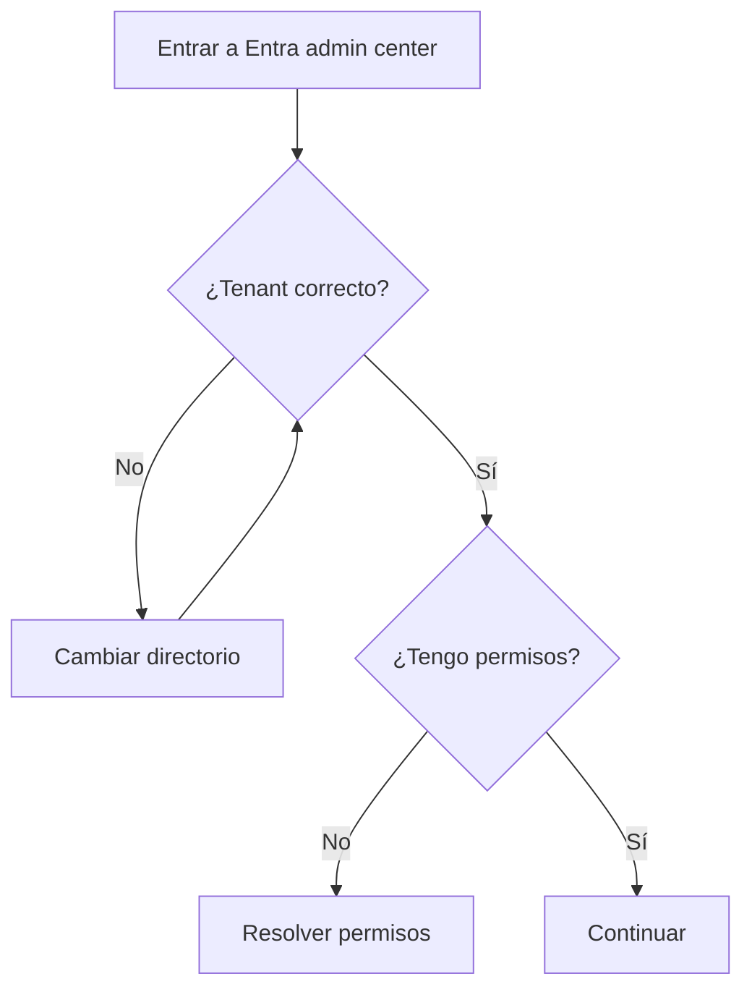

# Etapa 4B · Habilitar self-service sign-up en el tenant

## Objetivo

Habilitar en el tenant la capacidad de crear **user flows de auto-registro para usuarios externos**.

## Prerrequisito de permisos

Para esta configuración, el usuario debe tener permisos suficientes en Microsoft Entra ID. La documentación actual de Microsoft indica usar una cuenta con al menos rol **User Administrator** para crear/configurar el flujo de self-service sign-up.

Si la opción no aparece, está deshabilitada o no se puede guardar, **no continuar con MSAL ni con código**. El problema está en tenant/permisos.

## Paso 1 · Confirmar directorio correcto

1. Abrir Microsoft Entra admin center.
2. Revisar el directorio/tenant activo.
3. Confirmar que coincide con el tenant usado por la App Registration de DSY1107.
4. Anotar nuevamente:
   - `Directory (tenant) ID`;
   - nombre del tenant.

## Paso 2 · Ir a configuración de colaboración externa

Ruta:

`Entra ID → External Identities → External collaboration settings`

Buscar:

`Enable guest self-service sign up via user flows`

## Paso 3 · Habilitar

Cambiar a:

`Yes`

Luego seleccionar **Save**.

## Paso 4 · Verificar que la capacidad quedó disponible

Ir a:

`Entra ID → External Identities → User flows`

Debe aparecer la posibilidad de crear un nuevo user flow.

## Si no aparece la opción

Revisar en este orden:

1. tenant equivocado;
2. usuario sin rol suficiente;
3. cuenta operando como Guest dentro de otro directorio;
4. política del tenant que restringe colaboración externa;
5. configuración de external collaboration más restrictiva de lo esperado.

No intentar arreglarlo cambiando la SPA a multitenant.

## Checkpoint E4B

- [ ] tenant correcto seleccionado;
- [ ] permiso suficiente validado;
- [ ] `Enable guest self-service sign up via user flows = Yes`;
- [ ] configuración guardada;
- [ ] menú `External Identities → User flows` disponible.

→ Continúa con [Etapa 4C · Crear el user flow](./04c-self-service-crear-user-flow.md).
