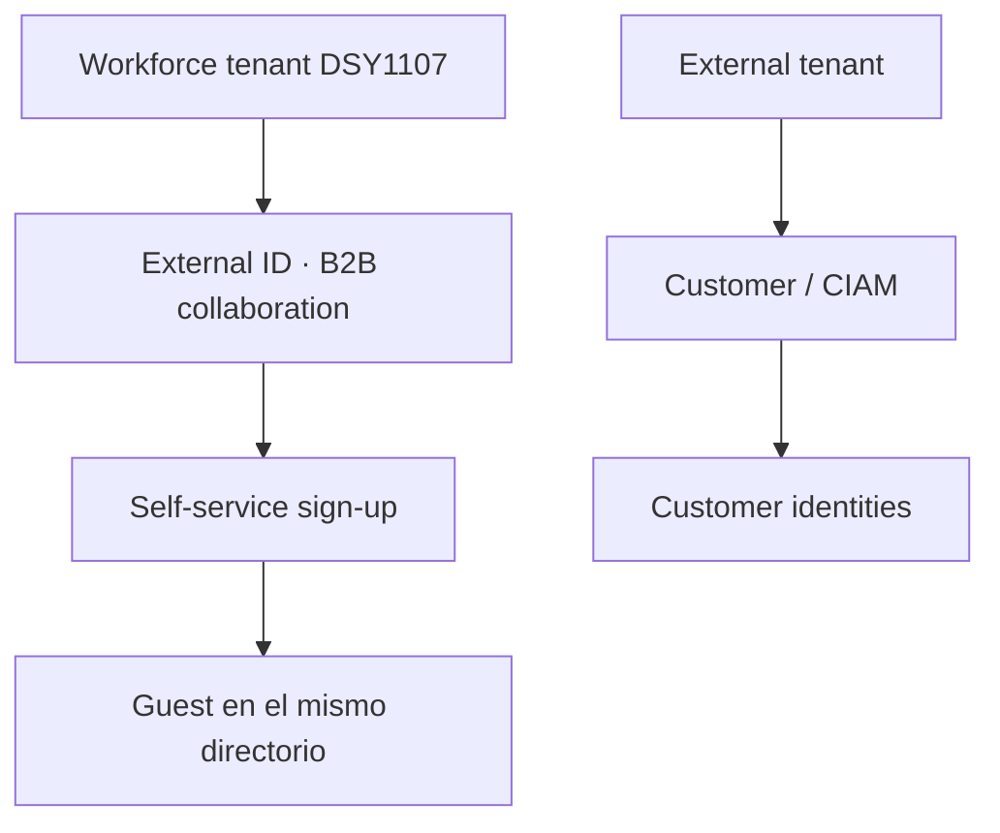
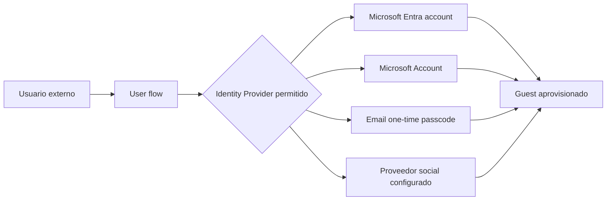
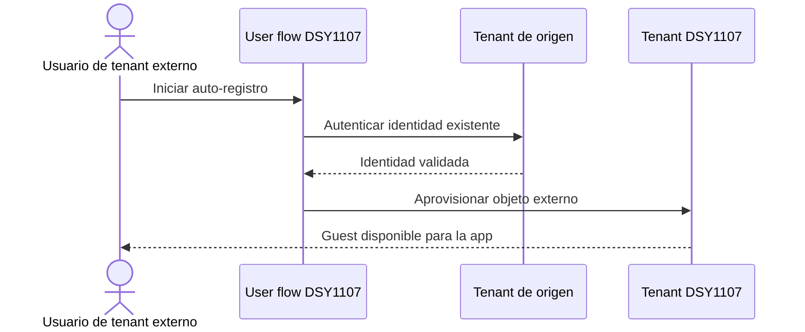
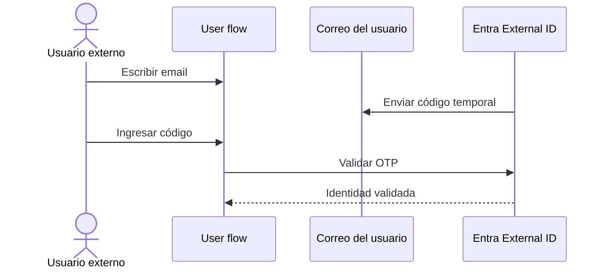
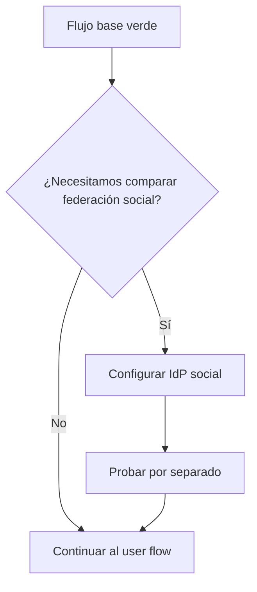

# Etapa 4B.1 · Preparar Identity Providers para self-service B2B

## Objetivo

Definir **con qué identidad podrá presentarse un tercero** durante el auto-registro antes de crear el user flow.

Esta parte pertenece al escenario de **B2B collaboration en un workforce tenant**. No confundirla con los user flows de un `external tenant` orientado a CIAM/clientes.



Para esta práctica seguimos la rama superior.

---

## 1 · Qué es un Identity Provider en este punto

El **Identity Provider (IdP)** es el sistema que comprueba la identidad que el tercero ya posee.

El user flow no tiene por qué inventar una contraseña nueva. Puede permitir que el usuario demuestre su identidad utilizando un proveedor existente.



---

## 2 · Camino base recomendado para DSY1107

Para la primera ejecución no habilites muchos proveedores simultáneamente.

Orden recomendado:

1. **Microsoft Entra account** como camino base;
2. comprobar el flujo completo;
3. opcionalmente agregar **Microsoft Account**;
4. opcionalmente experimentar con **Email one-time passcode**;
5. proveedores sociales solo cuando el flujo base ya esté verde.

La documentación de Microsoft indica que **Microsoft Entra ID es el proveedor predeterminado** para estos user flows de self-service B2B.

### Por qué comenzar así

Reduce variables durante el diagnóstico:

```text
un tenant
+ una aplicación
+ un user flow
+ un proveedor
+ un usuario nuevo
= fallo más fácil de localizar
```

---

## 3 · Microsoft Entra account

Este camino permite que una persona perteneciente a otra organización Microsoft Entra se autentique con su propia cuenta de trabajo/estudio.

Para un compañero de DSY1107, este es el caso que primero interesa comprobar cuando su identidad puede ser resuelta por Microsoft Entra.

No significa que el usuario pase a ser `Member` del tenant dueño de la SPA.

Resultado esperado:



---

## 4 · Microsoft Account

Puede habilitarse como opción para identidades Microsoft personales cuando esté disponible/configurado para el flujo.

Ejemplo de identidad personal:

```text
usuario@outlook.com
usuario@hotmail.com
```

No es necesario habilitarlo para demostrar el aprendizaje mínimo de DSY1107.

Primero completa el camino con Entra account.

---

## 5 · Email one-time passcode

El modelo OTP permite validar una dirección de correo mediante un código de un solo uso cuando este mecanismo está habilitado para el tenant y el escenario.

Conceptualmente:



No guardar el OTP como evidencia ni incluirlo en commits, screenshots o DevLog.

---

## 6 · Proveedores sociales

Microsoft Entra External ID puede incorporar proveedores sociales configurados previamente, como Google o Facebook, dependiendo de la configuración disponible.

Estos proveedores requieren configuración adicional del IdP y aumentan el número de fronteras que pueden fallar.

Por eso **no forman parte del gate mínimo**.



---

## 7 · Qué NO hacer

No:

- habilitar todos los IdP para “tener más opciones”;
- cambiar la SPA a multitenant para compensar una configuración incorrecta;
- implementar un formulario propio que recolecte passwords;
- almacenar credenciales del usuario externo;
- confundir Identity Provider con autorización de la API;
- asumir que autenticarse con Google/Microsoft concede un scope de negocio.

El IdP responde principalmente:

> **¿puedo confiar en que esta persona controla esta identidad?**

La autorización de la API responde después:

> **¿qué puede hacer esta identidad en este recurso?**

---

## 8 · Registro de decisión para la práctica

Antes de crear el user flow, documenta algo similar a:

```text
Identity Provider inicial: Microsoft Entra account
Motivo: reducir variables y probar B2B workforce-to-workforce
IdP adicionales: no habilitados inicialmente
```

No hace falta incluir Tenant IDs de terceros en documentación pública.

---

## Checkpoint E4B.1

- [ ] sé distinguir Identity Provider de tenant destino;
- [ ] entiendo que el resultado sigue siendo un Guest del tenant DSY1107;
- [ ] seleccioné un solo IdP inicial;
- [ ] Microsoft Entra account es el camino base recomendado;
- [ ] no habilité proveedores sociales innecesariamente;
- [ ] comprendo que IdP no define scopes ni autorización de backend.

→ Continúa con [Etapa 4B.2 · Definir atributos de auto-registro](./04b2-self-service-atributos.md).
