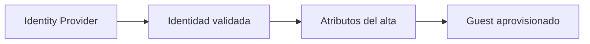
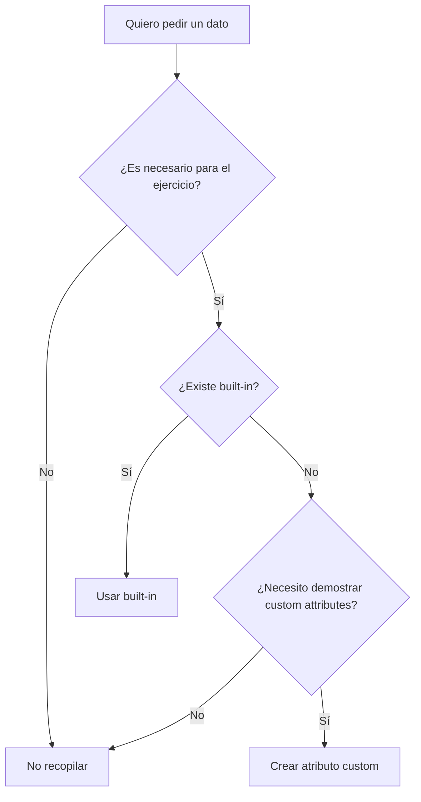
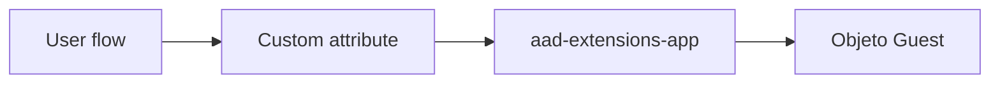
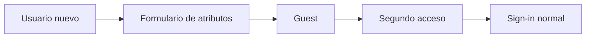

# Etapa 4B.2 · Definir atributos para el auto-registro

## Objetivo

Decidir qué información adicional recopilará Microsoft Entra External ID cuando un tercero se registra por primera vez mediante el user flow.

El propósito no es construir una ficha completa del usuario. La regla es **mínima recopilación necesaria**.

---

## 1 · Diferenciar identidad de atributos

La identidad demuestra quién controla una cuenta.

Los atributos agregan información sobre esa persona o sobre el contexto de incorporación.



Ejemplos:

```text
Identidad:
usuario@dominio.cl

Atributos:
Display Name
Given Name
Surname
Country/Region
```

No confundir estos atributos con permisos de negocio.

---

## 2 · Atributos built-in

Microsoft Entra External ID dispone de atributos integrados que pueden seleccionarse para el formulario de sign-up.

Para DSY1107 se recomienda comenzar con:

- `Display Name`;
- `Given Name`;
- `Surname`.

Opcional para experimentación:

- `Country/Region`.

No agregues más campos si no existe un objetivo pedagógico claro.

---

## 3 · Regla de minimización

Antes de seleccionar un atributo, pregunta:



Evita datos sensibles o innecesarios.

No utilizar la práctica para recopilar:

- RUT;
- dirección particular;
- teléfono personal;
- fecha de nacimiento;
- información médica;
- contraseñas;
- secretos;
- datos que no tengan relación con el objetivo del laboratorio.

---

## 4 · Custom attributes

Si se desea demostrar extensibilidad, Microsoft Entra permite definir atributos personalizados para los user flows B2B.

Ruta actual documentada por Microsoft:

`Entra ID → External Identities → Overview → Custom user attributes`

Luego:

1. seleccionar `Add`;
2. definir nombre;
3. seleccionar tipo de dato;
4. agregar descripción interna si corresponde;
5. crear.

Tipos disponibles documentados:

- `String`;
- `Boolean`;
- `Int`.

### Ejemplo pedagógico seguro

```text
Nombre: CourseSection
Tipo: String
Descripción: sección declarada durante ejercicio de self-service
```

O:

```text
Nombre: AcceptLabTerms
Tipo: Boolean
Descripción: atributo de demostración para user flow
```

Estos ejemplos sirven para comprender extensión de esquema sin recopilar información delicada.

---

## 5 · Qué ocurre internamente con un custom attribute

Microsoft almacena estos valores como extension attributes vinculados a la aplicación de extensiones del tenant.

Conceptualmente:



Microsoft Graph expone estos campos con nombres del estilo:

```text
extension_<extensions-app-id>_<attribute-name>
```

No necesitas usar Microsoft Graph para aprobar esta etapa. Esta referencia existe para conectar user flows con extensibilidad real del directorio.

---

## 6 · Cuándo se recopilan los atributos

Este punto es crítico:

> Los atributos seleccionados para sign-up se recopilan durante el **primer registro**.

Si luego cambias el user flow y agregas un atributo nuevo, un usuario que ya completó el alta no necesariamente volverá a ver el formulario.

Para probar cambios de formulario usa una identidad que **no haya completado previamente ese sign-up**.



---

## 7 · Layout del formulario

Después de crear el user flow podrás ordenar los atributos mediante:

`User flow → Customize → Page layouts`

El orden debería favorecer comprensión:

```text
Given Name
Surname
Display Name
atributo opcional de laboratorio
```

No conviertas el formulario en una encuesta extensa.

---

## 8 · Evidencia permitida

Puedes evidenciar:

- nombres de atributos configurados;
- tipos de dato;
- orden del formulario;
- resultado general del alta;
- que el Guest posee el atributo cuando corresponda.

No evidenciar valores personales innecesarios.

---

## Checkpoint E4B.2

- [ ] seleccioné solo atributos necesarios;
- [ ] entiendo diferencia entre identidad, atributo y permiso;
- [ ] conozco la diferencia entre built-in y custom attributes;
- [ ] sé que los atributos se recopilan en el primer sign-up;
- [ ] si agregué un custom attribute, usé un dato pedagógico no sensible;
- [ ] no estoy usando atributos del user flow como sustituto de autorización de backend.

→ Continúa con [Etapa 4C · Crear el user flow](./04c-self-service-crear-user-flow.md).
