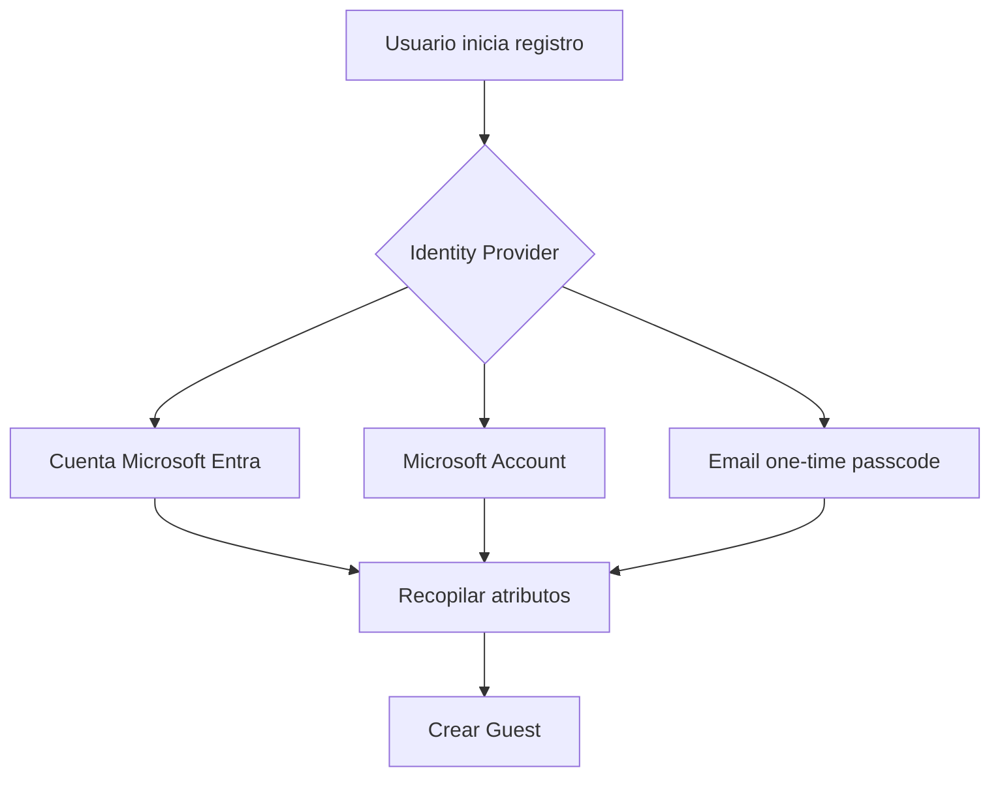

# Etapa 4C · Crear el user flow de auto-registro

## Objetivo

Crear el flujo que define **cómo se registra un usuario externo**, qué identidad puede usar y qué atributos se recopilan durante el alta.

## Paso 1 · Crear el user flow

Ruta:

`Entra ID → External Identities → User flows → New user flow`

Definir un nombre claro, por ejemplo:

`dsy1107-self-service-signup`

Microsoft agrega automáticamente el prefijo correspondiente al tipo de user flow cuando aplica.

## Paso 2 · Elegir Identity Providers

Seleccionar los proveedores que se permitirán durante el registro.

Para la práctica base, usar primero un proveedor simple y controlado. Según lo disponible en el tenant, pueden aparecer opciones como:

- Microsoft Entra account;
- Microsoft account;
- Email one-time passcode;
- proveedores sociales configurados previamente.

> No habilitar múltiples proveedores solo porque estén disponibles. Primero validar un camino completo de punta a punta.

## Paso 3 · Elegir atributos a recopilar

Seleccionar únicamente datos necesarios para el ejercicio.

Sugeridos para DSY1107:

- Display Name;
- Given Name;
- Surname;
- Country/Region, si se desea experimentar con atributos adicionales.

No recopilar datos sensibles innecesarios.

## Paso 4 · Crear el flujo

Seleccionar **Create**.

El nuevo user flow debe aparecer en la lista.

## Paso 5 · Personalizar layout si corresponde

Dentro del user flow:

`Customize → Page layouts`

Revisar:

- qué campos se muestran;
- orden de los campos;
- cuáles son obligatorios;
- experiencia de registro.

## Regla importante sobre atributos

Los atributos de alta se recopilan cuando el usuario **se registra por primera vez**. Si después se modifica el user flow, un usuario que ya completó el registro no necesariamente volverá a ver el formulario de atributos.

## Checkpoint E4C

- [ ] user flow creado;
- [ ] nombre identificable;
- [ ] al menos un Identity Provider seleccionado;
- [ ] atributos mínimos definidos;
- [ ] layout revisado;
- [ ] se comprende que el flujo controla el alta, no los permisos de negocio.

→ Continúa con [Etapa 4D · Asociar la aplicación y ejecutar el auto-registro](./04d-self-service-asociar-aplicacion.md).
