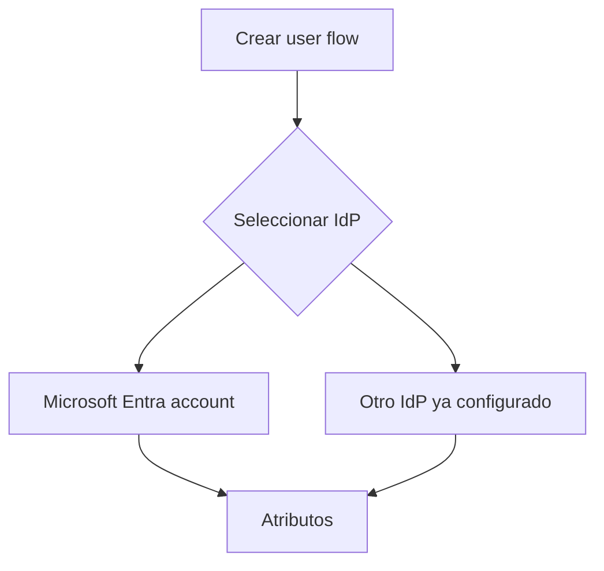
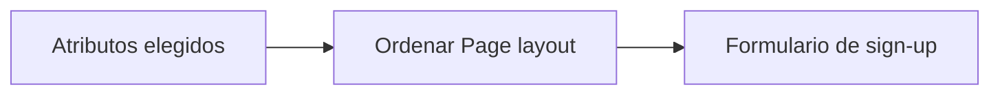
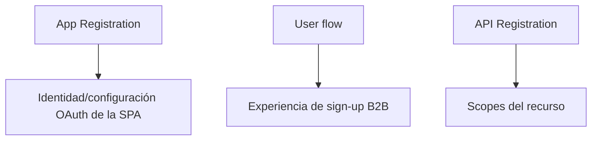

# Etapa 12 · Crear el user flow de auto-registro

## Objetivo

Crear el flujo que define **cómo se registra un usuario externo**, qué Identity Providers puede utilizar y qué atributos se recopilan durante el primer alta.

Antes de esta etapa ya debes haber decidido:

- que estás trabajando en un workforce tenant;
- qué IdP usarás primero;
- qué atributos built-in/custom necesitas;
- qué SPA será asociada más adelante.

---

## 0 · Gate previo

No continuar si falta alguno:

- [ ] self-service habilitado en tenant;
- [ ] `External Identities → User flows` visible;
- [ ] Identity Provider inicial elegido;
- [ ] atributos mínimos definidos;
- [ ] no hay política de colaboración conocida que bloquee el escenario.

---

## 1 · Abrir creación de user flow

Ruta:

`Entra ID → External Identities → User flows → New user flow`

Debe abrirse la pantalla de creación del flujo B2B de self-service.

Si el menú no coincide, vuelve a Etapa 9 antes de buscar código o cambiar la App Registration.

---

## 2 · Nombre del flujo

Definir un nombre corto, identificable y sin secretos.

Ejemplo:

```text
dsy1107-self-service
```

Microsoft agrega automáticamente un prefijo del tipo `B2X_1_` cuando corresponde al user flow.

No uses nombres de alumnos ni datos personales.

---

## 3 · Seleccionar Identity Providers

En **Identity providers**, seleccionar únicamente los proveedores preparados en Etapa 10.

Para el primer recorrido se recomienda:

```text
Microsoft Entra account
```

Si ya validaste ese camino, puedes añadir un segundo proveedor para comparación.



Si tienes varios IdP marcados y todavía no has demostrado ninguno, vuelve a uno solo.

---

## 4 · Seleccionar atributos del usuario

En **User attributes**, seleccionar lo definido en Etapa 11.

Base recomendada:

- Display Name;
- Given Name;
- Surname.

Opcional:

- Country/Region;
- un custom attribute pedagógico.

No agregues información personal sensible para “ver qué pasa”.

---

## 5 · Revisar qué estás construyendo

Antes de pulsar Create, deberías poder describir el flujo en una frase:

> “Un usuario externo llega a la SPA, se autentica usando Microsoft Entra account, completa los atributos definidos y Entra aprovisiona un Guest en este workforce tenant.”

Si no puedes decir claramente qué ocurre, no avances.

---

## 6 · Crear

Seleccionar **Create**.

Luego volver a:

`External Identities → User flows`

El flujo debe aparecer en la lista.

Si no aparece inmediatamente, refrescar antes de intentar crearlo otra vez. No crear duplicados por impaciencia.

---

## 7 · Abrir el flujo recién creado

Revisar al menos:

- Properties/configuración general;
- Identity providers;
- User attributes;
- Page layouts;
- Applications.

Todavía **Applications puede estar vacío**. La asociación ocurre en Etapa 13.

---

## 8 · Configurar Page layouts

Ruta:

`User flow → Customize → Page layouts`

Orden sugerido:

```text
Given Name
Surname
Display Name
atributo opcional
```



---

## 9 · Regla crítica: atributos de primer registro

Los atributos del formulario se recopilan cuando el usuario se registra por primera vez.

Para verificar cambios posteriores usa un usuario nuevo.

---

## 10 · No confundir user flow con App Registration

El user flow no reemplaza:

- client ID;
- redirect URI;
- scopes;
- API permissions;
- configuración de MSAL;
- JWT Authorizer.



---

## 11 · No confundir user flow con autorización

Un usuario que completó el user flow se autenticó y fue aprovisionado como Guest, pero eso no significa que pueda llamar cualquier endpoint, administrar el tenant o poseer todos los scopes/roles de negocio.

---

## 12 · Evidencia mínima

Guardar evidencia sanitizada de:

- nombre del user flow;
- Identity Provider seleccionado;
- atributos elegidos;
- Page layout;
- flujo visible en la lista.

No publicar datos personales ni secretos.

---

## Checkpoint E12

- [ ] user flow creado una sola vez;
- [ ] nombre identificable;
- [ ] IdP inicial seleccionado deliberadamente;
- [ ] atributos mínimos definidos;
- [ ] Page layout revisado;
- [ ] sé que atributos se recopilan en primer sign-up;
- [ ] sé diferenciar user flow, SPA App Registration y API Registration;
- [ ] comprendo que sign-up no concede autorización de negocio.

→ Continúa con [Etapa 13 · Asociar la aplicación y ejecutar el auto-registro](./04d-self-service-asociar-aplicacion.md).
