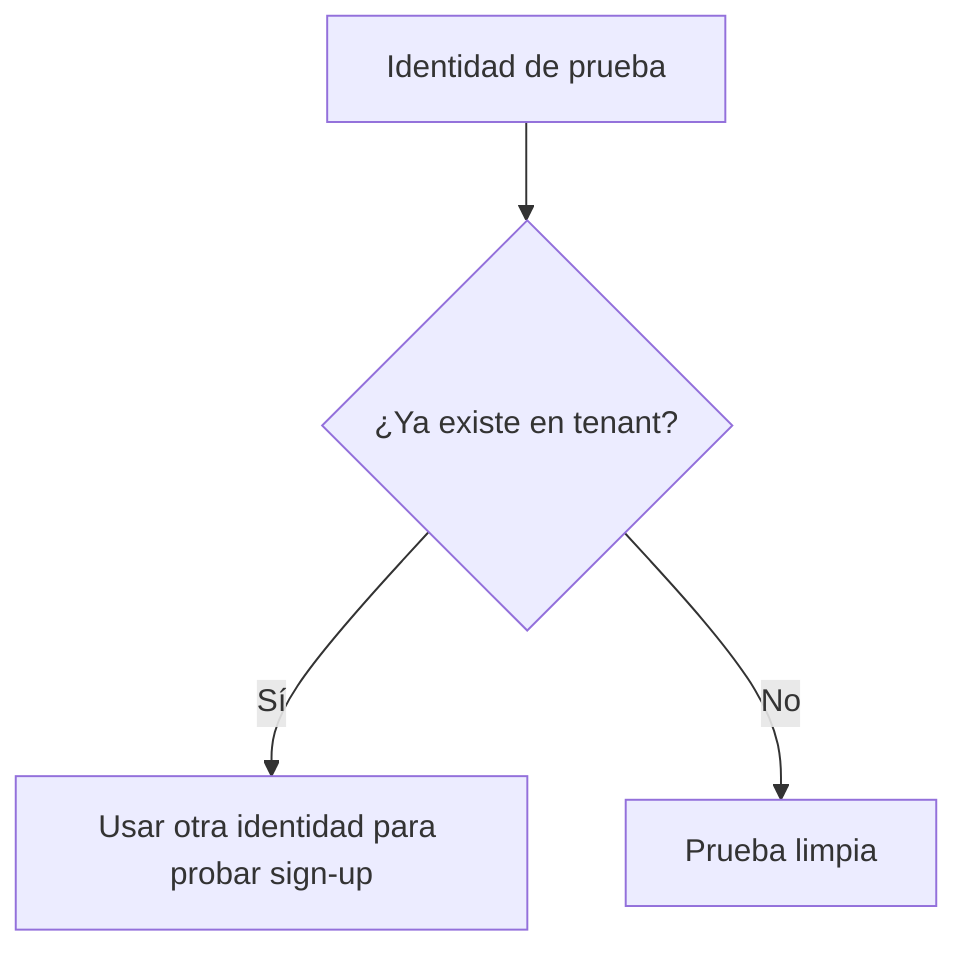
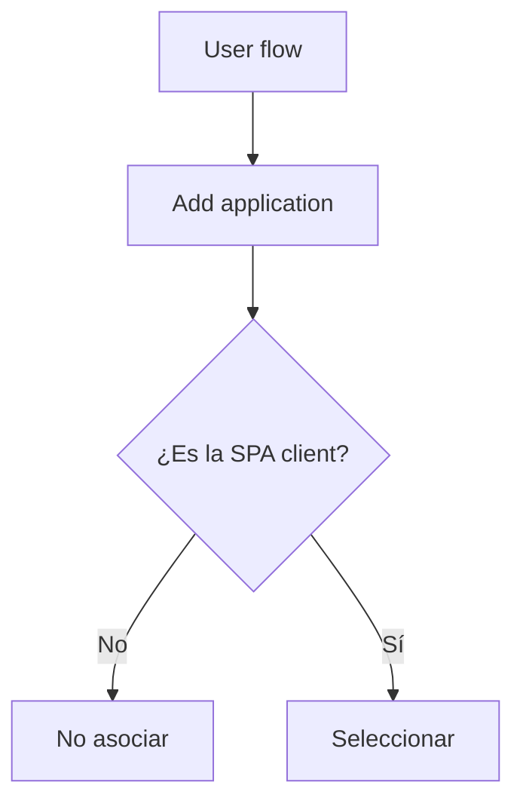
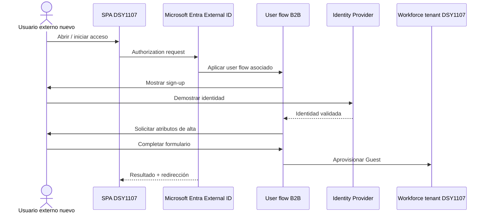
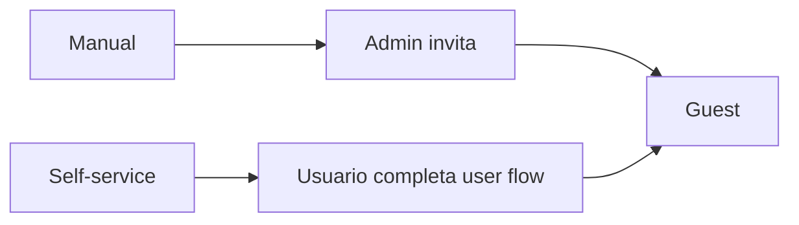
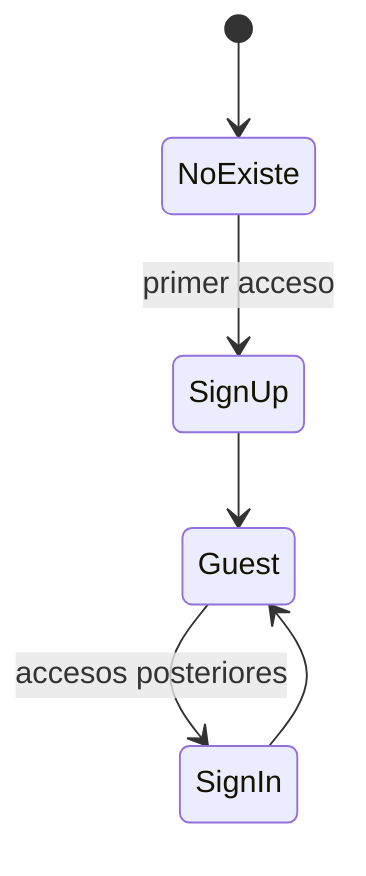
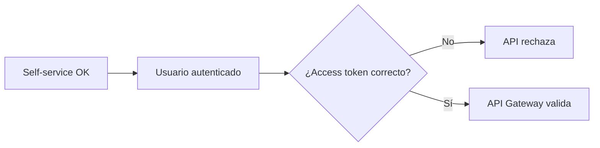

# Etapa 4D · Asociar la SPA y ejecutar el primer auto-registro

## Objetivo

Asociar el user flow B2B a la aplicación correcta y demostrar el primer ciclo completo:

```text
usuario externo inexistente
→ llega a la aplicación
→ entra al self-service sign-up
→ valida su identidad
→ completa atributos
→ Entra aprovisiona Guest
→ vuelve a la aplicación
```

---

## 0 · Preparar una prueba limpia

Necesitas una identidad externa que **todavía no exista en el tenant** como Guest.

Antes de probar:

1. ir a `Entra ID → Users`;
2. buscar el correo de prueba;
3. confirmar que no existe;
4. no reutilizar el Guest manual usado en Etapa 4 para la primera evidencia self-service.

### Por qué

Si el usuario ya existe, estarás probando **sign-in**, no el alta.



---

## 1 · Abrir el user flow

Ruta:

`Entra ID → External Identities → User flows → <user flow>`

Comprueba que estás abriendo exactamente el flujo creado en 4C.

---

## 2 · Asociar la aplicación

Dentro del user flow:

`Use → Applications → Add application`

Seleccionar la aplicación que representa la SPA de DSY1107.

### Antes de seleccionar

Compara el nombre y, cuando sea necesario, el `Application (client) ID` con el guardado en Etapa 2.

No asocies accidentalmente:

- la App Registration de la API;
- Microsoft Graph;
- otra app de prueba;
- una Enterprise Application distinta solo porque tiene nombre parecido.



---

## 3 · Verificar asociación

Después de agregarla, vuelve a `Applications` dentro del user flow.

La SPA debe aparecer en la lista.

La asociación significa:

> esta aplicación puede utilizar este user flow de self-service.

No significa:

> cualquier aplicación del tenant usa este flujo.

Microsoft permite asociar aplicaciones creadas por la organización a estos user flows; un mismo flujo puede servir a más de una aplicación.

---

## 4 · Volver a comprobar la App Registration

Antes de ejecutar el flujo, revisar la SPA:

`Entra ID → App registrations → <SPA>`

Confirmar:

- `Application (client) ID` esperado;
- `Directory (tenant) ID` esperado;
- plataforma `Single-page application`;
- redirect URI exacto del entorno de prueba;
- sin client secret en el frontend.

### Regla

No cambies `Supported account types` como intento genérico de hacer aparecer el sign-up.

En esta práctica el auto-registro B2B se resuelve mediante External ID/user flow, no convirtiendo a ciegas la arquitectura en multitenant.

---

## 5 · Entender cómo llega el usuario al flujo

La aplicación inicia la solicitud de autorización y Microsoft Entra aplica la experiencia de sign-up correspondiente a la aplicación/user flow asociado.

Modelo conceptual:



La SPA no crea el Guest mediante una llamada JavaScript propia.

---

## 6 · Ejecutar en navegador limpio

Para reducir sesiones heredadas:

1. cerrar sesión Microsoft previa cuando corresponda;
2. usar ventana privada/incógnito para la primera prueba;
3. abrir la SPA;
4. iniciar el flujo de autenticación;
5. seleccionar la opción de registro cuando aparezca;
6. usar la identidad externa elegida;
7. completar atributos;
8. finalizar el flujo.

### Por qué incógnito

No es un requisito de producción. Es una técnica de laboratorio para reducir confusión por cookies/sesiones de otras cuentas Microsoft.

---

## 7 · Observar el formulario

Comprueba que aparecen:

- el Identity Provider esperado;
- los atributos seleccionados;
- el orden configurado en Page layouts.

Si no aparecen los atributos:

1. verifica que el usuario no exista previamente;
2. confirma que editaste el user flow correcto;
3. revisa User attributes/Page layouts;
4. no asumas que MSAL es el problema.

---

## 8 · Completar el sign-up

El usuario debe completar el proceso sin intervención manual del administrador.

Esto es precisamente lo que diferencia el flujo de Etapa 4:



---

## 9 · Verificar el Guest en el directorio

Después del alta:

`Entra ID → Users`

Buscar el usuario.

Verificar:

- existe un objeto de usuario;
- `User type = Guest`;
- la identidad corresponde al usuario de prueba;
- los atributos seleccionados están presentes cuando aplique.

No uses una captura que exponga datos de otros estudiantes.

---

## 10 · Registrar estado antes/después

La evidencia más clara es:

```text
ANTES
usuario@example no existe en Entra Users

DESPUÉS
usuario@example existe como Guest
```

No necesitas publicar identificadores internos completos.

---

## 11 · Probar el segundo acceso

Cerrar sesión y repetir con **el mismo usuario**.

Resultado esperado:

```text
primer acceso = sign-up + aprovisionamiento
segundo acceso = sign-in
```

No debería repetirse el formulario completo de atributos de primer alta.



---

## 12 · Separar éxito de sign-up de éxito de API

En este punto puedes tener:

```text
Guest creado correctamente
+
login correcto
+
API todavía rechaza
```

Eso no invalida el self-service.

La siguiente frontera es token/autorización.



---

## 13 · Fallos frecuentes

### “No aparece opción de registro”

Revisar:

1. self-service habilitado;
2. user flow creado;
3. SPA asociada al flujo;
4. aplicación correcta;
5. Identity Provider disponible;
6. identidad realmente nueva.

### “Veo login pero no formulario de atributos”

Probable causa:

```text
usuario ya aprovisionado
```

Prueba con una identidad nueva.

### “Se crea el Guest, pero vuelve con error a localhost”

Revisar:

```text
redirect URI
→ plataforma SPA
→ configuración MSAL
```

El aprovisionamiento pudo haber funcionado aunque la redirección falle después.

### “El Guest aparece pero API da 401”

Ir a Etapa 5/6.

No borrar/recrear el usuario repetidamente antes de revisar el token.

---

## 14 · Evidencia mínima

- aplicación visible en `User flow → Applications`;
- usuario de prueba inexistente antes del flujo;
- formulario self-service visible;
- Guest resultante;
- segundo acceso como sign-in;
- ningún secreto/token publicado.

---

## Checkpoint E4D

- [ ] asocié la **SPA**, no la API;
- [ ] utilicé un usuario que no existía previamente;
- [ ] el user flow apareció;
- [ ] se ejecutó el Identity Provider esperado;
- [ ] se recopilaron atributos de primer alta;
- [ ] se creó un Guest sin invitación manual;
- [ ] segundo acceso funciona como sign-in;
- [ ] sé separar fallo de sign-up de fallo de API.

→ Continúa con [Etapa 4E · Comparación, pruebas y troubleshooting](./04e-self-service-pruebas-troubleshooting.md).
