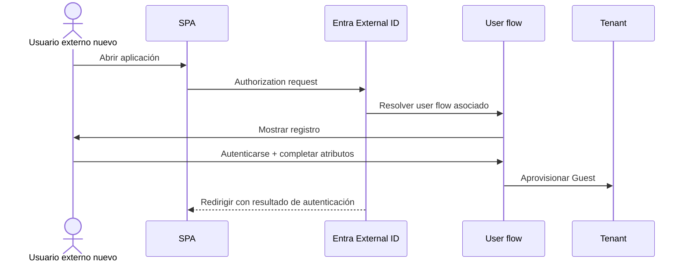

# Etapa 4D · Asociar la aplicación y ejecutar el auto-registro

## Objetivo

Asociar la App Registration de la SPA al user flow y ejecutar el primer registro real de un usuario externo.

## Paso 1 · Abrir el user flow

Ruta:

`Entra ID → External Identities → User flows → <user flow>`

## Paso 2 · Asociar la aplicación

Dentro del user flow:

`Use → Applications → Add application`

Seleccionar la aplicación correspondiente a la SPA de DSY1107.

> El user flow se aplica a las aplicaciones asociadas. No habilita auto-registro indiscriminado para todo el tenant.

## Paso 3 · Verificar la SPA

Confirmar que la App Registration sigue configurada correctamente:

- `Supported account types` según el diseño definido en clase;
- plataforma `Single-page application`;
- redirect URI exacto;
- sin `client_secret` en frontend.

## Paso 4 · Ejecutar con un usuario nuevo

Usar una identidad externa que **todavía no exista como Guest** en el tenant.

Secuencia esperada:

## Paso 5 · Verificar el usuario creado

Ir a:

`Entra ID → Users`

Buscar el correo usado en la prueba.

Verificar:

- usuario creado;
- `User type = Guest`;
- identidad externa correcta;
- atributos recopilados cuando corresponda.

## Paso 6 · Repetir login

Cerrar sesión y volver a entrar con el mismo usuario.

La segunda vez debe comportarse como **sign-in**, no como un registro inicial completo.

## Checkpoint E4D

- [ ] aplicación asociada al user flow;
- [ ] usuario externo no existía antes de la prueba;
- [ ] flujo de auto-registro apareció;
- [ ] registro se completó;
- [ ] Guest fue creado en el tenant;
- [ ] segundo acceso funciona como login;
- [ ] no se necesitó invitación manual.

→ Continúa con [Etapa 4E · Comparación, pruebas y troubleshooting](./04e-self-service-pruebas-troubleshooting.md).
