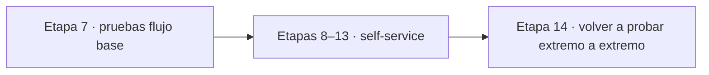
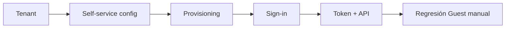
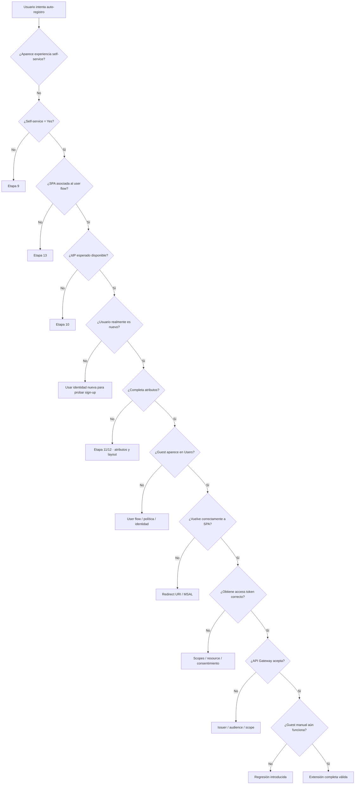
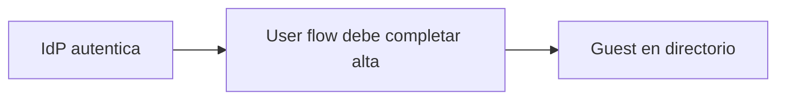
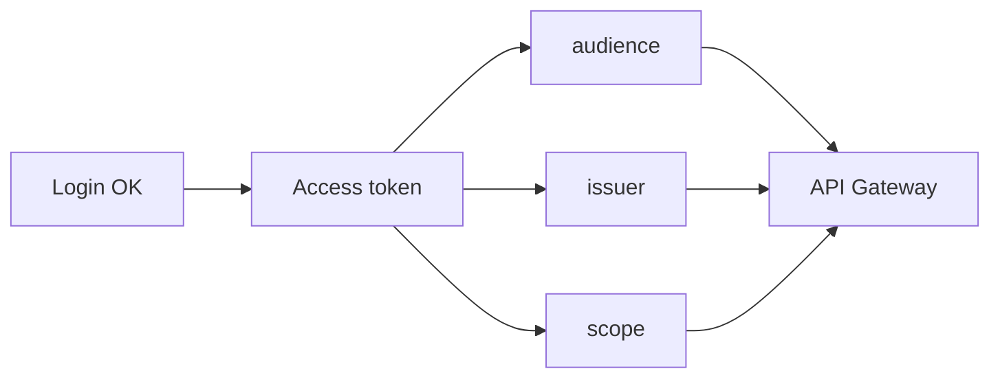
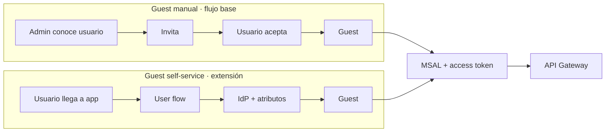
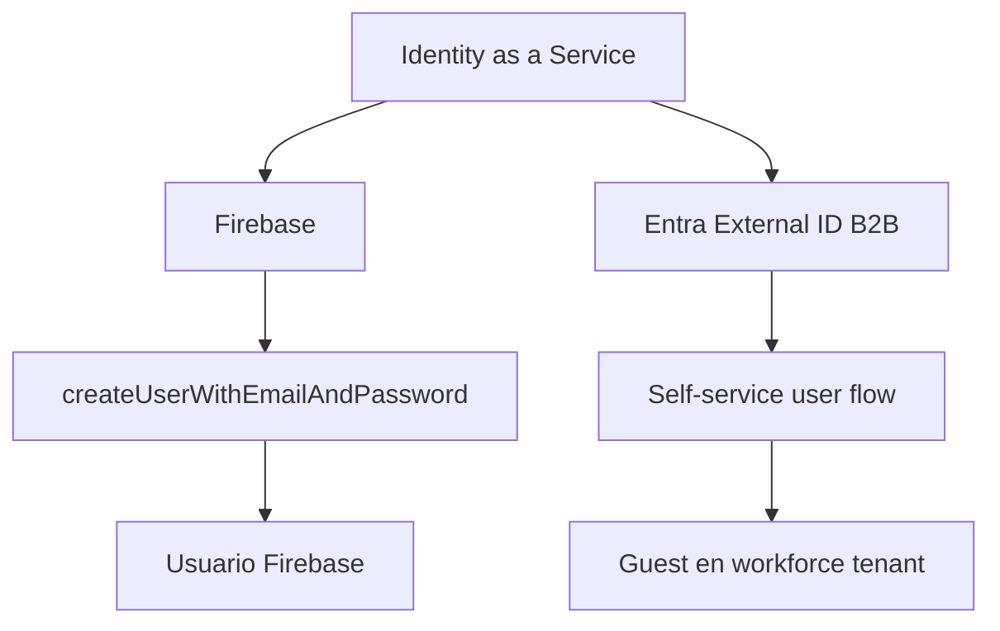

# Etapa 14 · Segunda pasada integral: pruebas, troubleshooting y evidencia self-service

## Objetivo

Volver a recorrer el sistema completo **después de incorporar self-service B2B**, para comprobar que la extensión de provisioning funciona y que el flujo base de autenticación, token y API sigue siendo correcto.

Esta etapa no sustituye la Etapa 7. Es una **segunda pasada**, con una hipótesis nueva:

> antes el Guest existía porque fue invitado manualmente; ahora debe existir porque un tercero completó el user flow de auto-registro.



---

## 1 · Qué se vuelve a validar

La segunda pasada cubre dos grupos de fronteras.

### Fronteras nuevas

```text
self-service habilitado
→ Identity Provider
→ atributos
→ user flow
→ SPA asociada
→ provisioning Guest
→ primer sign-up / segundo sign-in
```

### Fronteras que ya existían y deben seguir verdes

```text
SPA / MSAL
→ access token API propia
→ issuer / audience / scope
→ API Gateway
→ backend
```

La extensión se considera correcta solo si ambas cadenas funcionan juntas.

---

## 2 · Matriz mínima obligatoria

| Caso | Estado inicial | Acción | Resultado esperado |
|---|---|---|---|
| SSR-01 | usuario no existe | abrir app e iniciar acceso | aparece experiencia de sign-up |
| SSR-02 | usuario no existe | completar IdP + atributos | se crea Guest |
| SSR-03 | Guest self-service ya creado | volver a entrar | sign-in, no alta completa |
| SSR-04 | app no asociada | intentar flujo | no se aplica experiencia esperada |
| SSR-05 | self-service deshabilitado | revisar/crear flujo | capacidad no disponible |
| SSR-06 | rol insuficiente | modificar External Identities/user flow | operación bloqueada |
| SSR-07 | IdP no preparado | intentar usarlo | flujo falla/no ofrece proveedor esperado |
| SSR-08 | usuario ya existía | esperar formulario de alta | no debe asumirse nuevo sign-up |
| SSR-09 | redirect URI incorrecto | completar autenticación | falla retorno a SPA |
| SSR-10 | Guest creado + login correcto, sin token API | llamar backend protegido | API rechaza |
| SSR-11 | token para recurso incorrecto | llamar API Gateway | rechazo por audience/issuer |
| SSR-12 | token válido, scope insuficiente | llamar ruta protegida | 403/rechazo según diseño |
| SSR-13 | Guest self-service + token/scope correcto | llamar ruta protegida | acceso autorizado |
| SSR-14 | Guest manual del flujo base | repetir acceso conocido | sigue funcionando; no regresión |

El caso `SSR-14` es importante: introducir self-service no debe romper el mecanismo Guest manual previamente probado.

---

## 3 · Pruebas por capas

No ejecutes todo como una sola caja negra.

### Capa A · tenant

Demuestra:

```text
workforce tenant correcto
self-service = Yes
User flows disponible
```

### Capa B · configuración self-service

Demuestra:

```text
IdP elegido
atributos definidos
user flow creado
SPA asociada
```

### Capa C · provisioning

Demuestra:

```text
usuario no existía
→ sign-up
→ Guest creado
```

### Capa D · sign-in posterior

Demuestra:

```text
Guest self-service existente
→ segundo acceso
→ sign-in normal
```

### Capa E · autenticación/token/API

Reutiliza lo aprendido en Etapas 5–7:

```text
Guest self-service
→ MSAL
→ access token API propia
→ Gateway valida
→ backend responde
```

### Capa F · regresión

Confirma que el Guest manual original sigue funcionando.



---

## 4 · Árbol de diagnóstico principal



---

## 5 · Diagnóstico: “no aparece Register / Sign up”

Revisar en este orden:

1. tenant correcto;
2. workforce tenant;
3. self-service habilitado;
4. user flow existe;
5. SPA asociada;
6. Identity Provider seleccionado;
7. usuario no existe previamente;
8. sesión/cookies de otra cuenta no están confundiendo la prueba.

No comenzar cambiando `Supported account types`, redirect URI, clientId o API Gateway si todavía no has comprobado esos puntos.

---

## 6 · Diagnóstico: “el usuario se autentica, pero no se crea Guest”

Separar:



Autenticarse con el IdP no basta si el user flow no termina correctamente.

Revisar flujo correcto, atributos requeridos, políticas de colaboración, errores visibles y `Entra ID → Users`.

---

## 7 · Diagnóstico: “Guest creado, pero SPA falla”

Este caso indica que:

```text
self-service/provisioning = posiblemente OK
redirect/MSAL/frontend = posiblemente KO
```

Revisar redirect URI exacto, plataforma SPA, authority/tenant, inicialización MSAL y consola del navegador.

No borres el Guest antes de entender cuál frontera falló.

---

## 8 · Diagnóstico: “Guest creado y login funciona, pero API falla”

Self-service ya cumplió su responsabilidad. Reutiliza el diagnóstico de Etapa 7.



Preguntas:

1. ¿se pidió access token para la API propia?
2. ¿el `aud` corresponde al recurso esperado?
3. ¿el `iss` corresponde al tenant esperado?
4. ¿el token posee el scope necesario?
5. ¿el JWT Authorizer está configurado con esos valores?

---

## 9 · Diagnóstico: “cambié atributos y no aparecen”

Primero preguntar:

> ¿Este usuario ya completó el registro anteriormente?

Si sí, el comportamiento puede ser correcto: los atributos de sign-up se recopilan durante el primer alta.

Prueba con una identidad nueva.

---

## 10 · Diagnóstico: múltiples cuentas Microsoft en el navegador

Para laboratorio:

- cerrar sesiones previas;
- usar ventana privada;
- observar qué cuenta muestra Microsoft;
- no guardar credenciales en el código para forzar una cuenta.

---

## 11 · Comparación final: manual vs self-service



Lo que cambia es el **provisioning**. Lo que permanece es el circuito de autenticación, token y autorización posterior.

---

## 12 · Comparación con Firebase Register



La similitud útil es que la aplicación delega el lifecycle de identidad al IDaaS. La diferencia es el modelo explícito de tenant, B2B, App Registrations, user flows y Guest en Entra.

---

## 13 · Evidencia final de la extensión

La evidencia debe contar una historia verificable y evitar capturar cada click sin propósito.

### Evidencia administrativa

1. self-service habilitado;
2. IdP inicial definido;
3. atributos definidos;
4. user flow creado;
5. SPA asociada.

### Evidencia de provisioning

6. usuario no existente antes;
7. ejecución del sign-up;
8. Guest existente después;
9. segundo acceso como sign-in.

### Evidencia de integración

10. access token para API propia explicado mediante claims sanitizados;
11. llamada sin token/recurso incorrecto rechazada;
12. scope insuficiente rechazado;
13. token + scope correcto aceptado.

### Evidencia de no regresión

14. Guest manual del flujo base sigue pudiendo autenticarse y usar el circuito autorizado esperado.

### Evidencia de aprendizaje

15. DevLog con al menos un fallo, frontera identificada, corrección y resultado;
16. Mermaid final manual vs self-service;
17. explicación de qué cambió y qué permaneció igual.

---

## 14 · Checklist de seguridad

Nunca incluir:

- access token completo;
- refresh token;
- client secret;
- password;
- código OTP;
- cookies de sesión;
- credenciales AWS/Azure;
- información personal de otros alumnos.

Si necesitas explicar un JWT, usa claims sanitizados o valores ficticios.

---

## 15 · Gate final E14

- [ ] flujo base de Etapa 7 estaba cerrado antes de la extensión;
- [ ] Guest self-service demostrado con identidad nueva;
- [ ] IdP y atributos explicados;
- [ ] segundo acceso demostrado como sign-in;
- [ ] access token/API probados nuevamente con el Guest self-service;
- [ ] al menos un caso negativo diagnosticado por frontera;
- [ ] Guest manual anterior sigue funcionando;
- [ ] evidencia sanitizada y completa;
- [ ] diferencias con Firebase y CIAM explicadas.

Con este gate aprobado, la extensión self-service B2B queda cerrada.

← [Volver al índice de la guía](./README.md).
