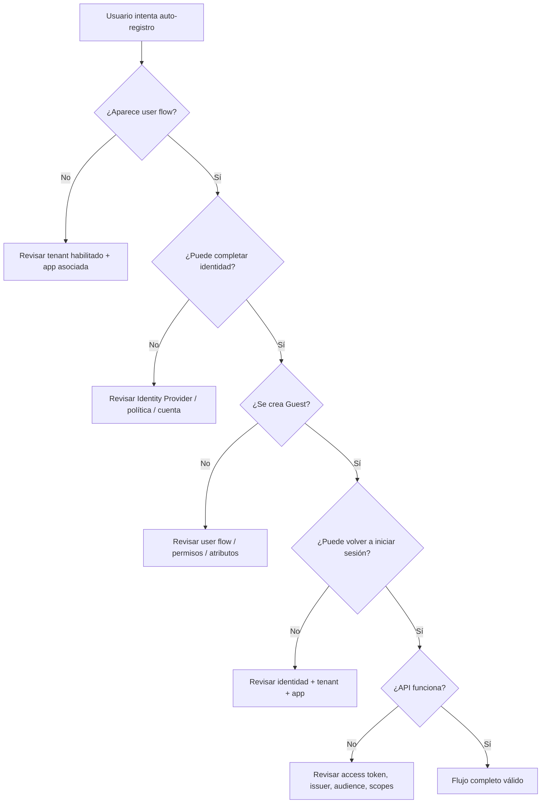
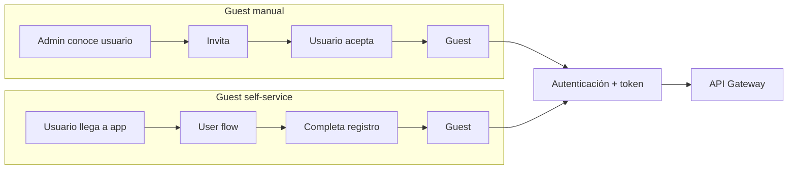

# Etapa 4E · Comparar, probar y diagnosticar self-service sign-up

## Objetivo

Validar que el auto-registro funciona de extremo a extremo y distinguir problemas de user flow, identidad, App Registration y autorización posterior.

## Matriz mínima de pruebas

| Caso | Estado inicial | Acción | Resultado esperado |
|---|---|---|---|
| SSR-01 | usuario no existe | abrir app e iniciar registro | aparece experiencia de sign-up |
| SSR-02 | usuario no existe | completar identidad + atributos | se crea Guest |
| SSR-03 | Guest ya creado | volver a entrar | sign-in sin alta completa |
| SSR-04 | app no asociada al user flow | intentar registro | no aparece experiencia esperada |
| SSR-05 | self-service deshabilitado en tenant | intentar configurar/usar flujo | capacidad no disponible |
| SSR-06 | usuario sin permisos administrativos | crear/configurar user flow | operación bloqueada |
| SSR-07 | login exitoso, sin token API | llamar backend protegido | API rechaza |
| SSR-08 | token para recurso incorrecto | llamar API Gateway | rechazo por audience/issuer |
| SSR-09 | token válido, scope insuficiente | llamar ruta protegida | autorización rechazada |

## Diagnóstico por frontera

## Comparación final: manual vs self-service

## Qué debe poder explicar el estudiante

1. por qué self-service no convierte automáticamente la app en multitenant;
2. qué configura el tenant y qué configura el user flow;
3. por qué el user flow se asocia a aplicaciones concretas;
4. por qué el usuario termina siendo Guest;
5. qué diferencia existe entre sign-up inicial y sign-in posterior;
6. por qué auto-registro no reemplaza scopes ni autorización;
7. qué diferencia existe con `createUserWithEmailAndPassword` de Firebase.

## Evidencia mínima

- captura sanitizada de self-service habilitado;
- user flow creado;
- aplicación asociada;
- prueba con usuario inexistente previamente;
- usuario Guest resultante;
- segundo login exitoso;
- diagrama Mermaid del flujo;
- DevLog con al menos un caso de fallo o una validación negativa;
- sin tokens ni secretos expuestos.

## Gate E4E

- [ ] Guest manual demostrado;
- [ ] Guest self-service demostrado;
- [ ] diferencias explicadas;
- [ ] flujo de API sigue separado del flujo de alta;
- [ ] evidencia completa.

→ Con este gate aprobado, continúa con [Etapa 5 · MSAL, PKCE y access token](./05-msal-token.md).
