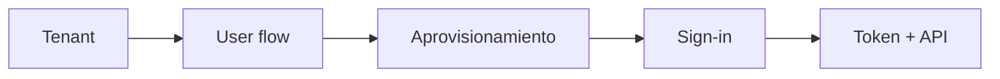
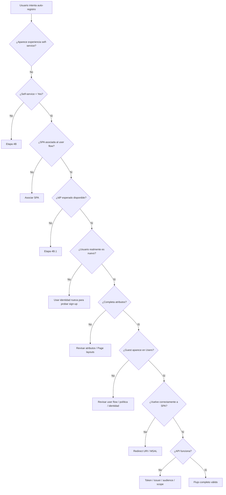
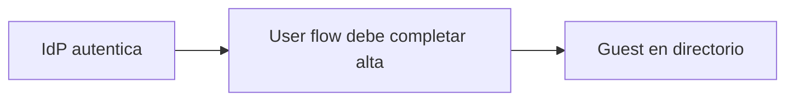
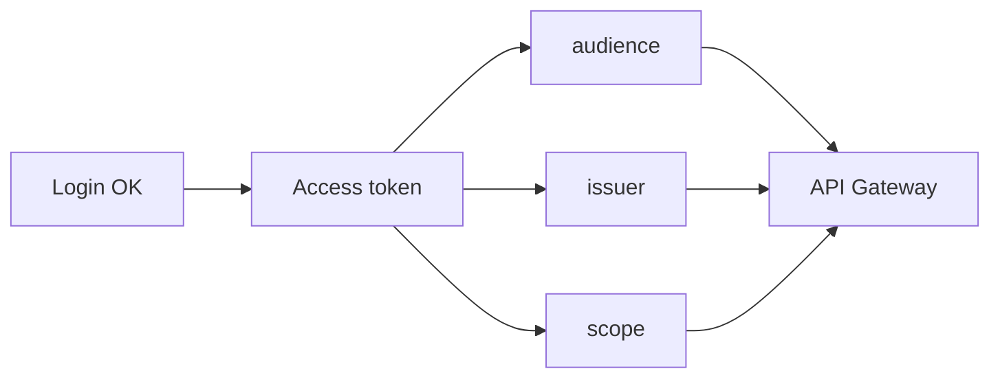
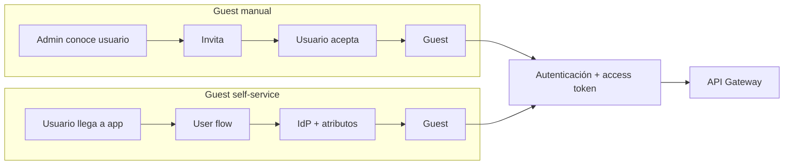
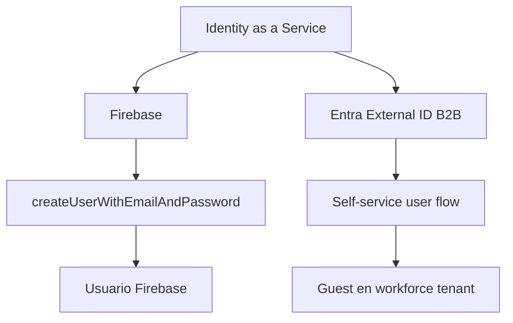

# Etapa 4E · Comparar, probar y diagnosticar self-service sign-up

## Objetivo

Validar que el auto-registro B2B funciona de extremo a extremo y distinguir con precisión problemas de:

- tenant/permisos;
- self-service habilitado;
- Identity Provider;
- atributos;
- user flow;
- asociación de aplicación;
- sign-up/sign-in;
- MSAL/redirect;
- token;
- API Gateway/autorización.

---

## 1 · Matriz mínima obligatoria

| Caso | Estado inicial | Acción | Resultado esperado |
|---|---|---|---|
| SSR-01 | usuario no existe | abrir app e iniciar acceso | aparece experiencia de sign-up |
| SSR-02 | usuario no existe | completar IdP + atributos | se crea Guest |
| SSR-03 | Guest self-service ya creado | volver a entrar | sign-in, no alta completa |
| SSR-04 | app no asociada | intentar flujo | no se aplica experiencia esperada |
| SSR-05 | self-service deshabilitado | revisar/crear flujo | capacidad no disponible |
| SSR-06 | rol insuficiente | modificar External Identities/user flow | operación bloqueada |
| SSR-07 | IdP no preparado | intentar usarlo | flujo falla/no ofrece proveedor esperado |
| SSR-08 | usuario ya existía | esperar formulario de alta | no debe asumirse nuevo sign-up |
| SSR-09 | redirect URI incorrecto | completar autenticación | falla retorno a SPA |
| SSR-10 | login correcto, sin token API | llamar backend protegido | API rechaza |
| SSR-11 | token para recurso incorrecto | llamar API Gateway | rechazo por audience/issuer |
| SSR-12 | token válido, scope insuficiente | llamar ruta protegida | 403/rechazo de autorización según diseño |
| SSR-13 | token correcto + scope correcto | llamar ruta protegida | acceso autorizado |

---

## 2 · Pruebas por capas

No ejecutes todas las pruebas como una sola caja negra.

### Capa A · tenant

Demuestra:

```text
workforce tenant correcto
self-service = Yes
User flows disponible
```

### Capa B · user flow

Demuestra:

```text
IdP elegido
atributos definidos
SPA asociada
```

### Capa C · aprovisionamiento

Demuestra:

```text
usuario no existía
→ sign-up
→ Guest creado
```

### Capa D · sign-in

Demuestra:

```text
Guest existente
→ segundo acceso
→ login normal
```

### Capa E · API

Demuestra:

```text
access token correcto
→ Gateway valida
→ backend responde
```



---

## 3 · Árbol de diagnóstico principal



---

## 4 · Diagnóstico: “no aparece Register / Sign up”

Revisar exactamente en este orden:

1. tenant correcto;
2. workforce tenant;
3. self-service habilitado;
4. user flow existe;
5. SPA asociada;
6. Identity Provider seleccionado;
7. usuario no existe previamente;
8. sesión/cookies de otra cuenta no están confundiendo la prueba.

No comenzar cambiando:

```text
Supported account types
redirect URI
clientId
API Gateway
```

si todavía no has comprobado los puntos anteriores.

---

## 5 · Diagnóstico: “el usuario se autentica, pero no se crea Guest”

Separar dos eventos:



Autenticarse con el IdP no basta si el user flow no termina correctamente.

Revisar:

- flujo correcto;
- atributos requeridos completados;
- políticas de colaboración;
- errores visibles antes de la redirección;
- `Entra ID → Users` después de la prueba.

---

## 6 · Diagnóstico: “Guest creado, pero SPA falla”

Este caso es muy útil pedagógicamente.

Significa que:

```text
self-service/provisioning
puede estar OK
```

mientras:

```text
redirect/MSAL/frontend
puede estar KO
```

Revisar:

- redirect URI exacto;
- plataforma SPA;
- authority/tenant;
- inicialización MSAL;
- consola del navegador.

No borres el Guest antes de entender cuál frontera falló.

---

## 7 · Diagnóstico: “Guest creado y login funciona, pero API falla”

Self-service ya cumplió su responsabilidad.

Ahora revisar:



Preguntas:

1. ¿se pidió access token para la API propia?
2. ¿el `aud` corresponde al recurso esperado?
3. ¿el `iss` corresponde al tenant esperado?
4. ¿el token posee el scope necesario?
5. ¿el JWT Authorizer está configurado con esos valores?

---

## 8 · Diagnóstico: “cambié atributos y no aparecen”

Primero preguntar:

> ¿Este usuario ya completó el registro anteriormente?

Si sí, el comportamiento puede ser correcto: los atributos de sign-up se recopilan durante el primer alta.

Prueba con una identidad nueva antes de concluir que el Page layout está roto.

---

## 9 · Diagnóstico: múltiples cuentas Microsoft en el navegador

Síntoma típico:

```text
entra automáticamente con otra cuenta
no aparece el usuario que quiero probar
parece ignorar el sign-up
```

Para laboratorio:

- cerrar sesiones previas;
- usar ventana privada;
- observar qué cuenta muestra Microsoft;
- no guardar credenciales en el código para forzar una cuenta.

---

## 10 · Comparación final: manual vs self-service



### Lo que se mantiene

- existe un tenant destino;
- el usuario externo termina administrado en el directorio;
- la aplicación sigue teniendo su App Registration;
- la API sigue validando tokens/scopes;
- Guest no equivale a rol de negocio.

### Lo que cambia

- quién inicia el alta;
- necesidad de invitación previa;
- existencia de user flow;
- posibilidad de recopilar atributos durante primer registro.

---

## 11 · Comparación con Firebase Register



La similitud útil es:

> la aplicación delega el lifecycle de identidad al IDaaS.

La diferencia importante es:

> Entra opera explícitamente con tenant/directorio, B2B, App Registrations, user flows y objetos Guest.

---

## 12 · Evidencia mínima recomendada

Una evidencia completa debería contar una historia verificable:

1. self-service habilitado;
2. IdP inicial definido;
3. atributos definidos;
4. user flow creado;
5. SPA asociada;
6. usuario no existente antes;
7. ejecución del sign-up;
8. Guest existente después;
9. segundo login;
10. al menos un caso negativo;
11. si se llega a backend: evidencia 401/403/éxito sin publicar token.

No necesitas capturar cada click. Captura **checkpoints con significado**.

---

## 13 · Checklist de seguridad

Nunca incluir en evidencia:

- access token completo;
- refresh token;
- client secret;
- password;
- código OTP;
- cookies de sesión;
- credenciales AWS/Azure;
- información personal de otros alumnos.

Si necesitas explicar un JWT, usa claims sanitizados o valores ficticios.

---

## 14 · Qué debe poder explicar el estudiante

1. por qué estamos usando self-service B2B en un workforce tenant;
2. por qué no es lo mismo que un external tenant CIAM;
3. qué rol cumple el Identity Provider;
4. qué rol cumple el user flow;
5. qué significa asociar una aplicación al flujo;
6. por qué el usuario termina como Guest;
7. qué diferencia existe entre primer sign-up y sign-in posterior;
8. por qué atributos no equivalen a permisos;
9. por qué auto-registro no reemplaza scopes/autorización;
10. cómo distinguir un fallo de provisioning de un fallo MSAL/API.

---

## Gate E4E

- [ ] Guest manual demostrado;
- [ ] Guest self-service demostrado con identidad nueva;
- [ ] IdP y atributos explicados;
- [ ] segundo acceso demostrado como sign-in;
- [ ] al menos un caso negativo diagnosticado por frontera;
- [ ] flujo de API separado conceptualmente del alta;
- [ ] evidencia sanitizada;
- [ ] diferencias con Firebase y CIAM explicadas.

→ Con este gate aprobado, continúa con [Etapa 5 · MSAL, PKCE y access token](./05-msal-token.md).
