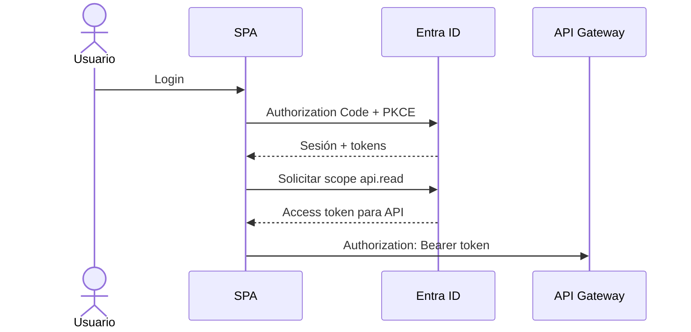

# Etapa 5 · MSAL, Authorization Code + PKCE y access token

## Objetivo

Configurar la SPA para autenticar al usuario y obtener un access token destinado a la API propia.

## Paso 1 · Instalar MSAL

En una SPA JavaScript:

```bash
npm install @azure/msal-browser
```

## Paso 2 · Configuración mínima

Ejemplo conceptual:

```javascript
import { PublicClientApplication } from "@azure/msal-browser";

const msalConfig = {
  auth: {
    clientId: "<SPA_CLIENT_ID>",
    authority: "https://login.microsoftonline.com/<TENANT_ID>",
    redirectUri: "http://localhost:5173"
  }
};

export const msalInstance = new PublicClientApplication(msalConfig);
```

Los valores deben corresponder exactamente al tenant y App Registration de las etapas anteriores.

## Paso 3 · Inicializar antes de usar

La instancia debe inicializarse antes de ejecutar login o adquisición de tokens, siguiendo la versión de MSAL utilizada.

## Paso 4 · Login

El login demuestra identidad, pero todavía no demuestra que el frontend tenga autorización para llamar la API.

## Paso 5 · Solicitar scope de la API propia

```javascript
const tokenRequest = {
  scopes: ["api://<API_CLIENT_ID>/api.read"]
};
```

Después de tener una cuenta autenticada, intentar adquisición silenciosa primero y usar interacción cuando corresponda.

## Paso 6 · Enviar token al gateway

```javascript
const response = await fetch(API_URL, {
  headers: {
    Authorization: `Bearer ${accessToken}`
  }
});
```

No enviar ID token como sustituto del access token.

## ID token vs access token

| Token | Finalidad principal |
|---|---|
| ID token | entregar información sobre la autenticación del usuario al cliente |
| Access token | autorizar acceso a un recurso/API |

## Paso 7 · Inspeccionar sin confiar solo en el decode

Para fines pedagógicos se pueden observar claims como:

- `iss`;
- `aud`;
- `exp`;
- `scp`;
- identificadores del usuario/tenant cuando estén presentes.

**Decodificar no equivale a verificar.** La decisión de confianza real debe ocurrir en el componente que protege la API.

## Flujo esperado



## Checkpoint E5

- [ ] owner puede hacer login;
- [ ] Guest puede hacer login;
- [ ] SPA solicita scope de la API propia;
- [ ] se obtiene access token;
- [ ] el token no está destinado a Microsoft Graph;
- [ ] el grupo distingue ID token de access token;
- [ ] no hay client secret embebido.

→ Continúa con [Etapa 6 · AWS API Gateway](./06-api-gateway.md).
