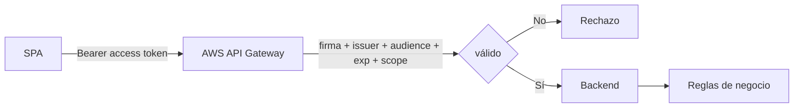

# Etapa 6 · AWS API Gateway + JWT Authorizer

## Objetivo

Proteger la API para que AWS API Gateway acepte únicamente access tokens emitidos por el tenant correcto y destinados a la API correcta.

## Paso 1 · Crear o seleccionar HTTP API

En AWS API Gateway trabajar sobre la HTTP API que expone el backend del proyecto.

## Paso 2 · Crear JWT Authorizer

Configurar un JWT Authorizer asociado a Microsoft Entra ID.

### Issuer

Para tokens v2 del tenant:

```text
https://login.microsoftonline.com/<TENANT_ID>/v2.0
```

El Tenant ID debe ser exactamente el mismo usado por la SPA.

### Audience

Configurar la audiencia esperada para la API según el App Registration y los claims reales emitidos. No aceptar una audience genérica ni asumir que cualquier token Microsoft sirve.

## Paso 3 · Asociar authorizer a rutas protegidas

Aplicar el authorizer a los endpoints que deben requerir autenticación.

Ejemplo:

```text
GET /private
```

## Paso 4 · Exigir scope cuando corresponda

Para una ruta de lectura, exigir por ejemplo:

```text
api.read
```

El access token debe contener el permiso delegado correspondiente en `scp`.

## Paso 5 · Entender la frontera



API Gateway puede centralizar controles técnicos de autenticación/autorización, pero el backend sigue siendo responsable de decisiones de dominio.

## Paso 6 · Probar sin token antes del caso feliz

Antes de probar el login completo:

1. llamar endpoint sin `Authorization`;
2. comprobar rechazo;
3. luego llamar con token correcto;
4. comprobar acceso;
5. finalmente probar token/scope incorrecto.

Esto demuestra que la ruta realmente está protegida y no simplemente que "funciona cuando hago login".

## Checkpoint E6

- [ ] issuer específico del tenant;
- [ ] audience de la API correctamente configurada;
- [ ] authorizer asociado a ruta;
- [ ] scope requerido cuando aplique;
- [ ] sin token se rechaza;
- [ ] con token correcto se permite;
- [ ] token destinado a otro recurso se rechaza;
- [ ] scope insuficiente se rechaza.

→ Continúa con [Etapa 7 · Pruebas y troubleshooting](./07-pruebas-troubleshooting.md).
