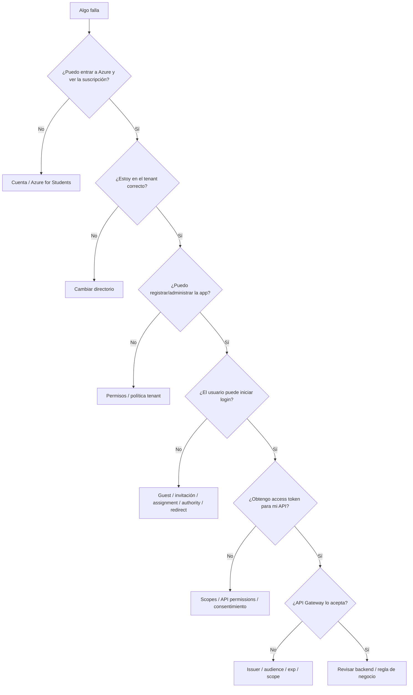

# Etapa 7 · Matriz de pruebas, troubleshooting y evidencia

## Objetivo

Diagnosticar por capas y demostrar que el flujo completo funciona para más de un usuario.

## Matriz mínima

| ID | Caso | Resultado esperado |
|---|---|---|
| AUTH-E0 | Azure for Students visible y activo | continuar |
| AUTH-E1 | directorio correcto y App registrations accesible | continuar |
| AUTH-E2 | owner hace login en SPA | éxito |
| AUTH-E3 | usuario no invitado intenta entrar a single-tenant | rechazo |
| AUTH-E4 | Guest pendiente intenta entrar | completar invitación |
| AUTH-E5 | Guest aceptado hace login | éxito |
| AUTH-E6 | endpoint protegido sin token | rechazo |
| AUTH-E7 | access token para API propia | acceso permitido |
| AUTH-E8 | token para recurso equivocado | rechazo |
| AUTH-E9 | token válido con scope insuficiente | rechazo de autorización |
| AUTH-E10 | redirect URI incorrecto | fallo OAuth antes de API |

## Árbol de diagnóstico



## Errores frecuentes y qué revisar primero

### "No me aparece el tenant"

1. verificar cuenta activa;
2. abrir selector de directorios;
3. comprobar si el alumno confunde suscripción con directorio;
4. no asumir que Azure for Students creó un tenant administrable adicional.

### "No tengo permiso para crear App Registration"

1. verificar directorio;
2. verificar si la cuenta es Member o Guest;
3. revisar política de registro de aplicaciones;
4. no intentar solucionar desde el código;
5. si es tenant institucional administrado, documentar la restricción y usar el entorno autorizado para el laboratorio.

### "No puedo invitar usuarios"

Revisar permisos/políticas de colaboración externa del tenant. La ausencia de la opción es un problema administrativo, no de MSAL.

### "A mí me funciona pero a mi compañero no"

1. confirmar Guest creado;
2. confirmar invitación aceptada;
3. confirmar tenant/authority;
4. revisar `Assignment required?`;
5. probar primero login, después API.

### "Hace login pero API Gateway responde 401/403"

Inspeccionar:

- `iss`;
- `aud`;
- `exp`;
- `scp`;
- authorizer de la ruta;
- scope requerido.

No reemplazar access token por ID token.

### "El token se ve correcto al decodificar"

Eso no prueba que la API deba confiar en él. Decodificar solo permite leer claims; el gateway debe verificar firma y contexto.

## Evidencia requerida

El grupo debe conservar evidencia sanitizada de:

1. Azure for Students activo;
2. nombre del tenant/directorio utilizado;
3. App Registration SPA single-tenant;
4. App Registration API + scope;
5. Member y Guest existentes;
6. Guest aceptado;
7. login de al menos dos usuarios;
8. access token observado con `iss`, `aud` y `scp` sin publicar el token completo;
9. request sin token rechazado;
10. request con token correcto aceptado;
11. caso de token/scope incorrecto rechazado;
12. diagrama Mermaid del flujo;
13. DevLog con problema, causa, corrección y resultado.

## No publicar

- passwords;
- tokens completos reutilizables;
- refresh tokens;
- client secrets;
- AWS credentials;
- certificados/keys privadas.

## Criterio de término

El flujo no se considera terminado porque el dueño del tenant pueda iniciar sesión. Debe demostrarse el circuito completo:

```text
Member + Guest
→ SPA
→ Entra ID
→ access token para API propia
→ API Gateway valida
→ backend recibe request autorizado
```

← [Volver al índice](./README.md).
