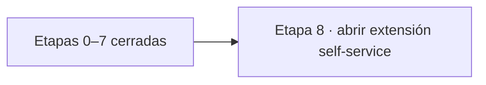
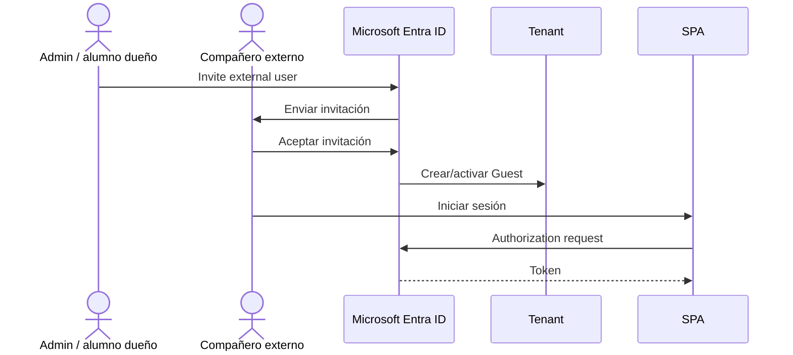
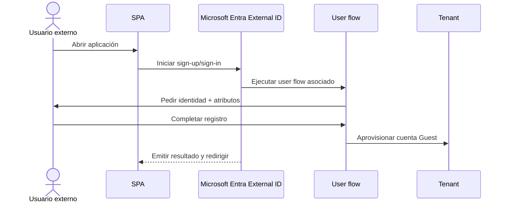
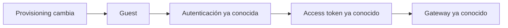
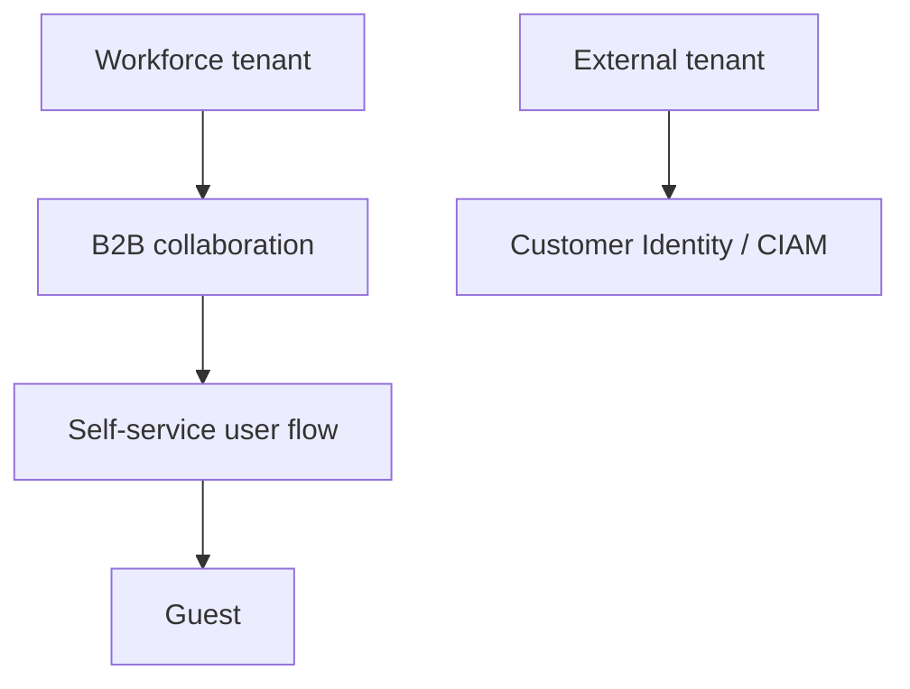

# Etapa 8 · Extensión: auto-registro de usuarios externos

## Objetivo

Comprender la diferencia entre **invitar manualmente** a un usuario Guest/B2B y permitir que una persona externa se **auto-registre** mediante un user flow de Microsoft Entra External ID.

> Esta etapa se trabaja **solo después de cerrar la Etapa 7**. El flujo base de tenant → SPA/API → Guest manual → MSAL → access token → API Gateway → pruebas debe estar comprendido antes de automatizar el alta.

## Prerrequisito de entrada

Antes de continuar debes poder demostrar:

- Guest/B2B manual funcionando;
- login desde la SPA;
- access token para la API propia;
- Gateway aceptando/rechazando según token/scope;
- troubleshooting base realizado en Etapa 7.



## Qué cambia respecto de la invitación manual

### Invitación manual



### Self-service sign-up



## Idea clave

En ambos modelos el usuario termina siendo una identidad externa gestionada por Entra. Lo que cambia es **quién inicia el alta**.

```text
Invitación manual
admin conoce al usuario primero
→ lo invita
→ usuario acepta
→ Guest

Self-service
usuario llega a la aplicación
→ inicia registro
→ Entra ejecuta user flow
→ Guest
```

## Qué NO cambia

La extensión self-service no reemplaza:

- App Registration de la SPA;
- App Registration de la API;
- Authorization Code + PKCE;
- MSAL;
- access token;
- issuer/audience/scopes;
- API Gateway/JWT Authorizer;
- autorización de negocio.



## Qué NO significa self-service

No significa:

- que el tenant quede abierto a cualquier recurso;
- que el usuario obtenga permisos administrativos;
- que desaparezcan issuer, audience, scopes o autorización;
- que la aplicación tenga que ser multitenant;
- que la SPA cree usuarios por código propio.

## Workforce tenant B2B vs external tenant CIAM

En esta guía usamos **self-service B2B dentro de un workforce tenant**. No estamos creando un external tenant orientado a Customer Identity/CIAM.



Para DSY1107 seguimos la rama superior.

## Checkpoint E8

- [ ] Etapas 0–7 completadas o defendibles;
- [ ] Guest manual funciona;
- [ ] se comprende Member vs Guest;
- [ ] se comprende que self-service no equivale a multitenant;
- [ ] se puede explicar qué cambia y qué permanece igual;
- [ ] se distingue workforce B2B de external tenant/CIAM.

→ Continúa con [Etapa 9 · Habilitar self-service sign-up en el workforce tenant](./09-self-service-habilitar-tenant.md).
