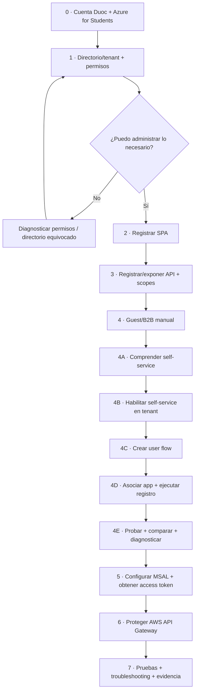
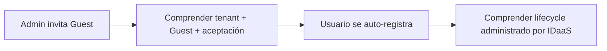

# Microsoft Entra ID · guía completa por etapas

**Asignatura:** DSY1107 Desarrollo Cloud Native I  
**Escenario:** cuenta Duoc + Azure for Students → Microsoft Entra ID → SPA → access token → AWS API Gateway → backend  
**Objetivo:** llegar desde una cuenta recién habilitada hasta un flujo de autenticación y autorización verificable, sin saltarse pasos.

> Esta guía separa deliberadamente **suscripción Azure**, **tenant/directorio Entra**, **App Registration**, **usuarios**, **OAuth/OIDC**, **tokens** y **protección de API**. Son conceptos relacionados, pero no son lo mismo.

## Ruta obligatoria



No avanzar de etapa si el checkpoint de la etapa anterior falla.

## Etapas

1. [Etapa 0 · Cuenta Duoc y Azure for Students](./00-cuenta-duoc-azure-students.md)
2. [Etapa 1 · Directorio, tenant y permisos](./01-tenant-directorio-permisos.md)
3. [Etapa 2 · App Registration de la SPA](./02-app-registration-spa.md)
4. [Etapa 3 · API propia, scopes y permisos](./03-api-scopes.md)
5. [Etapa 4 · Usuarios externos Guest/B2B manual](./04-usuarios-externos.md)
6. [Etapa 4A · Introducción al self-service sign-up](./04a-self-service-introduccion.md)
7. [Etapa 4B · Habilitar self-service en el tenant](./04b-self-service-habilitar-tenant.md)
8. [Etapa 4C · Crear el user flow](./04c-self-service-crear-user-flow.md)
9. [Etapa 4D · Asociar la aplicación y ejecutar el auto-registro](./04d-self-service-asociar-aplicacion.md)
10. [Etapa 4E · Comparar, probar y diagnosticar](./04e-self-service-pruebas-troubleshooting.md)
11. [Etapa 5 · MSAL, PKCE y access token](./05-msal-token.md)
12. [Etapa 6 · AWS API Gateway + JWT Authorizer](./06-api-gateway.md)
13. [Etapa 7 · Matriz de pruebas y troubleshooting](./07-pruebas-troubleshooting.md)

## Por qué Guest manual va antes de self-service



Primero el alumno observa explícitamente qué identidad entra al tenant. Después automatiza ese mismo lifecycle mediante un user flow. Así el auto-registro se entiende como una **evolución del modelo**, no como una pantalla mágica de login.

## Regla de diagnóstico

Cuando algo falla, identificar primero **en qué frontera falla**:

```text
cuenta/suscripción
→ directorio/tenant
→ permisos Entra
→ App Registration
→ Guest manual / invitación
→ self-service habilitado
→ user flow
→ aplicación asociada al user flow
→ redirect URI / MSAL
→ emisión de token
→ issuer/audience/scope
→ API Gateway
→ backend
```

Nunca cambiar varias capas a la vez. Corregir una frontera, volver a probar y recién continuar.

## Relación con los otros materiales

- [Referencia extendida · usuarios externos + SPA + API Gateway](../entra-usuarios-externos-spa-api-gateway.md)
- [Semana 4](../../../semanas/semana-04/README.md)
- [Proyecto formativo RegistrApp · Semana 4](../../../proyecto-formativo/semana-04/README.md)
- [Lab Firebase Authentication](../../../labs/firebase-auth-miniapp/README.md)

Firebase se estudia después como otro proveedor IDaaS para comparar capacidades y modelos, no para reemplazar la comprensión del flujo Entra.
