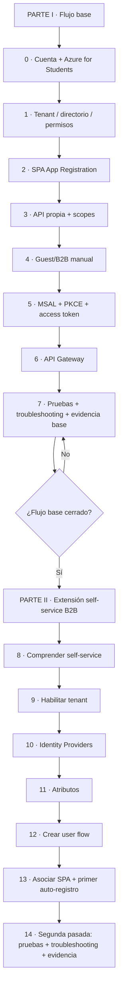
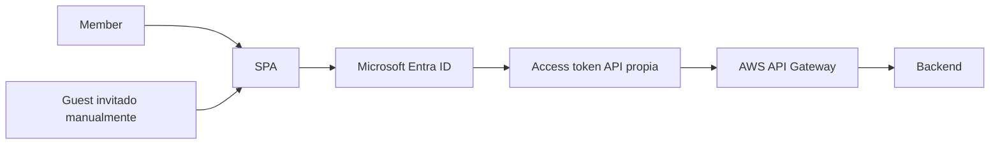
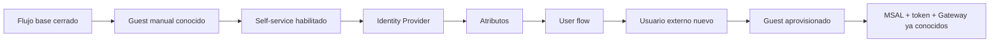

# Microsoft Entra ID · guía completa por etapas

**Asignatura:** DSY1107 Desarrollo Cloud Native I  
**Escenario base:** cuenta Duoc + Azure for Students → Microsoft Entra ID → SPA → access token → AWS API Gateway → backend  
**Objetivo:** completar primero el flujo base de autenticación/autorización y sus pruebas; solo después extenderlo con auto-registro B2B de terceros.

> La guía separa deliberadamente **suscripción Azure**, **tenant/directorio Entra**, **App Registration**, **usuarios**, **OAuth/OIDC**, **tokens**, **protección de API** y, en una segunda fase, **self-service sign-up**.

## Estructura pedagógica

La guía tiene dos recorridos deliberadamente separados.



**Regla:** no comenzar la Parte II mientras la Etapa 7 no esté razonablemente cerrada.

---

# Parte I · Flujo base

1. [Etapa 0 · Cuenta Duoc y Azure for Students](./00-cuenta-duoc-azure-students.md)
2. [Etapa 1 · Directorio, tenant y permisos](./01-tenant-directorio-permisos.md)
3. [Etapa 2 · App Registration de la SPA](./02-app-registration-spa.md)
4. [Etapa 3 · API propia, scopes y permisos](./03-api-scopes.md)
5. [Etapa 4 · Usuarios externos Guest/B2B manual](./04-usuarios-externos.md)
6. [Etapa 5 · MSAL, PKCE y access token](./05-msal-token.md)
7. [Etapa 6 · AWS API Gateway + JWT Authorizer](./06-api-gateway.md)
8. [Etapa 7 · Matriz de pruebas, troubleshooting y evidencia base](./07-pruebas-troubleshooting.md)

La Parte I debe demostrar el circuito completo antes de automatizar el alta de terceros:



---

# Parte II · Extensión: auto-registro B2B de terceros

Esta parte **no modifica retroactivamente el orden de la Parte I**. Extiende un sistema que ya funciona.

9. [Etapa 8 · Introducción al self-service sign-up](./04a-self-service-introduccion.md)
10. [Etapa 9 · Habilitar self-service en el workforce tenant](./04b-self-service-habilitar-tenant.md)
11. [Etapa 10 · Preparar Identity Providers](./04b1-self-service-identity-providers.md)
12. [Etapa 11 · Definir atributos built-in/custom](./04b2-self-service-atributos.md)
13. [Etapa 12 · Crear el user flow](./04c-self-service-crear-user-flow.md)
14. [Etapa 13 · Asociar la SPA y ejecutar el primer auto-registro](./04d-self-service-asociar-aplicacion.md)
15. [Etapa 14 · Segunda pasada integral: pruebas, troubleshooting y evidencia](./04e-self-service-pruebas-troubleshooting.md)

## Qué cambia en la extensión



La Parte II cambia **el mecanismo de incorporación del usuario externo**. No vuelve a enseñar desde cero MSAL, access tokens o API Gateway; reutiliza esas competencias para verificar que el nuevo mecanismo de provisioning no rompe el circuito existente.

## Por qué el self-service va después de la Etapa 7

Primero el estudiante debe poder afirmar:

```text
sé configurar el tenant
sé registrar SPA y API
sé incorporar un Guest manual
sé autenticar con MSAL/PKCE
sé obtener un access token para mi API
sé validar el token en Gateway
sé diagnosticar 401/403
```

Solo entonces se introduce:

```text
ahora reemplazaremos la invitación previa
por un lifecycle de alta self-service
sin cambiar las responsabilidades posteriores
```

Eso evita mezclar un problema de provisioning con un problema OAuth, MSAL o Gateway.

---

## Regla de diagnóstico global

### Parte I

```text
cuenta/suscripción
→ directorio/tenant
→ permisos Entra
→ App Registration
→ Guest manual/invitación
→ redirect URI / MSAL
→ emisión de access token
→ issuer/audience/scope
→ API Gateway
→ backend
```

### Parte II

```text
flujo base ya verde
→ self-service habilitado
→ Identity Provider
→ atributos
→ user flow
→ aplicación asociada
→ provisioning Guest
→ sign-in posterior
→ reutilizar token/Gateway del flujo base
```

Nunca cambiar varias fronteras a la vez.

---

## Relación con los otros materiales

- [Dominio Identity & Access](../README.md)
- [Referencia extendida · usuarios externos + SPA + API Gateway](../entra-usuarios-externos-spa-api-gateway.md)
- [Semana 4](../../../semanas/semana-04/README.md)
- [Proyecto formativo RegistrApp · Semana 4](../../../proyecto-formativo/semana-04/README.md)
- [Lab Firebase Authentication](../../../labs/firebase-auth-miniapp/README.md)

Firebase se estudia como otro proveedor IDaaS para comparar capacidades y modelos, no para reemplazar la comprensión del flujo Entra.
