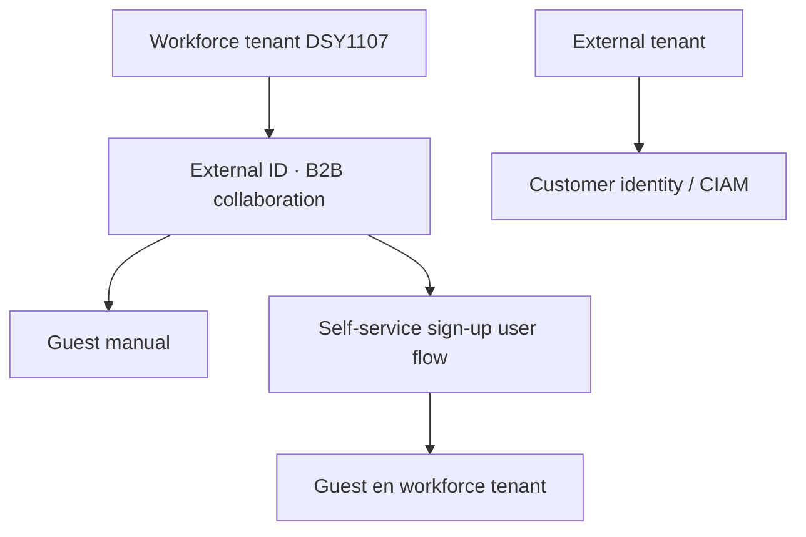
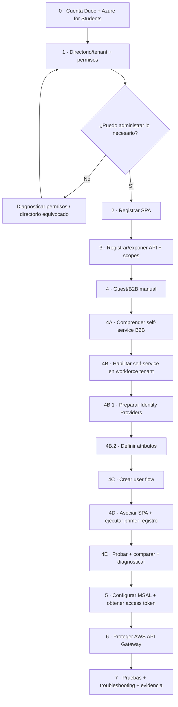
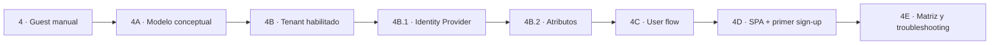
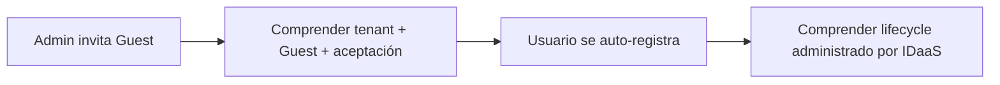
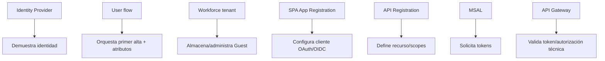

# Microsoft Entra ID · guía completa por etapas

**Asignatura:** DSY1107 Desarrollo Cloud Native I  
**Escenario:** cuenta Duoc + Azure for Students → Microsoft Entra ID → SPA → access token → AWS API Gateway → backend  
**Objetivo:** llegar desde una cuenta recién habilitada hasta un flujo de autenticación y autorización verificable, sin saltarse pasos.

> Esta guía separa deliberadamente **suscripción Azure**, **tenant/directorio Entra**, **App Registration**, **usuarios**, **External ID/B2B**, **Identity Providers**, **atributos**, **OAuth/OIDC**, **tokens** y **protección de API**. Son conceptos relacionados, pero no son lo mismo.

## Escenario de esta guía

La rama de auto-registro usa **Microsoft Entra External ID para B2B collaboration dentro de un workforce tenant**.

No estamos creando un `external tenant` orientado a CIAM/clientes.



La rama `external tenant/CIAM` se utiliza solo como comparación o evolución posterior.

## Ruta obligatoria



No avanzar de etapa si el checkpoint de la etapa anterior falla.

## Etapas

1. [Etapa 0 · Cuenta Duoc y Azure for Students](./00-cuenta-duoc-azure-students.md)
2. [Etapa 1 · Directorio, tenant y permisos](./01-tenant-directorio-permisos.md)
3. [Etapa 2 · App Registration de la SPA](./02-app-registration-spa.md)
4. [Etapa 3 · API propia, scopes y permisos](./03-api-scopes.md)
5. [Etapa 4 · Usuarios externos Guest/B2B manual](./04-usuarios-externos.md)
6. [Etapa 4A · Introducción al self-service B2B](./04a-self-service-introduccion.md)
7. [Etapa 4B · Habilitar self-service en el workforce tenant](./04b-self-service-habilitar-tenant.md)
8. [Etapa 4B.1 · Preparar Identity Providers](./04b1-self-service-identity-providers.md)
9. [Etapa 4B.2 · Definir atributos built-in/custom](./04b2-self-service-atributos.md)
10. [Etapa 4C · Crear el user flow](./04c-self-service-crear-user-flow.md)
11. [Etapa 4D · Asociar la SPA y ejecutar el primer auto-registro](./04d-self-service-asociar-aplicacion.md)
12. [Etapa 4E · Comparar, probar y diagnosticar](./04e-self-service-pruebas-troubleshooting.md)
13. [Etapa 5 · MSAL, PKCE y access token](./05-msal-token.md)
14. [Etapa 6 · AWS API Gateway + JWT Authorizer](./06-api-gateway.md)
15. [Etapa 7 · Matriz de pruebas y troubleshooting](./07-pruebas-troubleshooting.md)

## Subruta self-service B2B

Si el objetivo inmediato es trabajar únicamente auto-registro de terceros, utiliza esta secuencia:



### Qué prueba cada checkpoint

| Etapa | Pregunta que debe quedar resuelta |
|---|---|
| 4 | ¿Qué es un Guest y cómo entra manualmente al tenant? |
| 4A | ¿Qué automatiza realmente self-service? |
| 4B | ¿Está habilitada la capacidad en el workforce tenant y tengo permisos? |
| 4B.1 | ¿Con qué identidad demostrará quién es el tercero? |
| 4B.2 | ¿Qué información adicional recopilaré en el primer alta? |
| 4C | ¿Qué experiencia de alta define el user flow? |
| 4D | ¿La SPA realmente produce un Guest nuevo sin invitación manual? |
| 4E | ¿Puedo identificar exactamente dónde falla cada escenario? |

## Por qué Guest manual va antes de self-service



Primero el alumno observa explícitamente qué identidad entra al tenant. Después automatiza ese mismo lifecycle mediante un user flow. Así el auto-registro se entiende como una **evolución del modelo**, no como una pantalla mágica de login.

## Fronteras de responsabilidad



Una sola pantalla del portal de Azure puede mostrar varios de estos conceptos, pero eso no los convierte en una sola responsabilidad.

## Regla de diagnóstico

Cuando algo falla, identificar primero **en qué frontera falla**:

```text
cuenta/suscripción
→ directorio/workforce tenant
→ roles/permisos Entra
→ App Registration
→ Guest manual / invitación
→ self-service habilitado
→ Identity Provider
→ atributos / Page layout
→ user flow
→ SPA asociada al user flow
→ primer sign-up / provisioning Guest
→ redirect URI / MSAL
→ emisión de access token
→ issuer/audience/scope
→ API Gateway
→ backend
```

Nunca cambiar varias capas a la vez. Corregir una frontera, volver a probar y recién continuar.

## Evidencia recomendada para self-service

No captures cada click. Evidencia checkpoints con significado:

1. self-service habilitado en el tenant;
2. IdP seleccionado;
3. atributos seleccionados;
4. user flow creado;
5. SPA asociada;
6. identidad inexistente antes del sign-up;
7. Guest creado después del sign-up;
8. segundo acceso como sign-in;
9. al menos un caso negativo diagnosticado;
10. sin secretos, tokens completos ni datos personales innecesarios.

## Relación con los otros materiales

- [Índice del dominio Identity & Access](../README.md)
- [Referencia extendida · usuarios externos + SPA + API Gateway](../entra-usuarios-externos-spa-api-gateway.md)
- [Semana 4](../../../semanas/semana-04/README.md)
- [Proyecto formativo RegistrApp · Semana 4](../../../proyecto-formativo/semana-04/README.md)
- [Lab Firebase Authentication](../../../labs/firebase-auth-miniapp/README.md)
- [Vista web de identidad](../../../page/identidad.html)

Firebase se utiliza como otro proveedor IDaaS para comparar capacidades y modelos, no para reemplazar la comprensión de tenant, B2B y lifecycle externo de Entra.
