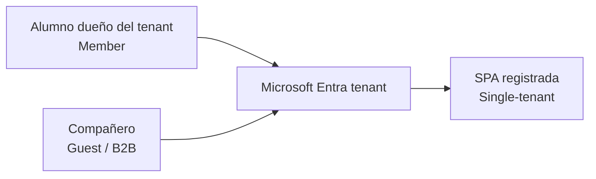
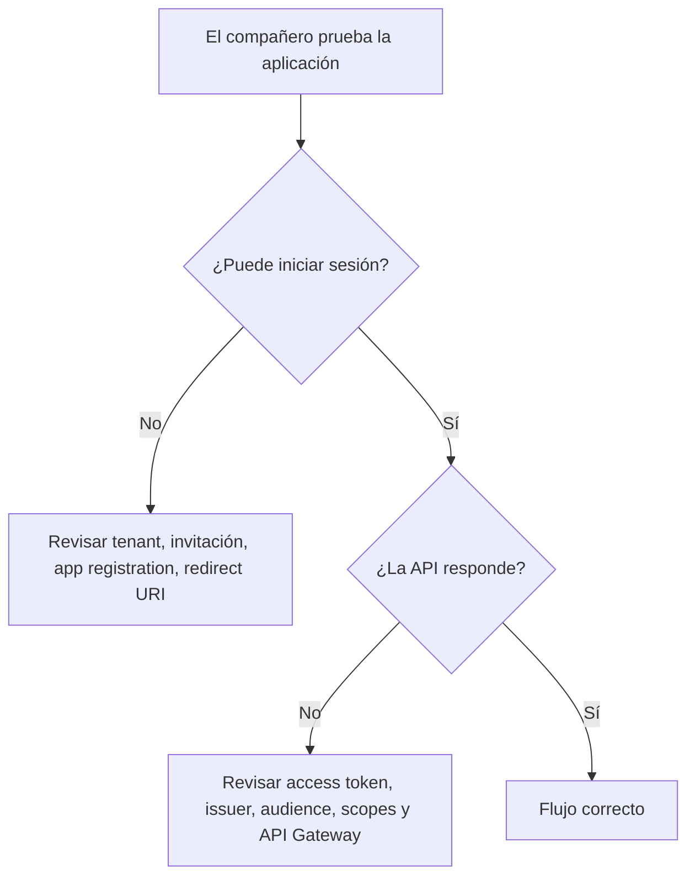
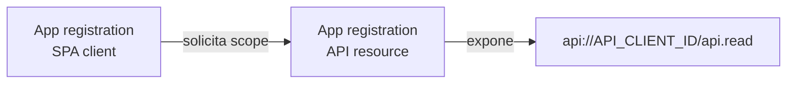
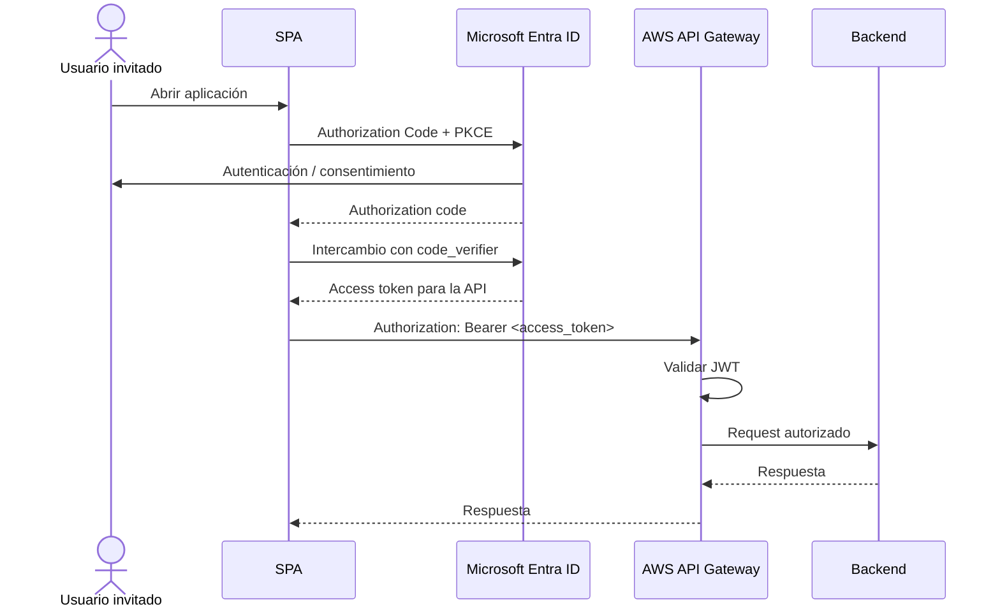
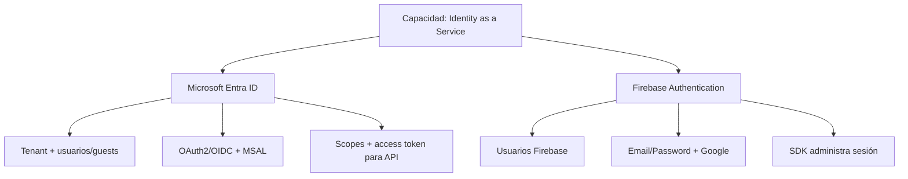

# Microsoft Entra ID · usuarios externos en una SPA con API protegida

**Asignatura:** DSY1107 Desarrollo Cloud Native I  
**Propósito:** apoyo de clase, laboratorio y proyecto transversal  
**Escenario base:** SPA → Microsoft Entra ID → access token → AWS API Gateway → backend

## 1. El problema que este documento resuelve

Un estudiante crea un tenant de Microsoft Entra ID, registra una SPA y logra autenticarse con su propia cuenta. Luego un compañero intenta iniciar sesión y no puede.

La primera pregunta no es "¿qué código falta?", sino:

> **¿Quién está autorizado a autenticarse contra este tenant y esta aplicación?**

En DSY1107 trabajaremos inicialmente con una aplicación **single-tenant**. Eso significa que pueden iniciar sesión:

- usuarios miembros del tenant;
- usuarios externos invitados al tenant como **Guest / B2B collaboration users**.

Por lo tanto, si los integrantes del grupo no pertenecen al tenant creado por el estudiante, deben ser invitados como usuarios externos.

## 2. Single-tenant no significa "solo el creador"

Una aplicación configurada como:

`Accounts in this organizational directory only`

acepta usuarios del directorio donde fue registrada. El directorio puede contener tanto miembros como invitados.



### Regla para esta etapa

**No cambies la aplicación a multitenant solo para que entren tus compañeros.**

Para el ejercicio de clase queremos que el grupo comprenda explícitamente:

1. tenant;
2. directorio de identidades;
3. usuario miembro vs usuario externo;
4. aplicación single-tenant;
5. emisión de tokens para una API protegida.

Más adelante se puede comparar este diseño con una aplicación multitenant.

---

# 3. Procedimiento: invitar a un compañero como usuario externo

## Paso 1 · Entrar al tenant correcto

1. Ingresar a **Microsoft Entra admin center**.
2. Verificar en la parte superior que se está trabajando en el tenant creado para el proyecto.
3. Ir a:

`Entra ID → Users`

## Paso 2 · Crear la invitación

1. Seleccionar **New user**.
2. Elegir **Invite external user**.
3. Ingresar:
   - correo del compañero;
   - nombre visible;
   - mensaje opcional de invitación.
4. Revisar y enviar la invitación.

El usuario aparecerá en el directorio con tipo **Guest**.

## Paso 3 · El compañero acepta la invitación

El compañero debe abrir el correo recibido y aceptar la invitación.

Después de aceptar, su identidad externa queda representada dentro del tenant como un usuario invitado.

> La contraseña del compañero no se copia ni se administra manualmente en el tenant. En B2B, la identidad sigue siendo autenticada por su proveedor/origen compatible, mientras el tenant del proyecto controla su presencia y acceso como invitado.

## Paso 4 · Verificar el estado

En:

`Entra ID → Users → <usuario invitado>`

verificar que:

- el usuario existe;
- el tipo sea Guest;
- la invitación haya sido aceptada o no esté pendiente;
- no esté bloqueado.

---

# 4. Revisar la App Registration de la SPA

Ir a:

`Entra ID → App registrations → <SPA>`

## Supported account types

Para esta etapa debe permanecer:

`Accounts in this organizational directory only`

## Authentication

La SPA debe estar registrada como **Single-page application** y contener el redirect URI real que utiliza el frontend.

Ejemplos locales:

- `http://localhost:5173`
- `http://localhost:3000`

No agregar un client secret al frontend. Una SPA es un **public client** y debe usar Authorization Code + PKCE.

## Authority

Para el escenario single-tenant con invitados, usar el tenant concreto:

```text
https://login.microsoftonline.com/<TENANT_ID>
```

Evitar `common` durante este ejercicio, porque queremos que el usuario acceda explícitamente al tenant donde fue invitado.

---

# 5. ¿Y si todavía no puede entrar?

Seguir este orden de diagnóstico.

## A. ¿Aceptó la invitación?

Si el estado sigue pendiente, reenviar la invitación y completarla primero.

## B. ¿La SPA usa el tenant correcto?

Comprobar `tenantId` / `authority` en la configuración de MSAL.

## C. ¿El redirect URI coincide exactamente?

Protocolo, host, puerto y path deben coincidir con lo configurado en Entra.

## D. ¿La Enterprise Application exige asignación?

Revisar:

`Entra ID → Enterprise applications → <aplicación> → Properties`

Si **Assignment required?** está habilitado, el usuario o un grupo que lo contenga debe ser asignado explícitamente a la aplicación.

## E. ¿El error ocurre al autenticar o al llamar la API?

Son problemas distintos.



---

# 6. Autenticarse no es suficiente: la SPA necesita un access token para SU API

Una confusión frecuente es obtener un token de Microsoft Graph y enviarlo a la API propia.

Eso es incorrecto.

La SPA debe solicitar un **access token destinado a la API del proyecto**.

## Registro recomendado

Conceptualmente existen dos aplicaciones:



### API registration

En la app registration que representa la API:

1. ir a **Expose an API**;
2. definir el Application ID URI, por ejemplo:

```text
api://<API_CLIENT_ID>
```

3. crear un scope, por ejemplo:

```text
api.read
```

El scope completo será:

```text
api://<API_CLIENT_ID>/api.read
```

### SPA registration

En la SPA:

1. ir a **API permissions**;
2. agregar permiso sobre la API propia;
3. seleccionar el scope expuesto.

En MSAL, solicitar ese scope al adquirir el access token.

Ejemplo conceptual:

```javascript
const tokenRequest = {
  scopes: ["api://<API_CLIENT_ID>/api.read"]
};
```

---

# 7. Flujo completo esperado



---

# 8. Configuración conceptual del JWT Authorizer en AWS API Gateway

Para una HTTP API con JWT Authorizer, API Gateway debe validar como mínimo:

- firma;
- `iss`;
- `aud`;
- expiración;
- scopes cuando la ruta los requiera.

## Issuer

Para tokens v2 de un tenant específico:

```text
https://login.microsoftonline.com/<TENANT_ID>/v2.0
```

## Audience

Debe corresponder a la audiencia de la API, no a "cualquier token válido de Microsoft".

En access tokens v2 emitidos para una API propia, el claim `aud` corresponde al identificador esperado para esa API; debe verificarse contra la configuración real del App Registration.

## Scope

Una ruta puede requerir, por ejemplo:

```text
api.read
```

El token debe contener el permiso correspondiente en `scp`.

---

# 9. Matriz mínima de pruebas del grupo

| Caso | Usuario | Login | Token para API | Resultado esperado |
|---|---|---:|---:|---|
| EXT-01 | dueño del tenant | sí | sí | API autorizada |
| EXT-02 | compañero no invitado | no | no | login rechazado |
| EXT-03 | compañero invitado, invitación pendiente | no/comportamiento incompleto | no | completar invitación |
| EXT-04 | compañero Guest aceptado | sí | sí | API autorizada |
| EXT-05 | Guest autenticado, token ausente | sí | no | API Gateway rechaza |
| EXT-06 | Guest autenticado, token para recurso equivocado | sí | incorrecto | API Gateway rechaza por audience/issuer |
| EXT-07 | Guest autenticado, scope insuficiente | sí | sí | autorización rechazada |

---

# 10. Single-tenant + Guests vs Multitenant

| Modelo | ¿Quién puede autenticarse? | Uso en DSY1107 |
|---|---|---|
| Single-tenant | miembros + guests del tenant | **modelo inicial recomendado** |
| Multitenant organizacional | usuarios de otros tenants Entra | etapa posterior / comparación |
| Multitenant + cuentas personales | organizaciones + Microsoft personal | fuera del alcance inicial salvo decisión explícita |

La diferencia pedagógica es importante:

```text
Single-tenant + Guest
→ el dueño del tenant controla qué identidades externas incorpora.

Multitenant
→ la aplicación acepta identidades nativas de otros tenants y debe resolver además consentimiento, service principals y validación multi-issuer/multi-tenant.
```

---

# 11. Relación con Firebase Authentication

Firebase y Entra ID resuelven la misma capacidad general —delegar identidad a un IDaaS— pero con experiencias diferentes.

## Firebase en la segunda práctica

En el laboratorio Firebase, el estudiante habilita mecanismos como:

- Email/Password;
- Google Sign-In.

El usuario se registra/autentica dentro del modelo de identidad administrado por Firebase.

## Entra en el proyecto cloud

En esta primera etapa usamos:

- tenant;
- Member / Guest;
- App Registration;
- Authorization Code + PKCE;
- scopes;
- access token;
- API Gateway.

La comparación que debe poder explicar el estudiante es:



No memorizar productos: comprender la **capacidad**, el **flujo**, los **tokens** y la **frontera de confianza**.

---

# 12. Evidencia esperada para clase y proyecto transversal

El grupo debe poder mostrar:

1. App Registration configurada como single-tenant;
2. usuario dueño como Member;
3. al menos un compañero como Guest;
4. invitación aceptada;
5. login exitoso de ambos usuarios;
6. adquisición de un access token para la API propia;
7. request `Authorization: Bearer ...` hacia API Gateway;
8. caso autorizado;
9. al menos un caso rechazado por token ausente/incorrecto;
10. diagrama Mermaid del flujo;
11. DevLog explicando qué falló y cómo se diagnosticó.

## No subir al repositorio

Nunca versionar:

- contraseñas;
- access tokens;
- refresh tokens;
- client secrets;
- certificados privados;
- credenciales AWS;
- capturas que expongan secretos reutilizables.

---

# 13. Checklist rápido cuando "a mí me funciona pero a mi compañero no"

- [ ] ¿La aplicación es single-tenant?
- [ ] ¿El compañero aparece en `Entra ID → Users` como Guest?
- [ ] ¿Aceptó la invitación?
- [ ] ¿MSAL apunta al tenant correcto?
- [ ] ¿El redirect URI coincide?
- [ ] ¿La Enterprise Application requiere asignación explícita?
- [ ] ¿El login falla o falla después la llamada a la API?
- [ ] ¿Se está solicitando un access token para la API propia?
- [ ] ¿API Gateway valida el issuer correcto?
- [ ] ¿API Gateway valida la audience correcta?
- [ ] ¿La ruta requiere un scope presente en `scp`?

Si se responde ese checklist en orden, se evita mezclar problemas de **identidad**, **cliente OAuth**, **emisión de token** y **autorización del API**.