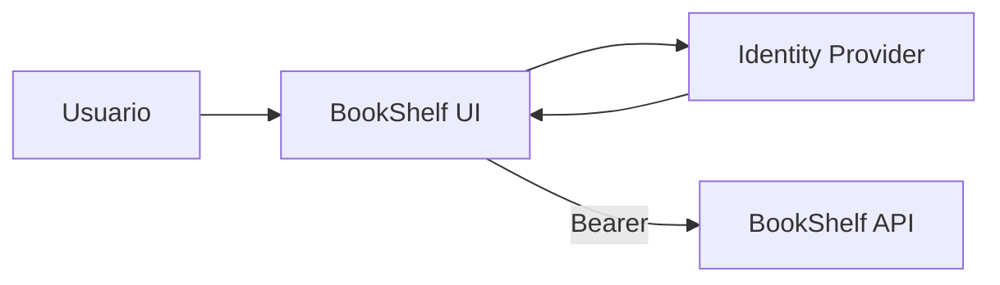

# Ejemplo · SPA + Resource Server

## Arquitectura mínima

## Contrato

- SPA pública sin client secret;
- API expone `books.read`;
- SPA solicita Access Token para esa API;
- backend valida token y scope.

## Matriz

| Caso | Resultado |
|---|---|
| sin token | 401 |
| audience incorrecta | 401 |
| sin `books.read` | 403 |
| token + scope correcto | 200 |

## Objetivo

Separar autenticación, validación técnica y autorización.
