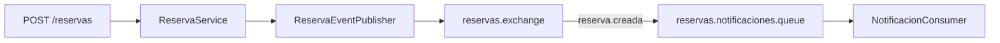

# Ejemplo · Reservas asíncronas

Ejemplo pequeño y autocontenido para visualizar:

```text
Producer -> DirectExchange -> Binding -> Queue -> Consumer
```

## Topología

- Exchange: `reservas.exchange`
- Routing key: `reserva.creada`
- Queue: `reservas.notificaciones.queue`



Payload sugerido:

```json
{
  "reservaId": 101,
  "usuarioId": 42,
  "estado": "CREADA"
}
```

## Separación de responsabilidades

```text
config/
  RabbitMQConfig
messaging/
  ReservaEventPublisher
  NotificacionConsumer
application/
  ReservaService
web/
  ReservaController
```

`ReservaService` contiene la lógica de aplicación. La configuración del broker no pertenece al Controller ni al Service.

## Extensión del ejemplo

Agregar:

- routing key `reserva.cancelada`;
- queue `reservas.auditoria.queue`;
- bindings suficientes para demostrar que una cola puede recibir más de un tipo de evento.

## Preguntas

1. ¿El consumer necesita conocer al producer?
2. ¿Qué responsabilidad tiene el exchange?
3. ¿Dónde debe vivir la lógica de negocio?
4. ¿Qué ocurre si el consumer se encuentra detenido temporalmente?
