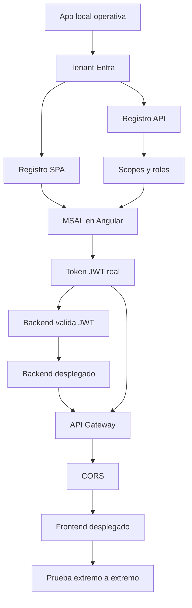

# 00 · Mapa EV1 y prerequisitos

## Objetivo

Comenzar desde un estado conocido y detectar bloqueos **antes** de entrar a AWS o Microsoft Entra.

## Qué se necesita

### Local

- Git;
- JDK 21+;
- Maven 3.9+;
- Node.js LTS;
- npm;
- Angular CLI;
- navegador moderno;
- Postman o `curl`;
- editor/IDE.

Validar:

```bash
git --version
java -version
mvn -version
node --version
npm --version
ng version
```

Si `ng` no existe:

```bash
npm install -g @angular/cli
```

## Cuentas cloud

Se necesitan dos capacidades independientes:

### Microsoft

Capacidad para trabajar con **Microsoft Entra External ID** y registrar aplicaciones. Se usará para:

- tenant de identidad;
- usuarios externos;
- sign-up/sign-in;
- aplicación SPA;
- API protegida;
- scopes;
- roles;
- emisión de tokens.

### AWS

Capacidad para crear, como mínimo:

- una instancia EC2 o equivalente autorizado por el laboratorio;
- un API Gateway HTTP API;
- rutas e integraciones;
- JWT Authorizer;
- configuración CORS;
- hosting para frontend según la alternativa disponible.

> Si el entorno académico restringe algún servicio, registrar la restricción antes de continuar. No improvisar una arquitectura diferente sin dejar constancia.

## Dependencias entre pasos



Esta secuencia es intencional. Ejemplo: **no se configura CORS para una URL de frontend cloud antes de tener esa URL**. Primero se usa `http://localhost:4200`; después del despliegue se agrega el origen real.

## Valores que se irán obteniendo

Crear localmente un archivo de notas **no versionado**, por ejemplo `ev1-local-values.txt`, y agregarlo a `.gitignore` si se guarda dentro de un repo.

Se completará con:

```text
TENANT_ID=
TENANT_DOMAIN=
SPA_CLIENT_ID=
API_CLIENT_ID=
API_AUDIENCE=
SCOPE_READ=
SCOPE_WRITE=
OIDC_ISSUER=
OIDC_JWKS_URI=
BACKEND_LOCAL_URL=http://localhost:8080
FRONTEND_LOCAL_URL=http://localhost:4200
BACKEND_CLOUD_URL=
API_GATEWAY_URL=
FRONTEND_CLOUD_URL=
```

No guardar secretos aquí.

## Puerta de validación 00

Antes de continuar:

- todas las herramientas locales responden;
- se sabe qué cuenta Microsoft se utilizará;
- se sabe qué cuenta/sandbox AWS se utilizará;
- el estudiante puede explicar por qué Azure/Entra y AWS cumplen responsabilidades distintas;
- no hay credenciales guardadas en Git.

## Contenido relacionado

- [Semana 1 · API Manager](../../semanas/semana-01/01-api-manager.md)
- [Semana 2 · IDaaS/CIAM](../../semanas/semana-02/02-idaas-ciam.md)
