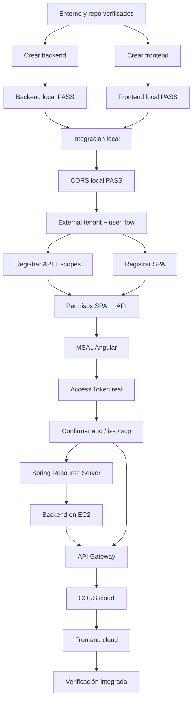

# 00 · Mapa y prerequisitos

## Objetivo

Comenzar desde un estado conocido y detectar bloqueos **antes** de entrar a AWS o Microsoft Entra.

Antes de esta etapa deben haberse completado:

- [00A · Preparar herramientas y entorno](./00a-preparar-entorno.md)
- [00B · Git/GitHub aplicado a la guía](./00b-git-github-flujo-guia.md)
- [00C · Matriz de valores](./00c-matriz-valores-y-checkpoints.md)
- [00D · Scaffolding vs código del estudiante](./00d-scaffolding-vs-codigo-estudiante.md)

## Qué se necesita localmente

- cuenta GitHub funcional;
- Git;
- GitHub Desktop, recomendado;
- GitHub CLI (`gh`), recomendado;
- IntelliJ IDEA;
- JDK 21;
- Node.js LTS compatible con Angular;
- npm;
- Angular CLI;
- VS Code o WebStorm;
- navegador con DevTools;
- Postman o `curl` como herramienta auxiliar.

## Maven global no es requisito

El backend se crea con IntelliJ + Spring Initializr y utiliza:

```text
mvnw
mvnw.cmd
.mvn/
```

Después de crear el backend:

PowerShell:

```powershell
.\mvnw.cmd --version
```

Git Bash/Linux/macOS:

```bash
./mvnw --version
```

## Validaciones iniciales

```bash
git --version
java -version
node --version
npm --version
ng version
```

Si se instaló GitHub CLI:

```bash
gh --version
gh auth status
```

`java -version` debe indicar Java 21.

## IDE/editor esperado

Backend:

```text
IntelliJ
→ New Project
→ Spring Boot / Spring Initializr
→ Java 21
→ Maven
→ dependencias mínimas
→ Maven Wrapper
```

Frontend:

```text
Angular CLI
→ SPA sin SSR
→ VS Code o WebStorm
```

No se construye manualmente la estructura Maven ni se escribe `pom.xml` desde cero. Tampoco se crea una estructura Angular manual.

## Cuentas cloud

### Microsoft

Capacidad para trabajar con Microsoft Entra External ID:

```text
External tenant
user flow
SPA app registration
API app registration
scopes
opcionalmente roles
emisión de tokens
```

### AWS

Capacidad para crear, como mínimo:

```text
EC2
API Gateway HTTP API
rutas/integraciones
JWT Authorizer
CORS
hosting frontend autorizado
```

Si el sandbox restringe un servicio, registrar la restricción antes de improvisar una sustitución.

## Dependencias entre pasos



## Dependencias que NO deben invertirse

```text
NO configurar CORS cloud sin FRONTEND_CLOUD_URL
NO cerrar API_AUDIENCE sin Access Token real
NO proteger backend antes de validar health público
NO integrar MSAL antes de que Angular compile
NO depurar Gateway mientras EC2/backend directo falla
NO depurar CORS con curl/Postman
NO agregar Docker a la ruta base
```

## Valores por etapa

La lista detallada está en [00C](./00c-matriz-valores-y-checkpoints.md). El orden resumido es:

```text
01 local
BACKEND_LOCAL_URL
FRONTEND_LOCAL_URL

02 Entra
TENANT_ID
TENANT_DOMAIN
TENANT_SUBDOMAIN
SPA_CLIENT_ID
API_CLIENT_ID
SCOPE_READ
SCOPE_WRITE
MSAL_AUTHORITY
OIDC_ISSUER
OIDC_JWKS_URI

03 token real
API_AUDIENCE
SCOPE_READ_CLAIM
SCOPE_WRITE_CLAIM

05 EC2
BACKEND_CLOUD_URL

06 Gateway
API_GATEWAY_URL

08 frontend cloud
FRONTEND_CLOUD_URL
```

No guardar secretos en `ev1-local-values.txt`.

## Puerta de validación 00

Antes de 01A/01B:

- [ ] 00A PASS.
- [ ] 00B PASS.
- [ ] 00C entendido y archivo local ignorado por Git.
- [ ] 00D entendido.
- [ ] Git y GitHub disponibles.
- [ ] Java 21 disponible.
- [ ] Angular CLI disponible.
- [ ] editor frontend disponible.
- [ ] navegador/DevTools disponible.
- [ ] cuenta/sandbox Microsoft identificado.
- [ ] cuenta/sandbox AWS identificado.
- [ ] se entiende Maven Wrapper.
- [ ] se distingue qué responsabilidad tendrá Entra y cuál AWS.
- [ ] no hay credenciales guardadas en Git.

## Contenido relacionado

- [Semana 1 · API Manager](../../semanas/semana-01/01-api-manager.md)
- [Semana 2 · IDaaS/CIAM](../../semanas/semana-02/02-idaas-ciam.md)
