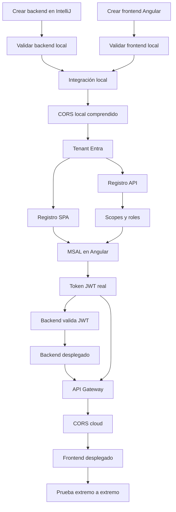

# 00 · Mapa EV1 y prerequisitos

## Objetivo

Comenzar desde un estado conocido y detectar bloqueos **antes** de entrar a AWS o Microsoft Entra.

## Qué se necesita

### Local

- Git;
- **IntelliJ IDEA**;
- **JDK 21**;
- Node.js LTS compatible con la versión de Angular utilizada;
- npm;
- Angular CLI;
- navegador moderno con DevTools;
- Postman o `curl` como herramienta auxiliar.

### Maven global no es requisito

El backend se creará con IntelliJ + Spring Initializr y utilizará el **Maven Wrapper generado por el proyecto**:

```text
mvnw
mvnw.cmd
.mvn/
```

Por lo tanto, no se exige instalar Maven globalmente.

Una vez creado el backend se validará Maven con:

Windows:

```powershell
.\mvnw.cmd --version
```

Linux/macOS:

```bash
./mvnw --version
```

### Validaciones iniciales

Antes de crear los proyectos:

```bash
git --version
java -version
node --version
npm --version
ng version
```

`java -version` debe mostrar Java 21.

Si `ng` no existe:

```bash
npm install -g @angular/cli
```

Luego:

```bash
ng version
```

## IDE esperado para backend

La guía asume que el backend Spring Boot será creado y trabajado desde **IntelliJ IDEA**.

Esto permite mantener una ruta única y reproducible para los alumnos:

```text
IntelliJ
→ New Project
→ Spring Boot / Spring Initializr
→ Java 21
→ Maven
→ dependencias mínimas
→ proyecto con Maven Wrapper
```

No se pedirá construir manualmente la estructura Maven ni escribir un `pom.xml` desde cero.

## Frontend esperado

El frontend será creado con **Angular CLI**.

No se entregará una aplicación visual compleja ni se evaluará diseño frontend avanzado. Angular se utilizará como SPA mínima para demostrar:

- redirect URI;
- OAuth2/OIDC;
- MSAL;
- Access Token;
- llamada HTTP protegida;
- CORS;
- integración con API Gateway.

## Cuentas cloud

Se necesitan dos capacidades independientes:

### Microsoft

Capacidad para trabajar con **Microsoft Entra External ID** y registrar aplicaciones. Se usará para:

- tenant de identidad;
- usuarios externos;
- sign-up/sign-in;
- aplicación SPA;
- API protegida;
- scopes;
- roles;
- emisión de tokens.

### AWS

Capacidad para crear, como mínimo:

- una instancia EC2 o equivalente autorizado por el laboratorio;
- un API Gateway HTTP API;
- rutas e integraciones;
- JWT Authorizer;
- configuración CORS;
- hosting para frontend según la alternativa disponible.

> Si el entorno académico restringe algún servicio, registrar la restricción antes de continuar. No improvisar una arquitectura diferente sin dejar constancia.

## Dependencias entre pasos



Esta secuencia es intencional.

Por ejemplo:

- no se configura CORS para una URL de frontend que todavía no existe;
- no se integra MSAL antes de que Angular funcione;
- no se protege Spring Boot antes de comprobar que responde sin seguridad;
- no se diagnostica API Gateway mientras el backend local todavía falla.

## Valores que se irán obteniendo

Crear localmente un archivo de notas **no versionado**, por ejemplo `ev1-local-values.txt`, y agregarlo a `.gitignore` si se guarda dentro de un repo.

Se completará con:

```text
TENANT_ID=
TENANT_DOMAIN=
SPA_CLIENT_ID=
API_CLIENT_ID=
API_AUDIENCE=
SCOPE_READ=
SCOPE_WRITE=
OIDC_ISSUER=
OIDC_JWKS_URI=
BACKEND_LOCAL_URL=http://localhost:8080
FRONTEND_LOCAL_URL=http://localhost:4200
BACKEND_CLOUD_URL=
API_GATEWAY_URL=
FRONTEND_CLOUD_URL=
```

No guardar secretos aquí.

## Puerta de validación 00

Antes de continuar:

- [ ] Git responde;
- [ ] IntelliJ IDEA está disponible;
- [ ] Java 21 funciona;
- [ ] Node y npm funcionan;
- [ ] Angular CLI funciona;
- [ ] se sabe qué cuenta Microsoft se utilizará;
- [ ] se sabe qué cuenta/sandbox AWS se utilizará;
- [ ] se entiende que Maven global no es necesario porque se usará Maven Wrapper;
- [ ] el estudiante puede explicar por qué Entra y AWS cumplen responsabilidades distintas;
- [ ] no hay credenciales guardadas en Git.

## Contenido relacionado

- [Semana 1 · API Manager](../../semanas/semana-01/01-api-manager.md)
- [Semana 2 · IDaaS/CIAM](../../semanas/semana-02/02-idaas-ciam.md)
