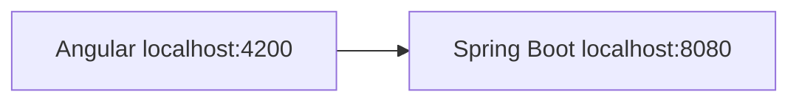
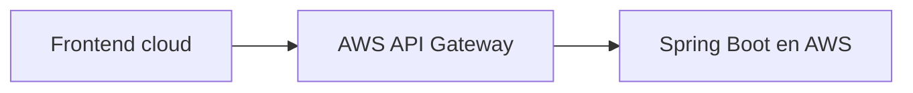

# 01C · Integrar frontend y backend localmente

## Objetivo

Conectar los dos proyectos ya validados:

```text
Angular :4200 → Spring Boot :8080
```

y observar **CORS desde el navegador** antes de corregirlo.

> Si `http://localhost:4200` o `http://localhost:8080/api/public/health` no funcionan por separado, volver a 01A/01B.

## Estado inicial

```text
frontend → http://localhost:4200
backend  → http://localhost:8080/api/public/health
```

Resultado backend esperado:

```json
{"status":"UP","service":"cloudtasks-api"}
```

---

# 1. Habilitar `HttpClient` en Angular

El proyecto generado por Angular CLI utiliza configuración standalone. Abrir:

```text
frontend/src/app/app.config.ts
```

y dejar, como mínimo:

```ts
import { ApplicationConfig } from '@angular/core';
import { provideHttpClient } from '@angular/common/http';
import { provideRouter } from '@angular/router';
import { routes } from './app.routes';

export const appConfig: ApplicationConfig = {
  providers: [
    provideRouter(routes),
    provideHttpClient()
  ]
};
```

Si Angular CLI generó providers adicionales, conservarlos y **agregar** `provideHttpClient()` en vez de borrar configuración válida.

**CHECKPOINT 01C-0**

```bash
npm start
```

- [ ] Angular compila.
- [ ] `http://localhost:4200` abre.
- [ ] Console no muestra error de provider de `HttpClient`.

---

# 2. Agregar una llamada mínima al backend

Reemplazar temporalmente el componente raíz por una versión mínima. No crear services todavía; esta etapa solo demuestra la conexión HTTP.

`src/app/app.component.ts`:

```ts
import { Component, inject, signal } from '@angular/core';
import { HttpClient } from '@angular/common/http';

interface HealthResponse {
  status: string;
  service: string;
}

@Component({
  selector: 'app-root',
  standalone: true,
  templateUrl: './app.component.html'
})
export class AppComponent {
  private readonly http = inject(HttpClient);

  readonly backendStatus = signal('pendiente');

  probarBackend(): void {
    this.backendStatus.set('consultando...');

    this.http
      .get<HealthResponse>('http://localhost:8080/api/public/health')
      .subscribe({
        next: response => this.backendStatus.set(response.status),
        error: error => {
          console.error('Error al consultar backend', error);
          this.backendStatus.set('ERROR');
        }
      });
  }
}
```

`src/app/app.component.html`:

```html
<main>
  <h1>CloudTasks</h1>
  <p>Frontend operativo</p>
  <p>Backend: {{ backendStatus() }}</p>

  <button type="button" (click)="probarBackend()">
    Probar backend
  </button>
</main>
```

No agregar CSS framework, routing extra ni arquitectura de services en este punto.

---

# 3. Ejecutar ambos proyectos

Backend, desde `backend/`:

PowerShell:

```powershell
.\mvnw.cmd spring-boot:run
```

Git Bash/Linux/macOS:

```bash
./mvnw spring-boot:run
```

Frontend, desde `frontend/`:

```bash
npm start
```

Abrir DevTools antes de presionar **Probar backend**:

```text
Console
Network
```

---

# 4. Observar CORS antes de corregirlo

Presionar **Probar backend**.

La llamada sale desde:

```text
Origin: http://localhost:4200
```

y tiene como destino:

```text
http://localhost:8080/api/public/health
```

Si el navegador muestra:

```text
blocked by CORS policy
Access-Control-Allow-Origin
```

el checkpoint es pedagógicamente correcto: frontend y backend existen, pero el navegador impide que un origen lea la respuesta de otro origen sin autorización explícita.

> Postman/curl no aplican la Same-Origin Policy del navegador. Que respondan `200` no demuestra que CORS esté configurado.

**CHECKPOINT 01C-1 · problema observado**

- [ ] backend directo = 200.
- [ ] Angular intentó la request.
- [ ] Network muestra URL/método.
- [ ] se conoce el `Origin` real.
- [ ] el estudiante puede distinguir error CORS de error HTTP del backend.

---

# 5. Configurar CORS local en Spring Boot

Dentro de:

```text
cl.duoc.<usuario-duoc-sin-puntos>.cloudtasks.config
```

crear `CorsConfig.java`.

Ejemplo para `c.martinez`:

```java
package cl.duoc.cmartinez.cloudtasks.config;

import org.springframework.context.annotation.Configuration;
import org.springframework.web.servlet.config.annotation.CorsRegistry;
import org.springframework.web.servlet.config.annotation.WebMvcConfigurer;

@Configuration
public class CorsConfig implements WebMvcConfigurer {

    @Override
    public void addCorsMappings(CorsRegistry registry) {
        registry.addMapping("/**")
                .allowedOrigins("http://localhost:4200")
                .allowedMethods("GET", "POST", "DELETE", "OPTIONS")
                .allowedHeaders("Authorization", "Content-Type");
    }
}
```

Cambiar únicamente el package personal. No usar literalmente `<usuario-duoc-sin-puntos>` dentro de Java.

No utilizar:

```java
.allowedOrigins("*")
```

para esconder el problema.

---

# 6. Reiniciar y repetir

Reiniciar Spring Boot y volver a presionar **Probar backend**.

Esperado en UI:

```text
Backend: UP
```

En DevTools → Network comprobar:

```text
Request URL: http://localhost:8080/api/public/health
Request Method: GET
Origin: http://localhost:4200
Status: 200
```

**CHECKPOINT 01C-2 · integración local**

- [ ] UI muestra `Backend: UP`.
- [ ] Network muestra request real del navegador.
- [ ] status HTTP = 200.
- [ ] origen permitido = `http://localhost:4200`.
- [ ] Postman/curl se reconocen como pruebas HTTP, no pruebas de CORS.

---

# 7. Qué es temporal

Ahora:



Más adelante:



Cuando el navegador consuma API Gateway, la política CORS principal estará en esa frontera. La configuración local de Spring existe para comprender el mecanismo y mantener una ruta local reproducible.

---

# 8. No introducir todavía

No agregar todavía:

```text
MSAL
login
Bearer tokens
Spring Security
JWT
scopes
roles
```

El estado conocido que debe quedar es:

```text
frontend PASS
backend PASS
HTTP frontend → backend PASS
CORS local PASS
```

## SI FALLA

| Síntoma | Revisar primero |
|---|---|
| `NullInjectorError`/provider HttpClient | `provideHttpClient()` |
| botón no cambia estado | Console + binding `(click)` |
| backend directo falla | 01A; no CORS |
| backend directo 200, Angular CORS | `CorsConfig` + origin exacto |
| status 404 | ruta `/api/public/health` |
| status 500 | logs Spring |
| puerto distinto | detener proceso conflictivo y conservar 4200/8080 |

## Puerta de validación 01C

No continuar hasta que todos sean `PASS`:

```text
01C-0 Angular con HttpClient
01C-1 CORS observado y entendido
01C-2 request navegador → backend = 200
```

## Contenido relacionado

- [Semana 1 · CORS](../../semanas/semana-01/04-cors-api-gateway.md)
- [Diagnóstico CORS](../../semanas/semana-01/04-cors-api-gateway/03-diagnostico-cors.md)
- [00D · Scaffolding vs código del estudiante](./00d-scaffolding-vs-codigo-estudiante.md)
