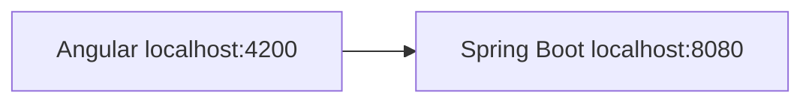
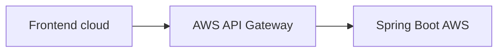

# 01C · Integrar frontend y backend localmente

## Objetivo

Conectar los dos proyectos que ya fueron creados y validados por separado:

```text
Angular  →  Spring Boot
:4200       :8080
```

Esta etapa introduce el primer problema real de integración de la guía: **CORS**.

> Aquí ya no se crea ningún proyecto. Si frontend o backend no funcionan por separado, volver a 01A o 01B antes de continuar.

---

## Prerrequisitos obligatorios

Antes de empezar debe funcionar:

```text
http://localhost:4200
```

Y también:

```text
http://localhost:8080/api/public/health
```

Guías anteriores:

- [01A · Crear backend Spring Boot con IntelliJ](./01a-crear-backend-intellij.md)
- [01B · Crear frontend Angular](./01b-crear-frontend-angular.md)

---

# 1. Ejecutar ambos proyectos simultáneamente

Backend desde IntelliJ o Maven Wrapper:

Windows:

```powershell
.\mvnw.cmd spring-boot:run
```

Linux/macOS:

```bash
./mvnw spring-boot:run
```

Frontend:

```bash
npm start
```

Comprobar nuevamente:

```text
frontend → http://localhost:4200
backend  → http://localhost:8080/api/public/health
```

---

# 2. Hacer una única llamada HTTP desde Angular

No crear todavía una arquitectura compleja de servicios.

Para esta prueba basta con que el componente raíz realice un `GET` al endpoint público del backend.

La idea conceptual es:

```text
Angular
  ↓ GET
http://localhost:8080/api/public/health
```

El resultado debe mostrarse de forma sencilla en pantalla, por ejemplo:

```text
Backend: UP
```

No se requiere diseño adicional.

---

# 3. Observar el error CORS antes de corregirlo

Es posible que el navegador bloquee la llamada.

Eso es esperado y pedagógicamente útil.

Abrir:

```text
DevTools
→ Console
→ Network
```

Registrar:

```text
Origin del frontend: http://localhost:4200
Destino backend:     http://localhost:8080
Método:              GET
```

Si aparece un mensaje relacionado con:

```text
Access-Control-Allow-Origin
CORS policy
blocked by CORS
```

no cambiar todavía URLs ni usar Postman como prueba sustitutiva.

## Punto clave

Postman no aplica la política CORS del navegador.

Por eso:

```text
Postman funciona
≠
CORS está correctamente configurado
```

La evidencia debe provenir de una llamada realizada por el frontend desde el navegador.

---

# 4. Configurar CORS local de forma mínima

En el backend, dentro de:

```text
cl.duoc.<usuario>.cloudtasks
```

crear el subpackage:

```text
config
```

Luego crear:

```text
CorsConfig.java
```

Configurar únicamente el origen real que ya existe:

```text
http://localhost:4200
```

Código completo —reemplazando `<usuario>` por el usuario Duoc sin puntos—:

```java
package cl.duoc.<usuario>.cloudtasks.config;

import org.springframework.context.annotation.Configuration;
import org.springframework.web.servlet.config.annotation.CorsRegistry;
import org.springframework.web.servlet.config.annotation.WebMvcConfigurer;

@Configuration
public class CorsConfig implements WebMvcConfigurer {

    @Override
    public void addCorsMappings(CorsRegistry registry) {
        registry.addMapping("/**")
                .allowedOrigins("http://localhost:4200")
                .allowedMethods("GET", "POST", "DELETE", "OPTIONS")
                .allowedHeaders("Authorization", "Content-Type");
    }
}
```

Ejemplo para el usuario `c.martinez`:

```java
package cl.duoc.cmartinez.cloudtasks.config;
```

Este archivo es deliberadamente pequeño.

El objetivo evaluativo es comprender:

```text
qué origen está llamando
qué servidor recibe
qué métodos se permiten
qué headers se permiten
```

No se busca construir una política CORS genérica ni sofisticada.

---

# 5. Reiniciar el backend

Después de agregar la configuración CORS, reiniciar Spring Boot.

Mantener Angular ejecutándose.

Volver a cargar:

```text
http://localhost:4200
```

La llamada debe completarse correctamente.

La pantalla debería poder mostrar algo equivalente a:

```text
Backend: UP
```

---

# 6. Validar en Network

En DevTools → Network seleccionar la llamada al backend.

Verificar:

```text
Request URL:
http://localhost:8080/api/public/health

Request Method:
GET

Origin:
http://localhost:4200
```

Y una respuesta HTTP exitosa.

Según el navegador/configuración pueden observarse headers CORS en la respuesta.

---

# 7. Entender qué configuración es temporal

En este momento la arquitectura es:



Por eso CORS se resuelve temporalmente en Spring Boot.

Más adelante la arquitectura será:



En ese escenario el navegador conversa con **API Gateway**, no directamente con Spring Boot.

Por eso la política CORS relevante para EV1 terminará configurándose en API Gateway usando la URL real del frontend desplegado.

> No borrar este aprendizaje: la configuración local existe para comprender el problema antes de trasladarlo a la frontera cloud correcta.

---

# 8. No introducir todavía seguridad

En esta etapa no agregar:

- login;
- MSAL;
- Bearer tokens;
- Spring Security;
- JWT;
- scopes;
- roles.

Primero debe quedar comprobado:

```text
frontend funciona
backend funciona
frontend puede llamar al backend
CORS se entiende y está controlado
```

Luego se incorpora identidad.

---

# Errores frecuentes

## Backend responde en navegador pero Angular falla

Revisar DevTools. Si el error menciona CORS, no cambiar el endpoint ni el backend antes de revisar la política de origen.

## Se configuró `allowedOrigins("*")`

No usar `*` para esconder el problema.

La guía conoce un origen concreto:

```text
http://localhost:4200
```

Usarlo explícitamente prepara al alumno para configurar posteriormente la URL cloud real.

## Angular llama a un puerto distinto

Revisar que el backend siga en:

```text
http://localhost:8080
```

No propagar cambios de puerto innecesarios porque después generan discrepancias en toda la guía.

## El package no coincide

No copiar literalmente:

```text
cl.duoc.<usuario>.cloudtasks.config
```

Debe usarse el usuario Duoc sin puntos, respetando el estándar del curso.

## Se prueba solo con Postman

La prueba no es suficiente para CORS.

Debe existir una request desde el navegador originada por Angular.

---

# Puerta de validación 01C

No continuar hasta demostrar:

- [ ] Angular funciona en `http://localhost:4200`;
- [ ] Spring Boot funciona en `http://localhost:8080`;
- [ ] Angular realiza una request real al backend;
- [ ] se identificó el origen usado por el navegador;
- [ ] CORS permite explícitamente ese origen;
- [ ] la request frontend → backend termina con respuesta HTTP exitosa;
- [ ] el alumno puede explicar por qué Postman no demuestra CORS.

## Evidencia mínima recomendada

Guardar evidencia de:

```text
Angular mostrando Backend: UP
+ DevTools/Network mostrando la request
+ origen http://localhost:4200
+ respuesta exitosa
```

---

## Contenido relacionado

- [Semana 1 · CORS](../../semanas/semana-01/04-cors-api-gateway.md)
- [Diagnóstico CORS](../../semanas/semana-01/04-cors-api-gateway/03-diagnostico-cors.md)
- [Estándar de repositorio del estudiante](../../docs/ESTANDAR-REPOSITORIO-ESTUDIANTE.md)
