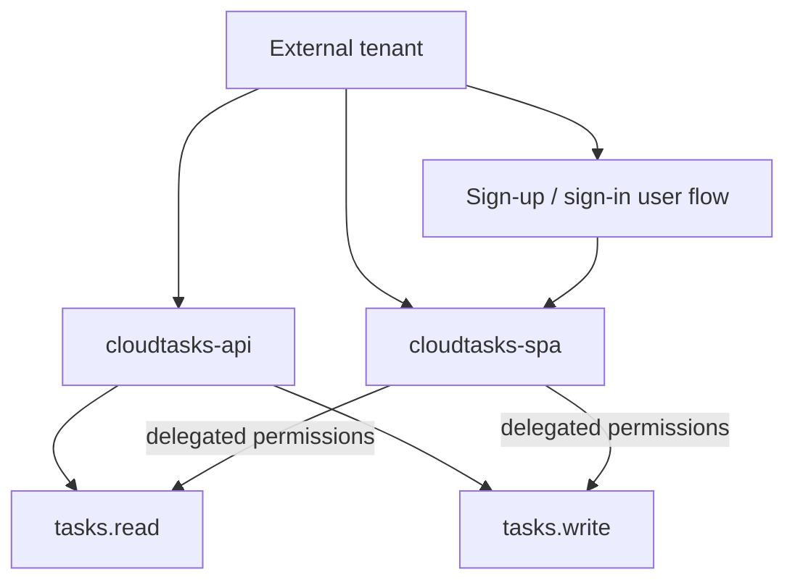

# 02 · Microsoft Entra External ID

## Objetivo

Crear la identidad real de CloudTasks: External tenant, flujo de usuarios, SPA, API y scopes.

> Angular es un cliente público. No crear ni utilizar un `client_secret` en el frontend. Authorization Code + PKCE será gestionado posteriormente por MSAL Angular.

Usar [00C · Matriz de valores](./00c-matriz-valores-y-checkpoints.md) para registrar cada dato cuando realmente exista.

---

# 1. Crear o seleccionar External tenant

En Microsoft Entra admin center trabajar sobre un **External tenant** autorizado para la práctica.

Registrar:

```text
TENANT_ID=<id real>
TENANT_DOMAIN=<dominio real>
TENANT_SUBDOMAIN=<subdominio>
```

**CHECKPOINT 02-0**

- [ ] directorio/tenant correcto seleccionado.
- [ ] `TENANT_ID` corresponde a ese directorio.
- [ ] se conoce el subdominio que se utilizará en CIAM.

**SI FALLA** · no crear aplicaciones hasta confirmar en qué directorio se está trabajando.

---

# 2. Crear flujo sign-up/sign-in

Crear un user flow para usuarios externos que permita, según capacidades del tenant:

```text
sign-up
sign-in
email como identificador
atributos básicos
```

No agregar atributos de dominio que CloudTasks no necesita.

Usar la experiencia de prueba del flujo antes de integrar Angular.

**CHECKPOINT 02-1**

- [ ] user flow existe.
- [ ] puede abrirse la experiencia de autenticación.
- [ ] se distingue user flow de app registration.

---

# 3. Registrar CloudTasks API

Crear una app registration:

```text
cloudtasks-api
```

Registrar:

```text
API_CLIENT_ID=<Application (client) ID>
```

## Expose an API

Configurar el **Application ID URI** que corresponda. Un formato habitual es:

```text
api://<API_CLIENT_ID>
```

pero se debe copiar el valor efectivo mostrado/configurado en el tenant, no reconstruirlo por intuición.

---

# 4. Exponer scopes

Crear:

```text
tasks.read
tasks.write
```

Semántica:

```text
tasks.read  → consultar recursos permitidos
tasks.write → crear/modificar/eliminar recursos permitidos
```

Registrar el scope **completo** que debe solicitar el cliente:

```text
SCOPE_READ=<scope completo>
SCOPE_WRITE=<scope completo>
```

Ejemplo conceptual:

```text
api://<API_CLIENT_ID>/tasks.read
api://<API_CLIENT_ID>/tasks.write
```

No reducir todavía esos valores a `tasks.read` / `tasks.write`: MSAL necesita el identificador completo del permiso solicitado.

---

# 5. Registrar la SPA

Crear:

```text
cloudtasks-spa
```

Configurar plataforma:

```text
Single-page application
```

Redirect URI local:

```text
http://localhost:4200
```

Registrar:

```text
SPA_CLIENT_ID=<Application (client) ID>
```

No crear un secret para Angular.

**CHECKPOINT 02-2**

- [ ] existe app API.
- [ ] existe app SPA diferente.
- [ ] sus Client IDs no se confunden.
- [ ] redirect URI local coincide exactamente.
- [ ] no existe una dependencia de secret en frontend.

---

# 6. Asociar SPA al user flow

Agregar `cloudtasks-spa` al user flow creado.

Una app registration existente **no participa automáticamente** en el flujo para clientes externos.

Usar `Run user flow` o experiencia equivalente seleccionando la SPA.

**CHECKPOINT 02-3**

- [ ] SPA aparece asociada al flujo correcto.
- [ ] experiencia de login corresponde al External tenant esperado.

---

# 7. Permisos delegados hacia CloudTasks API

En `cloudtasks-spa`, agregar permisos delegados sobre los scopes de `cloudtasks-api`:

```text
tasks.read
tasks.write
```

Si el tenant requiere consentimiento administrativo, otorgarlo mediante el mecanismo permitido.

No modificar MSAL para resolver un problema que en realidad es:

```text
API permission ausente
consent pendiente
scope no expuesto
```

---

# 8. Authority de External ID

Registrar:

```text
MSAL_AUTHORITY=https://<TENANT_SUBDOMAIN>.ciamlogin.com/
```

No sustituir `ciamlogin.com` por `login.microsoftonline.com` por costumbre cuando la aplicación utiliza un External tenant.

Validar que abrir el login desde el flujo efectivamente conduce al tenant esperado.

---

# 9. OIDC discovery: no adivinar issuer/JWKS

Localizar el documento OpenID Connect discovery correspondiente al tenant/flujo y registrar los valores efectivos:

```text
OIDC_ISSUER=<issuer real>
OIDC_JWKS_URI=<jwks_uri real>
```

Regla:

```text
metadata real
→ copiar issuer/jwks_uri
→ token real
→ confirmar iss
```

No construir `OIDC_ISSUER` únicamente a partir del tenant ID.

---

# 10. API_AUDIENCE queda pendiente hasta observar Access Token

En esta etapa se conoce:

```text
API_CLIENT_ID
Application ID URI
scopes completos
```

Pero **no se debe cerrar `API_AUDIENCE` por intuición**.

En la etapa 03, después de obtener un Access Token solicitado para CloudTasks API:

```text
decodificar temporalmente token
→ observar claim aud
→ API_AUDIENCE=<aud real>
→ marcar VALIDADO
```

Esto evita confundir:

```text
Client ID de SPA
Application ID URI
Client ID de API
claim aud efectivo
```

---

# 11. Claim `scp`

Después de obtener el Access Token también se confirmará:

```text
SCOPE_READ_CLAIM=tasks.read
SCOPE_WRITE_CLAIM=tasks.write
```

si esos son los valores realmente emitidos.

La cadena esperada es:

```text
MSAL solicita scope completo
→ Entra emite Access Token
→ scp contiene permiso
→ Spring lo convierte a SCOPE_tasks.read / SCOPE_tasks.write
```

---

# 12. Role Admin · extensión opcional

Si el entorno permite app roles, puede crearse:

```text
Admin
```

pero **no bloquear la ruta principal** si la asignación/configuración de roles no está disponible.

Además, que el token contenga `roles` no significa automáticamente que Spring lo convierta en `ROLE_Admin`; esa integración se estudia solo después de que scopes y ownership funcionen.

---

# 13. Diagrama de recursos



---

# Puerta de validación 02

Antes de integrar MSAL:

```text
External tenant correcto PASS
user flow PASS
cloudtasks-api PASS
Application ID URI conocido PASS
SCOPE_READ completo PASS
SCOPE_WRITE completo PASS
cloudtasks-spa PASS
redirect localhost:4200 PASS
SPA asociada al user flow PASS
permisos/consent PASS
MSAL_AUTHORITY ciamlogin PASS
OIDC discovery localizado PASS
sin client secret frontend PASS
```

Todavía puede quedar:

```text
API_AUDIENCE=PENDIENTE
SCOPE_*_CLAIM=PENDIENTE
```

porque esos valores se cierran con el Access Token real en 03.

## SI FALLA

| Síntoma | Revisar primero |
|---|---|
| redirect mismatch | URI literal registrada |
| app no aparece en user flow | tenant + asociación |
| login sí, scope no | Expose an API + API permissions + consent |
| authority abre tenant incorrecto | `TENANT_SUBDOMAIN` |
| se creó secret SPA | eliminar dependencia del secret |
| no se sabe audience | correcto: esperar token real en 03 |

## Contenido relacionado

- [OAuth2/OIDC](../../semanas/semana-02/01-oauth2-oidc.md)
- [IDaaS/CIAM](../../semanas/semana-02/02-idaas-ciam.md)
- [Tenant](../../semanas/semana-02/03-configurando-tenant.md)
- [App registration](../../semanas/semana-02/04-configurando-apps-idaas.md)
