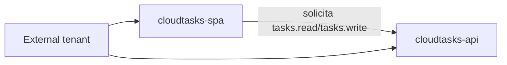

# 02 · Microsoft Entra External ID

## Objetivo

Crear la identidad real que reemplazará al simulador local: tenant, flujo de usuarios, SPA, API, scopes y roles.

> No crear secretos para el frontend. Angular es un cliente público y utilizará Authorization Code + PKCE.

## 1. Crear o seleccionar External tenant

En Microsoft Entra admin center, trabajar sobre un **External tenant** autorizado para el curso.

Registrar en `ev1-local-values.txt`:

```text
TENANT_ID=<id real>
TENANT_DOMAIN=<dominio real>
```

### Validación

Antes de seguir, confirmar que se está operando sobre el tenant correcto. Un error frecuente es registrar la app en el tenant corporativo/personal equivocado y luego obtener `issuer` inesperado.

## 2. Crear flujo de sign-up/sign-in

Crear un user flow para usuarios externos que permita al menos:

- registro;
- inicio de sesión;
- email como identificador, según capacidades del tenant;
- atributos básicos necesarios para la demo.

No agregar atributos de negocio que CloudTasks no utilice.

### Validación

Ejecutar la experiencia de prueba del flujo desde la propia consola. Debe ser posible llegar a una pantalla real de autenticación/registro antes de integrar Angular.

## 3. Registrar la API

Crear una app registration para:

```text
cloudtasks-api
```

Registrar:

```text
API_CLIENT_ID=<Application/Client ID>
```

Definir el identificador/audience de la API. Usar el valor que entregue/configure Entra y registrarlo como:

```text
API_AUDIENCE=<valor real>
```

## 4. Exponer scopes

Crear al menos:

```text
tasks.read
tasks.write
```

Semántica:

```text
tasks.read  → consultar recursos propios
tasks.write → crear/modificar/eliminar recursos permitidos
```

Registrar los nombres completos que deba solicitar MSAL:

```text
SCOPE_READ=<scope completo>
SCOPE_WRITE=<scope completo>
```

## 5. Crear app role

Crear, si el entorno lo permite:

```text
Admin
```

El rol se utilizará posteriormente para demostrar que:

```text
scope ≠ role
```

Si la asignación de roles no está disponible en el sandbox, marcarlo como extensión y no bloquear la ruta principal EV1.

## 6. Registrar la SPA

Crear una app registration:

```text
cloudtasks-spa
```

Configurar plataforma **Single-page application**.

Primera redirect URI:

```text
http://localhost:4200
```

Registrar:

```text
SPA_CLIENT_ID=<Application/Client ID>
```

No crear ni copiar `client_secret` al frontend.

## 7. Permisos de API

Dar a `cloudtasks-spa` acceso delegado a los scopes expuestos por `cloudtasks-api`.

El resultado conceptual debe ser:



## 8. Obtener metadata OIDC

Localizar la configuración OIDC/discovery del tenant y determinar el issuer real que aparecerá en tokens válidos.

Registrar:

```text
OIDC_ISSUER=<issuer real>
OIDC_JWKS_URI=<jwks_uri real>
```

No adivinar el issuer a partir del tenant ID. Debe verificarse contra metadata/token real.

## Puerta de validación 02

Debe existir y poder mostrarse:

- External tenant correcto;
- user flow utilizable;
- `cloudtasks-spa` con redirect local;
- `cloudtasks-api`;
- scopes `tasks.read` y `tasks.write`;
- permisos entre SPA y API;
- issuer identificado desde metadata real.

## Errores frecuentes

### `redirect_uri` no coincide

La URI debe coincidir **exactamente** con una URI registrada. Revisar esquema, host, puerto, path y slash final.

### Se obtuvo un token pero el `aud` no es la API

Probablemente se solicitó un recurso/scope incorrecto. No continuar al Gateway hasta que `aud` corresponda a la API esperada.

### Se creó un secret para Angular

Eliminar esa dependencia. Un secreto dentro del bundle JavaScript deja de ser secreto.

## Contenido relacionado

- [OAuth2/OIDC](../../semanas/semana-02/01-oauth2-oidc.md)
- [IDaaS/CIAM](../../semanas/semana-02/02-idaas-ciam.md)
- [Tenant](../../semanas/semana-02/03-configurando-tenant.md)
- [App registration](../../semanas/semana-02/04-configurando-apps-idaas.md)
