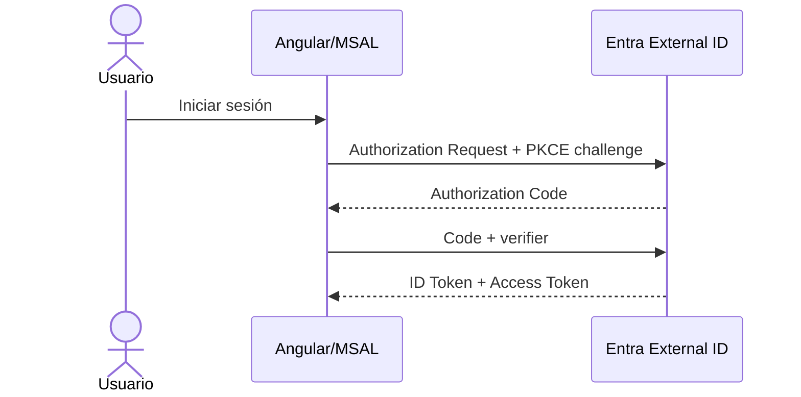

# 03 · Angular + MSAL + Authorization Code con PKCE

## Objetivo

Conectar el frontend existente con Microsoft Entra External ID y obtener Access Tokens reales para CloudTasks API.

El alumno configura y explica OAuth2/OIDC; **MSAL implementa Authorization Code + PKCE**. No se programa PKCE manualmente.

## Antes de comenzar

Debe existir:

```text
Angular → http://localhost:4200
SPA_CLIENT_ID validado
MSAL_AUTHORITY validado
SCOPE_READ validado
SCOPE_WRITE validado
```

Usar la [matriz canónica de valores](./00c-matriz-valores-y-checkpoints.md).

## Implementación guiada

Para evitar boilerplate accidental, utilizar:

→ [03A · Starter mínimo Angular + MSAL](./03a-starter-angular-msal.md)

El starter define solo los bloques necesarios para esta práctica:

```text
auth config
auth service
API service
login/logout
read/write tokens
UI mínima
```

## Dependencia

```bash
npm install @azure/msal-browser
npm start
```

**Checkpoint 03-0**

- [ ] Angular sigue compilando después de instalar MSAL.
- [ ] `http://localhost:4200` abre.
- [ ] Console no muestra error de inicialización.

## Flujo que debe poder explicar



Angular no contiene `client_secret`.

## ID Token vs Access Token

```text
ID Token     → identidad/sesión del cliente
Access Token → autorización para llamar API
```

Solo Access Token se envía como:

```http
Authorization: Bearer <ACCESS_TOKEN>
```

## Claims didácticos

Mostrar sanitizados:

```text
iss
aud
sub
exp
scp
roles (si existen)
```

Decodificar un JWT **no valida** su firma ni autorización.

## Checkpoint 03-1 · login

- [ ] redirect va a `<TENANT_SUBDOMAIN>.ciamlogin.com`.
- [ ] user flow permite sign-up/sign-in.
- [ ] redirect vuelve a `http://localhost:4200`.
- [ ] existe active account.

**SI FALLA** · revisar authority → redirect URI → asociación user flow → tenant. No tocar CORS.

## Checkpoint 03-2 · Access Token

- [ ] MSAL obtiene Access Token.
- [ ] `aud` corresponde a CloudTasks API.
- [ ] `scp`/scope contiene permiso solicitado.
- [ ] token no se guarda en Git ni en registros compartidos.

**SI FALLA** · revisar API permissions → scopes → consentimiento → recurso solicitado.

## Checkpoint 03-3 · API

Con backend protegido:

```text
GET /api/tasks + Access Token tasks.read → éxito
POST /api/tasks + Access Token tasks.write → éxito autorizado
```

La separación read/write permite observar scopes sin agregar complejidad de negocio.

## Diagnóstico resumido

| Síntoma | Revisar primero |
|---|---|
| redirect mismatch | redirect URI literal |
| login en tenant incorrecto | `MSAL_AUTHORITY` |
| login funciona, token API no | scopes/permisos/consent |
| `aud` incorrecto | recurso/scope solicitado |
| `interaction_in_progress` | múltiples redirects simultáneos |
| API 401 | tipo de token/iss/aud/exp; no CORS |

## Puerta de validación 03

No continuar hasta obtener simultáneamente:

```text
login real PASS
Access Token PASS
audience PASS
scope PASS
request protegida PASS
```

## Contenido relacionado

- [03A · Starter Angular/MSAL](./03a-starter-angular-msal.md)
- [Matriz de valores](./00c-matriz-valores-y-checkpoints.md)
- [Authorization Code + PKCE](../../semanas/semana-02/01-oauth2-oidc/07-authorization-code-pkce/README.md)
- [JWT y claims](../../semanas/semana-03/01-jwt-claims.md)
