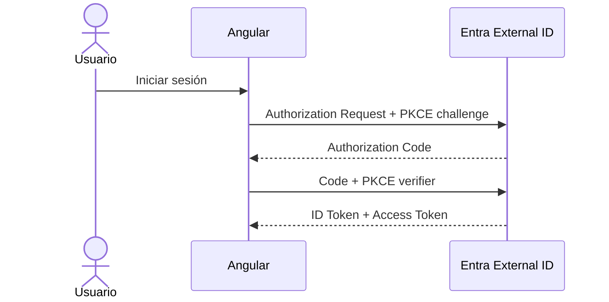

# 03 · Angular + MSAL + Authorization Code con PKCE

## Objetivo

Conectar el frontend existente con Microsoft Entra External ID y obtener tokens reales para la API.

## 1. Instalar MSAL

Desde `frontend/`:

```bash
npm install @azure/msal-browser @azure/msal-angular
```

## 2. Configuración

Crear una configuración que use exclusivamente valores obtenidos en la etapa anterior:

```ts
export const authConfig = {
  auth: {
    clientId: '<SPA_CLIENT_ID>',
    authority: '<AUTHORITY_REAL_DEL_EXTERNAL_TENANT>',
    redirectUri: 'http://localhost:4200'
  }
};

export const apiScopes = [
  '<SCOPE_READ>',
  '<SCOPE_WRITE>'
];
```

No copiar secretos.

## 3. Flujo esperado



MSAL implementa PKCE; el estudiante debe saber **qué está ocurriendo**, aunque no programe manualmente `code_verifier`.

## 4. Login

Implementar un botón de login con redirect o popup según la guía oficial vigente adoptada por el curso. Mantener un solo enfoque en la solución final para reducir ambigüedad.

Después del login mostrar:

```text
nombre visible
username/email disponible
estado: autenticado
```

## 5. Obtener Access Token para la API

Solicitar explícitamente los scopes de CloudTasks. Priorizar adquisición silenciosa cuando exista sesión y manejar fallback interactivo cuando sea necesario.

La llamada a la API debe incluir:

```http
Authorization: Bearer <ACCESS_TOKEN>
```

Nunca usar el ID Token como Bearer para CloudTasks API.

## 6. Inspección didáctica

Agregar una vista `Mi identidad` que muestre, sin exponer el token completo:

```text
iss
aud
sub
exp
scp/scopes
roles (si existen)
```

El token puede decodificarse para observar claims, pero la UI debe advertir:

> Decodificar un JWT no valida su firma ni demuestra que sea confiable.

## Puerta de validación 03

Antes de continuar debe ocurrir todo esto:

1. Angular abre en `http://localhost:4200`.
2. Login redirige al tenant correcto.
3. El usuario puede autenticarse/registrarse según el user flow.
4. Angular recupera sesión.
5. Existe un Access Token para CloudTasks API.
6. El `aud` coincide con la API esperada.
7. El token contiene los scopes solicitados/autorizados.

## Diagnóstico

### Loop de login

Revisar `redirectUri`, authority y estado de cuenta activa antes de cambiar código.

### `interaction_in_progress`

No iniciar dos flujos interactivos simultáneamente. Esperar/completar la interacción vigente.

### Token para audiencia incorrecta

Revisar scopes solicitados. Un login exitoso no implica que se haya obtenido un Access Token válido para **esta API**.

## Contenido relacionado

- [Authorization Code + PKCE](../../semanas/semana-02/01-oauth2-oidc/07-authorization-code-pkce/README.md)
- [JWT y claims](../../semanas/semana-03/01-jwt-claims.md)
