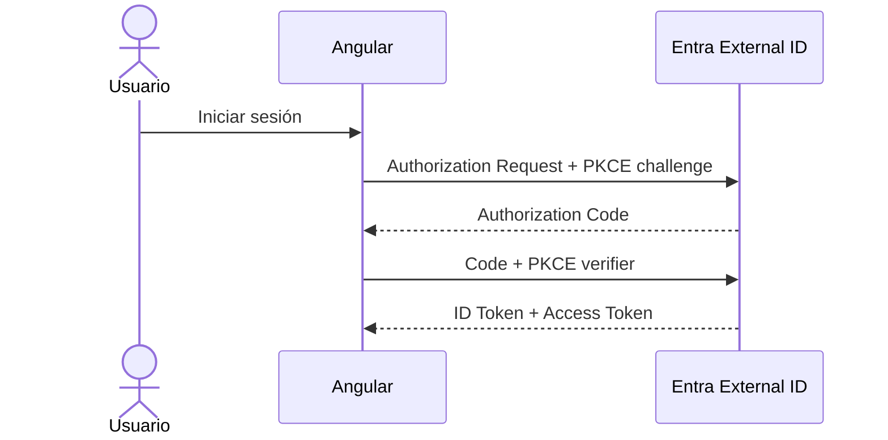

# 03 · Angular + MSAL + Authorization Code con PKCE

## Objetivo

Conectar el frontend existente con Microsoft Entra External ID y obtener tokens reales para CloudTasks API sin depender de código que la guía no entregue.

Esta implementación usa `@azure/msal-browser` dentro de Angular. Sigue siendo MSAL y utiliza Authorization Code + PKCE para SPA; evita esconder el flujo detrás de una plantilla adicional.

## 1. Instalar dependencias

Desde `frontend/`:

```bash
npm install @azure/msal-browser
```

Angular ya incluye `HttpClient` en proyectos modernos cuando se configura `provideHttpClient()`.

## 2. Crear configuración de entorno

Crear `src/app/auth-config.ts`:

```ts
export const authConfig = {
  clientId: '<SPA_CLIENT_ID>',
  authority: '<MSAL_AUTHORITY>',
  redirectUri: window.location.origin,
  scopes: [
    '<SCOPE_READ>',
    '<SCOPE_WRITE>'
  ]
};
```

Para External ID, `MSAL_AUTHORITY` debe venir de la etapa 02 y normalmente tendrá esta forma:

```text
https://<TENANT_SUBDOMAIN>.ciamlogin.com/
```

No copiar secretos al frontend.

## 3. Crear `AuthService`

Crear `src/app/auth.service.ts`:

```ts
import { Injectable } from '@angular/core';
import {
  AccountInfo,
  AuthenticationResult,
  PublicClientApplication
} from '@azure/msal-browser';
import { authConfig } from './auth-config';

@Injectable({ providedIn: 'root' })
export class AuthService {
  private readonly msal = new PublicClientApplication({
    auth: {
      clientId: authConfig.clientId,
      authority: authConfig.authority,
      redirectUri: authConfig.redirectUri,
      postLogoutRedirectUri: authConfig.redirectUri
    },
    cache: {
      cacheLocation: 'sessionStorage'
    }
  });

  private initialized = false;

  async init(): Promise<void> {
    if (this.initialized) return;

    await this.msal.initialize();
    const result = await this.msal.handleRedirectPromise();

    if (result?.account) {
      this.msal.setActiveAccount(result.account);
    } else if (!this.msal.getActiveAccount()) {
      const account = this.msal.getAllAccounts()[0];
      if (account) this.msal.setActiveAccount(account);
    }

    this.initialized = true;
  }

  async login(): Promise<void> {
    await this.init();
    await this.msal.loginRedirect({
      scopes: authConfig.scopes
    });
  }

  async logout(): Promise<void> {
    await this.init();
    await this.msal.logoutRedirect();
  }

  async getAccessToken(): Promise<string> {
    await this.init();

    const account = this.requireAccount();

    try {
      const result = await this.msal.acquireTokenSilent({
        account,
        scopes: authConfig.scopes
      });
      return result.accessToken;
    } catch {
      await this.msal.acquireTokenRedirect({
        account,
        scopes: authConfig.scopes
      });
      throw new Error('Se inició una interacción para obtener el Access Token');
    }
  }

  get account(): AccountInfo | null {
    return this.msal.getActiveAccount();
  }

  private requireAccount(): AccountInfo {
    const account = this.msal.getActiveAccount();
    if (!account) throw new Error('No existe una sesión autenticada');
    return account;
  }
}
```

## 4. Inicializar MSAL al abrir la aplicación

En el componente raíz, ejecutar una sola vez:

```ts
constructor(public readonly auth: AuthService) {
  void this.auth.init();
}
```

Agregar botones:

```html
<button (click)="auth.login()">Iniciar sesión</button>
<button (click)="auth.logout()">Cerrar sesión</button>
```

No iniciar dos logins simultáneos.

## 5. Crear servicio API

Crear `src/app/api.service.ts`:

```ts
import { HttpClient, HttpHeaders } from '@angular/common/http';
import { Injectable } from '@angular/core';
import { firstValueFrom } from 'rxjs';
import { AuthService } from './auth.service';

@Injectable({ providedIn: 'root' })
export class ApiService {
  private readonly baseUrl = '<API_BASE_URL>';

  constructor(
    private readonly http: HttpClient,
    private readonly auth: AuthService
  ) {}

  async health(): Promise<unknown> {
    return firstValueFrom(
      this.http.get(`${this.baseUrl}/api/public/health`)
    );
  }

  async tasks(): Promise<unknown> {
    const token = await this.auth.getAccessToken();
    return firstValueFrom(
      this.http.get(`${this.baseUrl}/api/tasks`, {
        headers: new HttpHeaders({
          Authorization: `Bearer ${token}`
        })
      })
    );
  }
}
```

Durante desarrollo local:

```text
API_BASE_URL=http://localhost:8080
```

Más adelante se reemplazará por `API_GATEWAY_URL`.

## 6. Habilitar HttpClient

En `src/app/app.config.ts`, asegurar:

```ts
import { ApplicationConfig } from '@angular/core';
import { provideHttpClient } from '@angular/common/http';

export const appConfig: ApplicationConfig = {
  providers: [provideHttpClient()]
};
```

Si el proyecto ya tiene otros providers, conservarlos y agregar `provideHttpClient()`; no reemplazar la configuración completa a ciegas.

## 7. Flujo esperado



MSAL genera y maneja PKCE. El estudiante no programa manualmente `code_verifier`, pero debe poder explicar su función.

## 8. Mostrar identidad sin exponer secretos

Después del login mostrar al menos:

```text
account.name
account.username
estado autenticado
```

Para la vista de claims, obtener el Access Token y decodificar únicamente su payload con fines didácticos. No usar esa decodificación como decisión de seguridad.

Mostrar:

```text
iss
aud
sub
exp
scp
roles (si existen)
```

Advertencia visible:

> Decodificar un JWT permite leer claims; no valida firma, issuer, audience ni vigencia.

## 9. ID Token ≠ Access Token

El objeto de sesión de MSAL puede incluir información derivada del ID Token. Eso sirve al **cliente** para saber quién inició sesión.

Para llamar CloudTasks API usar exclusivamente el resultado de:

```ts
acquireTokenSilent(...).accessToken
```

y enviar:

```http
Authorization: Bearer <ACCESS_TOKEN>
```

## Puerta de validación 03

No continuar hasta que:

1. Angular abre en `http://localhost:4200`.
2. `auth.init()` no produce errores.
3. Login redirige a `<TENANT_SUBDOMAIN>.ciamlogin.com`.
4. El usuario puede registrarse/iniciar sesión mediante el user flow asociado.
5. Angular recupera una cuenta activa después del redirect.
6. `getAccessToken()` retorna un Access Token para CloudTasks API.
7. El payload contiene el `aud` esperado.
8. Los scopes autorizados aparecen en `scp` o en el claim real emitido.
9. `/api/tasks` puede invocarse con `Authorization: Bearer ...` cuando el backend ya está protegido.

## Diagnóstico

### `redirect_uri` mismatch

Comparar literalmente:

```text
window.location.origin
vs
redirect URI registrada en Entra
```

`http://localhost:4200` y `http://localhost:4200/otra-ruta` no son equivalentes.

### Se abre un login de Microsoft distinto al esperado

Revisar `MSAL_AUTHORITY`. En External ID debe apuntar al dominio CIAM del tenant correcto, no a un authority copiado de una guía de workforce tenant.

### `interaction_in_progress`

No ejecutar `loginRedirect` o `acquireTokenRedirect` desde múltiples eventos simultáneamente.

### Login funciona pero `getAccessToken()` falla por consentimiento

Revisar `cloudtasks-spa` → API permissions → scopes de `cloudtasks-api` y admin consent cuando el External tenant lo requiera.

### Token para audiencia incorrecta

Revisar los scopes solicitados. Un login exitoso solo demuestra autenticación; no demuestra que se obtuvo autorización para CloudTasks API.

## Contenido relacionado

- [Authorization Code + PKCE](../../semanas/semana-02/01-oauth2-oidc/07-authorization-code-pkce/README.md)
- [JWT y claims](../../semanas/semana-03/01-jwt-claims.md)
