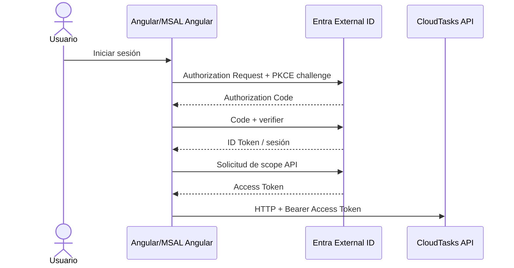

# 03 · Angular + MSAL Angular + Authorization Code con PKCE

## Objetivo

Conectar el frontend existente con Microsoft Entra External ID y obtener Access Tokens reales para CloudTasks API usando **MSAL Angular**, el wrapper oficial para Angular.

El estudiante configura y explica OAuth2/OIDC; **MSAL implementa Authorization Code + PKCE**. No se programa PKCE ni adquisición manual de tokens.

## Antes de comenzar

Debe existir:

```text
Angular → http://localhost:4200
SPA_CLIENT_ID validado
MSAL_AUTHORITY validado
SCOPE_READ completo validado
SCOPE_WRITE completo validado
```

Usar:

- [00C · Matriz de valores](./00c-matriz-valores-y-checkpoints.md)
- [00D · Scaffolding vs código del estudiante](./00d-scaffolding-vs-codigo-estudiante.md)

## Starter operativo

Seguir:

→ [03A · Starter reproducible Angular + MSAL Angular](./03a-starter-angular-msal.md)

El starter usa:

```text
MsalService
MsalBroadcastService
MsalInterceptor
protectedResourceMap
HttpClient
UI mínima
```

No crea un `AuthService` propio ni construye headers Bearer a mano.

## Compatibilidad

Primero:

```bash
ng version
```

Referencia vigente:

```text
Angular 22      → @azure/msal-angular 6
Angular 19–21   → @azure/msal-angular 5
```

Para Angular 22:

```bash
npm install @azure/msal-angular@^6 @azure/msal-browser@^5
```

## Flujo que debe poder explicar



Angular no contiene `client_secret`.

## ID Token vs Access Token

```text
ID Token     → identidad/sesión del cliente
Access Token → autorización para llamar CloudTasks API
```

Solo el Access Token se utiliza como Bearer frente al API.

## Qué hace `protectedResourceMap`

La configuración relaciona:

```text
URL + método HTTP
→ scope requerido
```

Ejemplo:

```text
GET    /api/tasks      → SCOPE_READ
POST   /api/tasks      → SCOPE_WRITE
DELETE /api/tasks/*    → SCOPE_WRITE
```

`MsalInterceptor` adquiere el token adecuado y agrega el header automáticamente.

## Checkpoint 03-0 · instalación

```bash
npm start
```

- [ ] Angular compila después de instalar MSAL Angular.
- [ ] no hay conflicto de peer dependencies.
- [ ] frontend abre.

## Checkpoint 03-1 · login

- [ ] redirect llega a `<TENANT_SUBDOMAIN>.ciamlogin.com`.
- [ ] user flow permite sign-up/sign-in.
- [ ] redirect vuelve a `http://localhost:4200`.
- [ ] existe active account.

**SI FALLA** · authority → redirect URI → asociación user flow → tenant. No tocar CORS.

## Checkpoint 03-2 · Access Token

Ejecutar `GET /api/me` o `GET /api/tasks` desde Angular y observar Network.

- [ ] existe header `Authorization: Bearer ...`.
- [ ] `aud` corresponde a CloudTasks API.
- [ ] `iss` corresponde al issuer real.
- [ ] `scp` contiene el permiso esperado.
- [ ] el token no se guarda en Git/documentación.

**SI FALLA** · API permissions → scope completo → consentimiento → `protectedResourceMap`.

## Checkpoint 03-3 · lectura/escritura

```text
GET /api/tasks       → read scope
POST /api/tasks      → write scope
DELETE /api/tasks/id → write scope
```

La diferencia debe observarse sin implementar adquisición manual de tokens.

## Diagnóstico

| Síntoma | Revisar primero |
|---|---|
| `ERESOLVE` | Angular/MSAL compatibility |
| redirect mismatch | redirect URI literal |
| tenant incorrecto | `MSAL_AUTHORITY` |
| login sí, token API no | permisos/scopes/consent |
| request sin Bearer | `protectedResourceMap` |
| `aud` incorrecto | scope completo solicitado |
| 401 | token/iss/aud/exp; no CORS |
| 403 | scope/ownership |
| error CORS | CORS; no cambiar MSAL |

## Puerta de validación 03

```text
MSAL Angular compila PASS
login real PASS
active account PASS
Access Token PASS
audience PASS
scope read/write PASS
request protegida PASS
```

## Contenido relacionado

- [03A · Starter Angular/MSAL](./03a-starter-angular-msal.md)
- [Authorization Code + PKCE](../../semanas/semana-02/01-oauth2-oidc/07-authorization-code-pkce/README.md)
- [JWT y claims](../../semanas/semana-03/01-jwt-claims.md)
