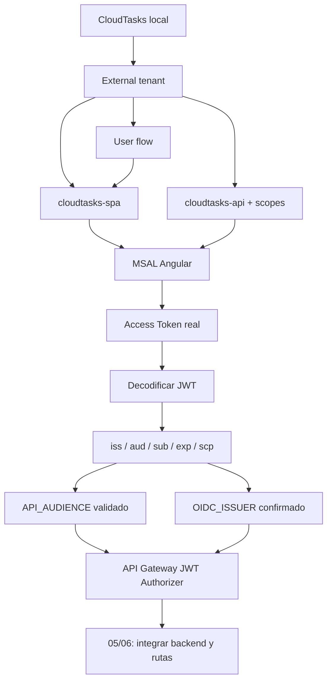

# 03B · Checkpoint Semana 3 · IDaaS + JWT + seguridad en API Manager

## Propósito

Este checkpoint integra en **CloudTasks** los conocimientos que corresponden a la semana actual, sin adelantar todavía EC2, despliegue productivo del backend ni el cierre E2E completo de la guía.

Al terminar, el estudiante debe haber recorrido de forma práctica:

```text
1.2 Implementando autenticación con Identity as a Service
1.2.5 Creando una aplicación para usuarios externos
1.2.6 Integrando Seguridad en nuestro API Manager
1.2.7 Introducción a JWT y Claims
1.2.8 Decodificando tokens JWT
```

La meta técnica de esta semana es:

```text
CloudTasks local
→ External tenant + user flow
→ SPA + API registrations
→ scopes
→ login real
→ Access Token real
→ JWT decodificado
→ iss/aud/sub/exp/scp comprendidos
→ JWT Authorizer de API Gateway configurado
→ contrato de seguridad listo para conectar rutas en 06
```

> Configurar el authorizer esta semana no obliga a tener todavía el backend desplegado en EC2. La integración HTTP y las rutas funcionales se completan posteriormente en 05/06, reutilizando el mismo API Gateway y el mismo authorizer.

---

# Estado inicial obligatorio

Antes de entrar a 03B deben estar en `PASS`:

```text
01A backend local creado
01B frontend Angular creado
01C integración local comprendida
02 External ID configurado
03/03A Angular + MSAL funcionando
```

Valores ya conocidos:

```text
TENANT_ID
TENANT_SUBDOMAIN
SPA_CLIENT_ID
API_CLIENT_ID
SCOPE_READ
SCOPE_WRITE
MSAL_AUTHORITY
OIDC_ISSUER
OIDC_JWKS_URI
```

Y debe existir al menos un **Access Token real** emitido para CloudTasks API.

No continuar usando valores inventados o reconstruidos manualmente.

---

# Parte A · 1.2.5 · Aplicación para usuarios externos

## A1. Comprobar el External tenant

Debe existir un External tenant real y el estudiante debe poder distinguir:

```text
External tenant
≠
app registration
≠
user flow
```

Comprobar en Microsoft Entra:

- directorio correcto;
- `cloudtasks-spa`;
- `cloudtasks-api`;
- user flow de sign-up/sign-in;
- asociación de la SPA al user flow.

## A2. Probar usuario externo

Ejecutar el flujo mediante la SPA o `Run user flow`.

Esperado:

```text
usuario externo puede registrarse/iniciar sesión
→ vuelve a http://localhost:4200
→ MSAL mantiene una cuenta activa
```

### CHECKPOINT W3-A

- [ ] External tenant correcto.
- [ ] user flow operativo.
- [ ] SPA asociada al flujo.
- [ ] login/sign-up real funciona.
- [ ] no existe `client_secret` en Angular.

---

# Parte B · Access Token real de CloudTasks

## B1. Solicitar permiso de API

La SPA debe solicitar los scopes completos:

```text
SCOPE_READ=api://<API_CLIENT_ID>/tasks.read
SCOPE_WRITE=api://<API_CLIENT_ID>/tasks.write
```

Los valores exactos se copian desde Entra; el ejemplo anterior no reemplaza los valores reales.

## B2. Observar el request

Desde Angular, abrir DevTools → Network y provocar una llamada protegida.

Comprobar que existe:

```http
Authorization: Bearer <ACCESS_TOKEN>
```

No copiar el token completo a GitHub, README, capturas públicas ni archivos versionados.

### CHECKPOINT W3-B

- [ ] login real PASS.
- [ ] Access Token real obtenido.
- [ ] token corresponde a CloudTasks API.
- [ ] token no fue persistido en el repositorio.

---

# Parte C · 1.2.7 · JWT y Claims

## C1. Reconocer estructura JWT

Un JWT compacto tiene tres segmentos separados por puntos:

```text
header.payload.signature
```

El estudiante debe identificar:

```text
header     → metadatos del token / algoritmo / key id
payload    → claims
signature  → integridad/autenticidad verificable criptográficamente
```

## C2. Claims mínimos de CloudTasks

Decodificar temporalmente el Access Token y localizar:

```text
iss
  quién emitió el token

aud
  para qué recurso fue emitido

sub
  identificador del sujeto

exp
  expiración

scp
  permisos delegados concedidos
```

Si aparece `roles`, reconocerlo como un concepto diferente de `scp`; roles se profundiza opcionalmente en 04B.

### CHECKPOINT W3-C

El estudiante puede explicar, usando **su token real**:

```text
iss → issuer de Entra

aud → CloudTasks API
sub → sujeto autenticado
exp → instante después del cual el token deja de ser válido
scp → tasks.read/tasks.write u otros scopes realmente emitidos
```

---

# Parte D · 1.2.8 · Decodificar JWT sin confundir con validar

## D1. Decodificación didáctica

Se puede usar una herramienta local o una página de inspección JWT autorizada por el docente.

Para observación local simple del payload en Linux/WSL, sin validar firma:

```bash
python3 - <<'PY'
import base64
import json

TOKEN = input('Access Token: ').strip()
parts = TOKEN.split('.')
if len(parts) != 3:
    raise SystemExit('No parece un JWT compacto de tres segmentos')

payload = parts[1]
payload += '=' * (-len(payload) % 4)
data = base64.urlsafe_b64decode(payload.encode())
print(json.dumps(json.loads(data), indent=2, ensure_ascii=False))
PY
```

> Este comando **solo decodifica** el payload. No verifica firma, issuer, audience ni expiración.

No guardar el token en el script.

## D2. Diferencia obligatoria

```text
decodificar
→ transformar Base64URL y leer claims

validar
→ firma + claves públicas/JWKS + issuer + audience + tiempos + política
```

Por tanto:

```text
"puedo leer el payload"
≠
"el token es válido"
```

### CHECKPOINT W3-D

- [ ] payload decodificado.
- [ ] `iss` observado.
- [ ] `aud` observado.
- [ ] `sub` observado.
- [ ] `exp` interpretado.
- [ ] `scp` observado.
- [ ] diferencia decodificación/validación explicable.

---

# Parte E · Cerrar valores derivados del token real

Actualizar la matriz local de valores:

```text
API_AUDIENCE=<valor real de aud>
SCOPE_READ_CLAIM=<valor real dentro de scp>
SCOPE_WRITE_CLAIM=<valor real dentro de scp>
```

La relación queda:

```text
MSAL solicita:
api://.../tasks.read

Access Token contiene:
tasks.read

Spring interpreta después:
SCOPE_tasks.read
```

No intercambiar estos tres niveles.

### CHECKPOINT W3-E

```text
OIDC_ISSUER == iss esperado
API_AUDIENCE == aud real
scope solicitado ↔ scp emitido comprendido
```

---

# Parte F · 1.2.6 · Integrar seguridad en API Manager

Esta semana se crea la **frontera de seguridad** de CloudTasks en API Gateway aunque el backend todavía no esté desplegado en EC2.

## F1. Crear API Gateway HTTP API vacío

En AWS API Gateway crear una HTTP API:

```text
cloudtasks-api-gateway
```

Si AWS permite crearla sin integración inicial, dejarla sin rutas de negocio por ahora.

Registrar:

```text
API_GATEWAY_ID=<id real>
```

No crear un segundo Gateway en la etapa 06.

## F2. Crear JWT Authorizer

Configurar un authorizer:

```text
Nombre: cloudtasks-jwt-authorizer
Issuer: <OIDC_ISSUER>
Audience: <API_AUDIENCE>
```

Los valores deben venir del discovery/token real ya observados en B–E.

No usar:

```text
SPA_CLIENT_ID como audience por intuición
Application ID URI reconstruido manualmente
login.microsoftonline.com si el issuer real es ciamlogin.com
```

## F3. Comprender qué podrá exigir API Gateway

Cuando las rutas se conecten en 06, el contrato será:

```text
GET    /api/tasks         → authorization scope tasks.read
POST   /api/tasks         → authorization scope tasks.write
DELETE /api/tasks/{id}    → authorization scope tasks.write
```

El valor que API Gateway debe comparar es el permiso representado en el **claim real `scp`**, no necesariamente el scope completo solicitado por MSAL.

## F4. Qué queda deliberadamente pendiente

Todavía no es requisito de este checkpoint:

```text
EC2
BACKEND_CLOUD_URL
integración HTTP Gateway → EC2
rutas CloudTasks funcionales vía Gateway
CORS cloud
frontend cloud
```

Esas dependencias se crearán en orden en 05–08.

### CHECKPOINT W3-F

- [ ] HTTP API `cloudtasks-api-gateway` existe.
- [ ] JWT Authorizer existe.
- [ ] issuer proviene de metadata real.
- [ ] audience proviene del `aud` del Access Token real.
- [ ] estudiante puede explicar qué claim se usará para scopes por ruta.
- [ ] no se inventó un backend cloud para completar esta etapa.

---

# Mapa completo de la semana



---

# Gate curricular WEEK-03

El checkpoint de la semana está en `PASS` únicamente cuando:

```text
W3-A aplicación externa / user flow     PASS
W3-B Access Token real                  PASS
W3-C JWT + claims comprendidos          PASS
W3-D token decodificado                 PASS
W3-E issuer/audience/scopes validados   PASS
W3-F JWT Authorizer API Manager         PASS
```

No se exige todavía:

```text
Spring Resource Server completo
EC2
rutas Gateway → backend
CORS cloud
frontend cloud
```

Estos elementos pertenecen a las siguientes puertas de la guía.

---

# Preguntas de salida

El estudiante debería poder responder sin memorizar frases:

1. ¿Qué diferencia hay entre External tenant, user flow y app registration?
2. ¿Por qué Angular no debe tener un client secret?
3. ¿Qué diferencia hay entre ID Token y Access Token?
4. ¿Qué representa `iss`?
5. ¿Qué representa `aud`?
6. ¿Qué representa `sub`?
7. ¿Cómo se interpreta `exp`?
8. ¿Qué permisos aparecen en `scp`?
9. ¿Por qué decodificar un JWT no demuestra que sea válido?
10. ¿De dónde obtiene un validador las claves públicas?
11. ¿Qué issuer y audience configuraste en el JWT Authorizer y de dónde salieron?
12. ¿Qué diferencia existe entre `api://.../tasks.read`, `tasks.read` y `SCOPE_tasks.read`?

## Continuación

Después de este checkpoint curricular:

→ [04 · JWT, scopes, ownership y Spring Security](./04-jwt-y-backend.md)

Posteriormente:

→ [05 · Backend en AWS EC2](./05-aws-backend.md)
→ [06 · API Gateway + JWT Authorizer](./06-api-gateway-jwt.md)
