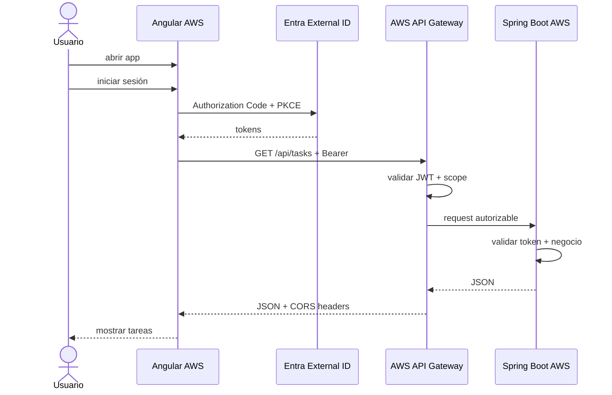

# 08 · Desplegar frontend e integrar extremo a extremo

## Objetivo

Publicar Angular, obtener por fin la URL real del frontend cloud y actualizar las dos configuraciones que dependen de ella: **redirect URI de Entra** y **CORS de API Gateway**.

## 1. Configurar URL de API de producción

La aplicación no debe quedar amarrada a `localhost:8080`.

Configurar el frontend para usar:

```text
API base URL = <API_GATEWAY_URL>
```

Mantener configuración local y cloud separables mediante environments/configuración de build.

## 2. Build Angular

```bash
cd frontend
npm ci
ng build
```

Identificar el directorio exacto generado en `dist/`. No asumir el nombre si la versión de Angular cambió la estructura.

Probar el build localmente con un servidor estático antes de subirlo.

## 3. Hosting AWS

Usar el mecanismo autorizado por el curso. Opción de referencia:

```text
S3 + CloudFront
```

Se requiere una URL HTTPS estable para una experiencia realista de autenticación.

Al finalizar registrar:

```text
FRONTEND_CLOUD_URL=https://<dominio real>
```

## 4. Actualizar redirect URI en Entra

Ahora —y no antes— existe la URL real.

Agregar a `cloudtasks-spa` la redirect URI cloud correspondiente:

```text
<FRONTEND_CLOUD_URL>
```

Mantener `http://localhost:4200` mientras se necesite desarrollo local.

Validar que la URI configurada y la utilizada por MSAL sean idénticas.

## 5. Actualizar CORS en API Gateway

Agregar el origen cloud real:

```text
Allowed origins:
  http://localhost:4200
  <FRONTEND_CLOUD_URL>
```

No poner la URL del API Gateway en `Allowed origins`; el origin es la aplicación web que ejecuta el navegador.

## 6. Flujo final



## 7. Checklist funcional final

Comprobar desde el frontend cloud:

```text
abrir app
→ registrarse/iniciar sesión
→ ver identidad
→ consultar tareas
→ crear tarea
→ eliminar tarea propia
→ cerrar sesión
```

Si se implementó Admin, comprobar también acceso permitido/denegado por rol.

## Puerta de validación 08

Debe existir evidencia de:

- frontend servido desde AWS;
- backend servido desde AWS;
- login en Entra External ID;
- Access Token emitido para la API;
- consumo exclusivamente por API Gateway;
- JWT Authorizer activo;
- CORS válido para la URL cloud;
- respuesta JSON visible en el frontend.

## Fallas típicas después del despliegue

### Local funciona, cloud login falla

Primero revisar redirect URI cloud en Entra y `redirectUri` efectiva de MSAL.

### Login funciona, API falla por CORS

Revisar que `FRONTEND_CLOUD_URL` esté permitida exactamente en API Gateway.

### Frontend sigue llamando localhost

El build usó configuración de desarrollo. Inspeccionar Network y corregir environment/build.

### Recargar una ruta Angular devuelve 403/404

Configurar fallback SPA en el hosting/CDN para que las rutas de cliente vuelvan a `index.html` cuando corresponda.
