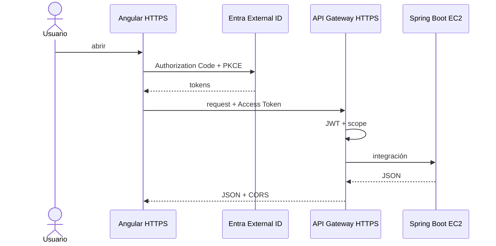

# 08 · Desplegar frontend e integrar extremo a extremo

## Objetivo

Publicar Angular, obtener una URL cloud real y cerrar el flujo navegador → Entra → API Gateway → EC2.

El objetivo de esta etapa es que frontend y backend queden desplegados, activos e integrados dentro de la práctica.

## Hosting

Usar primero:

→ [08A · Hosting frontend, HTTPS y mixed content](./08a-hosting-frontend-https.md)

S3 + CloudFront se mantiene como opción de referencia AWS, no como dependencia necesaria del aprendizaje.

## 1. Configuración de producción

Angular debe usar:

```text
API base URL = <API_GATEWAY_URL>
```

Nunca `localhost:8080` ni EC2 directo en el build cloud.

## 2. Build

```bash
npm ci
ng build
```

**Checkpoint 08-1**

- [ ] build PASS.
- [ ] no contiene secrets.
- [ ] API URL corresponde al Gateway.

## 3. Publicar y registrar URL

Obtener:

```text
FRONTEND_CLOUD_URL=https://...
```

Validar en navegador antes de tocar Entra/CORS.

## 4. Propagar URL

Actualizar exactamente:

```text
Entra SPA redirect URI → FRONTEND_CLOUD_URL
API Gateway CORS       → allowed origin FRONTEND_CLOUD_URL
```

Usar [00C · matriz de valores](./00c-matriz-valores-y-checkpoints.md).

## 5. Flujo final



## Checkpoint 08-2 · login cloud

- [ ] frontend HTTPS abre.
- [ ] login llega al External tenant correcto.
- [ ] redirect vuelve al frontend cloud.
- [ ] Access Token conserva `aud` correcto.

## Checkpoint 08-3 · E2E

```text
/api/me        PASS
GET tasks      PASS
POST task      PASS
DELETE propia  PASS
```

DevTools Network debe mostrar **API Gateway** como destino.

## Checkpoint 08-4 · navegador

- [ ] no mixed content.
- [ ] CORS cloud PASS.
- [ ] preflight PASS.
- [ ] refresh de SPA no rompe rutas relevantes.

## Fallas típicas

| Síntoma | Revisar primero |
|---|---|
| login cloud falla | redirect URI efectiva |
| API CORS falla | allowed origin cloud |
| sigue llamando localhost | build/config/cache |
| Mixed Content | API URL HTTP incorrecta |
| refresh 403/404 | SPA fallback hosting/CDN |
| token 401 | iss/aud/exp; no CORS |

## Puerta de validación 08

Solo continuar cuando:

```text
frontend cloud PASS
login cloud PASS
Gateway PASS
JWT PASS
CORS PASS
JSON en UI PASS
```

**SI FALLA** · usar [09A · estado conocido](./09a-runbook-checkpoints-estado-conocido.md), no cambiar simultáneamente hosting, Entra y Gateway.
