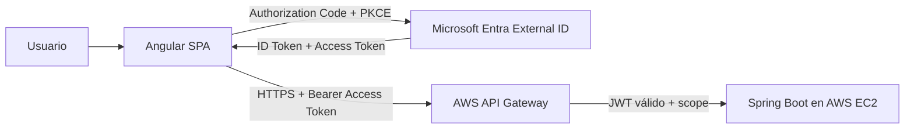

# EV1 · Guía integrada de implementación real

Esta guía conecta, en una sola ruta reproducible, los contenidos que la EV1 exige demostrar: frontend + backend, API Manager/Gateway, CORS, Identity as a Service, OAuth2, OpenID Connect, Authorization Code + PKCE, JWT, scopes/roles y despliegue cloud.

> Esta vertical no es RegistrApp. RegistrApp permanece como proyecto formativo transversal. Aquí se construye una **aplicación técnica de referencia** para demostrar el encargo institucional sin dependencias ocultas.

## Resultado final



El estudiante debe poder demostrar y explicar cada salto.

## Aplicación de referencia: CloudTasks

CloudTasks es intencionalmente pequeña. Solo permite iniciar sesión, consultar tareas, crear una tarea, eliminar una tarea propia y consultar información básica de identidad. El dominio es irrelevante; la arquitectura y la seguridad son lo evaluado.

### Endpoints mínimos

| Método | Ruta | Requisito | Propósito didáctico |
|---|---|---|---|
| GET | `/api/public/health` | público | comprobar backend |
| GET | `/api/me` | token válido | inspeccionar identidad |
| GET | `/api/tasks` | `tasks.read` | autorización por scope |
| POST | `/api/tasks` | `tasks.write` | autorización por scope |
| DELETE | `/api/tasks/{id}` | `tasks.write` + ownership | autorización de negocio |
| GET | `/api/admin/stats` | rol `Admin` | rol vs scope |

## Principio de implementación: mínimo código, máxima evidencia EV1

El alumno **no debe dedicar tiempo a programar capacidades que no aportan directamente a la evaluación**.

La guía prioriza:

```text
scaffolding de herramientas
→ configuración explícita
→ código mínimo indispensable
→ validación observable
→ evidencia
```

Por eso, en la ruta base:

- Spring Boot se crea con IntelliJ + Spring Initializr;
- Maven se ejecuta con Maven Wrapper (`mvnw` / `mvnw.cmd`);
- Angular se crea con Angular CLI;
- MSAL implementa Authorization Code + PKCE;
- los datos permanecen en memoria;
- no se implementa login propio;
- no se implementa criptografía JWT manual;
- no se exige diseño frontend complejo;
- no se agregan Docker, Kubernetes o mensajería **como requisitos de la ruta base**;
- cada fragmento de código manual debe tener una razón evaluativa clara.

### Regla para decidir si algo se programa

> ¿Qué criterio o concepto específico de EV1 demuestra este código?

Si la respuesta es “ninguno”, se usa scaffolding, configuración, una dependencia existente o se elimina esa complejidad.

## Orden obligatorio · ruta base

0. [00A · Preparar herramientas y entorno](./00a-preparar-entorno.md)
1. [00 · Mapa EV1 y prerequisitos](./00-mapa-y-prerequisitos.md)
2. [01A · Crear backend Spring Boot con IntelliJ](./01a-crear-backend-intellij.md)
3. [01B · Crear frontend Angular](./01b-crear-frontend-angular.md)
4. [01C · Integrar frontend y backend localmente + CORS](./01-cloudtasks-local.md)
5. [02 · Crear Microsoft Entra External ID](./02-entra-external-id.md)
6. [03 · Integrar Angular con MSAL y PKCE](./03-angular-msal.md)
7. [04 · JWT, scopes, roles y Spring Security](./04-jwt-y-backend.md)
8. [05 · Desplegar backend en AWS EC2](./05-aws-backend.md)
9. [06 · Crear AWS API Gateway + JWT Authorizer](./06-api-gateway-jwt.md)
10. [07 · Configurar CORS con URLs que ya existen](./07-cors.md)
11. [08 · Desplegar frontend e integrar extremo a extremo](./08-frontend-cloud-e2e.md)
12. [09 · Pruebas negativas y troubleshooting](./09-pruebas-y-troubleshooting.md)
13. [10 · Evidencias y defensa EV1](./10-evidencias-y-defensa.md)

---

# ★ Ruta opcional · Advanced Developer

Para estudiantes que quieran trabajar en un entorno más cercano al desarrollo profesional existe una ruta adicional:

→ [**★ Advanced Developer · WSL2 + Ubuntu + Docker**](./advanced-developer/README.md)

No es requisito de EV1 y no reemplaza el contenido evaluado.

La ruta agrega:

```text
WSL2
+ Ubuntu
+ terminal Linux
+ repositorio en filesystem Linux
+ Docker Desktop / WSL integration
+ Dockerfile multi-stage
+ Spring Boot containerizado
+ Docker sobre EC2
```

### Mismo sistema, diferente empaquetado

```text
RUTA BASE
Spring Boot
→ JAR
→ Java 21 en EC2
→ API Gateway

★ ADVANCED
Spring Boot
→ Docker image
→ Docker Engine en EC2
→ API Gateway
```

El contrato HTTP, Entra External ID, Access Token, JWT, scopes, CORS y API Gateway son los mismos.

### ¿Por qué Docker sobre EC2 y no ECS?

La pauta institucional de EV1 indica explícitamente **despliegue en EC2 y uso de API Gateway**. ECS no aparece como requisito de esta evaluación.

Por esa razón:

```text
EV1 base     → EC2 + JAR
EV1 advanced → EC2 + Docker
```

ECS se documenta solo como evolución profesional posterior y no como sustitución silenciosa de un requisito institucional.

### Puntos donde la ruta diverge

| Etapa | Base | ★ Advanced |
|---|---|---|
| entorno | Windows/tooling habitual | [WSL2 + Ubuntu](./advanced-developer/00-wsl2-ubuntu.md) |
| backend local | JAR/proceso Java | [imagen + container Docker](./advanced-developer/01-docker-local.md) |
| backend AWS | Java + JAR en EC2 | [Docker + container en EC2](./advanced-developer/02-docker-ec2.md) |
| API Gateway en adelante | igual | vuelve a la ruta base |

---

## Herramientas esperadas

La etapa `00A` deja instalado y verificado lo necesario para la ruta base.

Principales decisiones:

- Git es obligatorio;
- GitHub Desktop y `gh` son recomendados;
- IntelliJ IDEA es la ruta principal para Spring Boot;
- Java 21 es obligatorio;
- Maven global no es requisito porque se usa Maven Wrapper;
- Node.js LTS + npm + Angular CLI son obligatorios;
- para Angular se usa VS Code o WebStorm;
- navegador con DevTools es obligatorio;
- Postman es recomendado;
- WSL2 y Docker Desktop son **opcionales y pertenecen a ★ Advanced Developer**.

## Regla de avance

No se continúa porque “parece estar bien”. Cada etapa termina con una **puerta de validación**. Si falla, se corrige antes de seguir.

## Convención de valores

```text
<VALOR_ASI>
```

significa que debe reemplazarse por un valor real obtenido en un paso anterior.

Nunca versionar:

- contraseñas;
- client secrets;
- access tokens reutilizables;
- claves AWS;
- credenciales del tenant.

## Correspondencia con el contenido existente

Esta guía enlaza los contenidos canónicos de Semanas 1–3. No vuelve a escribir la teoría de OAuth2, CORS o JWT: muestra **dónde aparece y cómo se valida en una solución real**.
