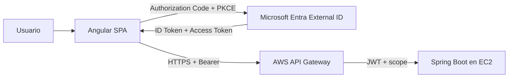

# EV1 · Guía integrada de implementación real

Esta ruta implementa de extremo a extremo los contenidos evaluados en EV1: frontend + backend, API Gateway, CORS, IDaaS, OAuth2/OIDC, Authorization Code + PKCE, JWT, scopes/roles y despliegue cloud.

> No reemplaza RegistrApp. CloudTasks es una aplicación técnica mínima cuyo dominio existe solo para hacer observable la arquitectura evaluada.

## Convenciones visuales

- **REQUERIDO EV1**: necesario para cubrir la evaluación.
- **EVIDENCIA**: debe poder demostrarse o registrarse.
- **SI FALLA**: no avanzar; volver al último checkpoint PASS.
- **★ OPCIONAL / Advanced Developer**: profundización técnica; no agrega criterios institucionales.

## Arquitectura final



## CloudTasks mínimo

| Método | Ruta | Requisito | Evidencia |
|---|---|---|---|
| GET | `/api/public/health` | público | backend/Gateway disponible |
| GET | `/api/me` | token válido | identidad/claims |
| GET | `/api/tasks` | `tasks.read` | scope lectura |
| POST | `/api/tasks` | `tasks.write` | scope escritura |
| DELETE | `/api/tasks/{id}` | `tasks.write` + ownership | autorización de negocio |
| GET | `/api/admin/stats` | `Admin` | opcional si sandbox permite roles |

## Principio: mínimo código, máxima evidencia EV1

```text
scaffolding
→ configuración explícita
→ código mínimo indispensable
→ checkpoint
→ evidencia
```

Si un fragmento de código no demuestra una competencia EV1, se evita o se entrega como starter.

## Ruta completa

### Preparación

0. [00A · Instalar herramientas](./00a-preparar-entorno.md)
1. [00B · Git/GitHub aplicado a la evaluación](./00b-git-github-flujo-evaluacion.md)
2. [00C · Matriz de valores y checkpoints](./00c-matriz-valores-y-checkpoints.md)
3. [00 · Mapa y prerequisitos](./00-mapa-y-prerequisitos.md)

### Aplicaciones locales

4. [01A · Backend Spring Boot con IntelliJ](./01a-crear-backend-intellij.md)
5. [01B · Frontend Angular](./01b-crear-frontend-angular.md)
6. [01C · Integración local + CORS](./01-cloudtasks-local.md)

### Identidad y seguridad

7. [02 · Microsoft Entra External ID](./02-entra-external-id.md)
8. [03 · Angular + MSAL + PKCE](./03-angular-msal.md)
   - [03A · Starter mínimo Angular/MSAL](./03a-starter-angular-msal.md)
9. [04 · JWT, scopes, roles y Spring Security](./04-jwt-y-backend.md)
   - [04A · Starter mínimo Spring Security](./04a-starter-spring-security.md)

### AWS

10. [05 · Backend en AWS EC2](./05-aws-backend.md)
    - [05A · EC2 paso a paso](./05a-ec2-paso-a-paso.md)
11. [06 · API Gateway + JWT Authorizer](./06-api-gateway-jwt.md)
12. [07 · CORS con URLs reales](./07-cors.md)
13. [08 · Frontend cloud + E2E](./08-frontend-cloud-e2e.md)
    - [08A · Hosting, HTTPS y mixed content](./08a-hosting-frontend-https.md)

### Validación y cierre

14. [09 · Pruebas negativas y troubleshooting](./09-pruebas-y-troubleshooting.md)
    - [09A · Runbook de checkpoints/estado conocido](./09a-runbook-checkpoints-estado-conocido.md)
15. [10 · Evidencias y defensa](./10-evidencias-y-defensa.md)
    - [10A · Evidencias EV1-01…EV1-08](./10a-plan-evidencias-ev1.md)
    - [10B · Runbook del día de defensa](./10b-runbook-dia-defensa.md)
16. [11 · Costos y cleanup](./11-costos-y-cleanup.md)

## ★ Advanced Developer

Ruta opcional:

→ [WSL2 + Ubuntu + Docker](./advanced-developer/README.md)

Bifurcaciones:

```text
entorno base     → Windows/tooling habitual
★ advanced       → WSL2 + Ubuntu

backend base     → JAR
★ advanced       → Docker image

deployment base  → Java/JAR en EC2
★ advanced       → Docker Engine/container en EC2

ambas rutas       → mismo API Gateway → mismo frontend → mismas evidencias
```

La pauta revisada exige **EC2 + API Gateway**; ECS no se encontró como requisito de EV1 y no sustituye EC2 en esta guía.

## Hosting frontend

La pauta exige frontend desplegado y activo, pero en el material revisado no se encontró S3/CloudFront como tecnología obligatoria. Se mantiene como referencia AWS apropiada para SPA; una alternativa autorizada por el laboratorio es válida si produce la misma evidencia.

## Regla de avance

Cada episodio termina en un estado observable. Solo se avanza con checkpoint `PASS`.

```text
FAIL
→ identificar último PASS
→ aislar una capa
→ corregir
→ repetir prueba positiva
→ continuar
```

## Seguridad

Nunca versionar contraseñas, client secrets, Access/Refresh Tokens, AWS keys, cookies de sesión o claves privadas.
