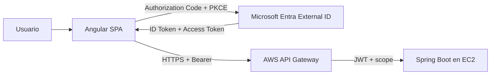

# EV1 · Guía integrada de preparación

> **Importante:** esta guía **no es la evaluación E1**, no reemplaza sus instrucciones oficiales y no define una estructura de entrega. Es una práctica integrada para comprender, relacionar y ejercitar los conocimientos que se medirán en E1 mediante una aplicación técnica mínima llamada **CloudTasks**.

CloudTasks permite recorrer de extremo a extremo frontend + backend, API Gateway, CORS, IDaaS, OAuth2/OIDC, Authorization Code + PKCE, JWT, scopes/roles y despliegue cloud sin mezclar esos aprendizajes con RegistrApp ni con la futura evaluación.

## Convenciones visuales

- **CHECKPOINT**: estado observable que debe quedar funcionando antes de avanzar.
- **SI FALLA**: volver al último checkpoint `PASS` y aislar una capa.
- **★ OPCIONAL / Advanced Developer**: profundización técnica adicional.

## Arquitectura final de la práctica



## CloudTasks mínimo

| Método | Ruta | Propósito de aprendizaje |
|---|---|---|
| GET | `/api/public/health` | comprobar backend/Gateway |
| GET | `/api/me` | observar identidad y claims |
| GET | `/api/tasks` | autorización por `tasks.read` |
| POST | `/api/tasks` | autorización por `tasks.write` |
| DELETE | `/api/tasks/{id}` | combinar scope + ownership |
| GET | `/api/admin/stats` | diferenciar role y scope, si el sandbox lo permite |

## Principio: mínimo código, máxima comprensión

```text
scaffolding
→ configuración explícita
→ código mínimo indispensable
→ checkpoint
→ explicación técnica
```

Si un fragmento de código no aporta directamente al aprendizaje de esta vertical, se evita o se entrega como starter.

## Ruta completa

### Preparación

0. [00A · Instalar herramientas](./00a-preparar-entorno.md)
1. [00B · Git/GitHub aplicado a la guía](./00b-git-github-flujo-guia.md)
2. [00C · Matriz de valores y checkpoints](./00c-matriz-valores-y-checkpoints.md)
3. [00 · Mapa y prerequisitos](./00-mapa-y-prerequisitos.md)

### Aplicaciones locales

4. [01A · Backend Spring Boot con IntelliJ](./01a-crear-backend-intellij.md)
5. [01B · Frontend Angular](./01b-crear-frontend-angular.md)
6. [01C · Integración local + CORS](./01-cloudtasks-local.md)

### Identidad y seguridad

7. [02 · Microsoft Entra External ID](./02-entra-external-id.md)
8. [03 · Angular + MSAL + PKCE](./03-angular-msal.md)
   - [03A · Starter mínimo Angular/MSAL](./03a-starter-angular-msal.md)
9. [04 · JWT, scopes, roles y Spring Security](./04-jwt-y-backend.md)
   - [04A · Starter mínimo Spring Security](./04a-starter-spring-security.md)

### AWS

10. [05 · Backend en AWS EC2](./05-aws-backend.md)
    - [05A · EC2 paso a paso](./05a-ec2-paso-a-paso.md)
11. [06 · API Gateway + JWT Authorizer](./06-api-gateway-jwt.md)
12. [07 · CORS con URLs reales](./07-cors.md)
13. [08 · Frontend cloud + E2E](./08-frontend-cloud-e2e.md)
    - [08A · Hosting, HTTPS y mixed content](./08a-hosting-frontend-https.md)

### Verificación y cierre de la práctica

14. [09 · Pruebas negativas y troubleshooting](./09-pruebas-y-troubleshooting.md)
    - [09A · Runbook de checkpoints/estado conocido](./09a-runbook-checkpoints-estado-conocido.md)
15. [10 · Verificación integrada](./10-verificacion-integrada.md)
    - [10A · Mapa de cobertura de conocimientos E1](./10a-mapa-cobertura-e1.md)
    - [10B · Simulación de presentación técnica](./10b-simulacion-presentacion-tecnica.md)
16. [11 · Costos y cleanup](./11-costos-y-cleanup.md)

## Estructura sugerida dentro del repositorio personal

```text
DSY1107-00XD-nombre-apellido/
└── guia/
    └── ev1/
        ├── README.md
        ├── frontend/
        ├── backend/
        └── docs/
```

La carpeta `evaluaciones/` queda reservada para actividades evaluativas reales cuando corresponda y según las instrucciones que se entreguen para ellas.

## ★ Advanced Developer

Ruta opcional:

→ [WSL2 + Ubuntu + Docker](./advanced-developer/README.md)

Bifurcaciones:

```text
entorno base     → Windows/tooling habitual
★ advanced       → WSL2 + Ubuntu

backend base     → JAR
★ advanced       → Docker image

deployment base  → Java/JAR en EC2
★ advanced       → Docker Engine/container en EC2

ambas rutas       → mismo API Gateway → mismo frontend → mismos checkpoints
```

La práctica mantiene EC2 + API Gateway porque esos componentes aparecen en el material revisado; ECS queda como profundización posterior.

## Hosting frontend

S3 + CloudFront se mantiene como referencia técnica apropiada para una SPA. Si el laboratorio autoriza otra alternativa cloud que produzca la misma arquitectura observable, puede utilizarse.

## Regla de avance

Cada episodio termina en un estado observable. Solo se avanza con checkpoint `PASS`.

```text
FAIL
→ identificar último PASS
→ aislar una capa
→ corregir
→ repetir prueba positiva
→ continuar
```

## Seguridad

Nunca versionar contraseñas, client secrets, Access/Refresh Tokens, AWS keys, cookies de sesión o claves privadas.
