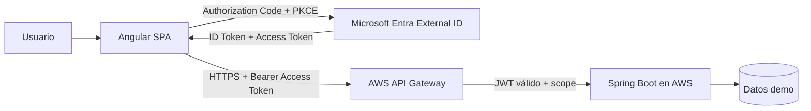

# EV1 · Guía integrada de implementación real

Esta guía conecta, en una sola ruta reproducible, los contenidos que la EV1 exige demostrar: frontend + backend, API Manager/Gateway, CORS, Identity as a Service, OAuth2, OpenID Connect, Authorization Code + PKCE, JWT, scopes/roles y despliegue cloud.

> Esta vertical no es RegistrApp. RegistrApp permanece como proyecto formativo transversal. Aquí se construye una **aplicación técnica de referencia** para demostrar el encargo institucional sin dependencias ocultas.

## Resultado final

Al completar la guía debe existir este flujo real:



El estudiante debe poder demostrar y explicar cada salto.

## Aplicación de referencia: CloudTasks

CloudTasks es intencionalmente pequeña. Solo permite iniciar sesión, consultar tareas, crear una tarea, eliminar una tarea propia y consultar información básica de identidad. El dominio es irrelevante; la arquitectura y la seguridad son lo evaluado.

### Endpoints mínimos

| Método | Ruta | Requisito | Propósito didáctico |
|---|---|---|---|
| GET | `/api/public/health` | público | comprobar backend |
| GET | `/api/me` | token válido | inspeccionar identidad |
| GET | `/api/tasks` | `tasks.read` | autorización por scope |
| POST | `/api/tasks` | `tasks.write` | autorización por scope |
| DELETE | `/api/tasks/{id}` | `tasks.write` + ownership | autorización de negocio |
| GET | `/api/admin/stats` | rol `Admin` | rol vs scope |

## Principio de implementación: mínimo código, máxima evidencia EV1

El alumno **no debe dedicar tiempo a programar capacidades que no aportan directamente a la evaluación**.

La guía prioriza, en este orden:

```text
scaffolding de herramientas
→ configuración explícita
→ código mínimo indispensable
→ validación observable
→ evidencia
```

Por eso:

- Spring Boot se crea con IntelliJ + Spring Initializr;
- Maven se ejecuta con el wrapper generado por el proyecto (`mvnw` / `mvnw.cmd`);
- Angular se crea con Angular CLI;
- MSAL implementa el protocolo Authorization Code + PKCE;
- los datos de CloudTasks permanecen en memoria;
- no se incorpora base de datos si EV1 no la exige;
- no se implementa login propio;
- no se implementa generación ni validación criptográfica de JWT manualmente;
- no se exige diseño frontend complejo;
- no se construyen microservicios, Docker, Kubernetes ni mensajería;
- cada fragmento de código manual debe tener una razón evaluativa clara.

### Regla para decidir si algo se programa

Antes de pedir código al alumno, la guía debe poder responder:

> ¿Qué criterio o concepto específico de EV1 demuestra este código?

Si la respuesta es “ninguno”, se usa scaffolding, configuración, una dependencia existente o se elimina esa complejidad.

## Orden obligatorio

La guía está diseñada para que ningún paso use un artefacto inexistente.

1. [00 · Mapa EV1 y prerequisitos](./00-mapa-y-prerequisitos.md)
2. [01A · Crear backend Spring Boot con IntelliJ](./01a-crear-backend-intellij.md)
3. [01B · Crear frontend Angular](./01b-crear-frontend-angular.md)
4. [01C · Integrar frontend y backend localmente + CORS](./01-cloudtasks-local.md)
5. [02 · Crear Microsoft Entra External ID](./02-entra-external-id.md)
6. [03 · Integrar Angular con MSAL y PKCE](./03-angular-msal.md)
7. [04 · JWT, scopes, roles y Spring Security](./04-jwt-y-backend.md)
8. [05 · Desplegar backend en AWS](./05-aws-backend.md)
9. [06 · Crear AWS API Gateway + JWT Authorizer](./06-api-gateway-jwt.md)
10. [07 · Configurar CORS con URLs que ya existen](./07-cors.md)
11. [08 · Desplegar frontend e integrar extremo a extremo](./08-frontend-cloud-e2e.md)
12. [09 · Pruebas negativas y troubleshooting](./09-pruebas-y-troubleshooting.md)
13. [10 · Evidencias y defensa EV1](./10-evidencias-y-defensa.md)

## Regla de avance

No se continúa porque “parece estar bien”. Cada etapa termina con una **puerta de validación**. Si la validación falla, se corrige antes de seguir.

## Convención de valores

En toda la guía:

```text
<VALOR_ASI>
```

significa que el estudiante debe reemplazarlo por un valor real obtenido en un paso anterior.

Nunca versionar:

- contraseñas;
- client secrets;
- access tokens reutilizables;
- claves AWS;
- credenciales del tenant.

Los IDs públicos (`client_id`, tenant id, audience pública) sí pueden documentarse cuando corresponda, pero la guía evita exigir que se suban si no son necesarios.

## Correspondencia con el contenido existente

Antes o durante cada implementación se enlazan los contenidos canónicos existentes de las Semanas 1–3. Esta guía no vuelve a escribir teoría de OAuth2, CORS o JWT: muestra exactamente **dónde aparece en una solución real**.
